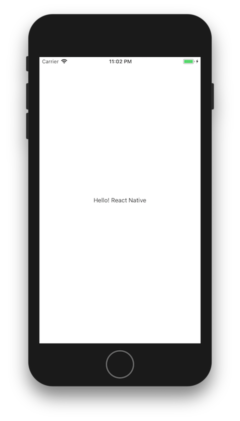
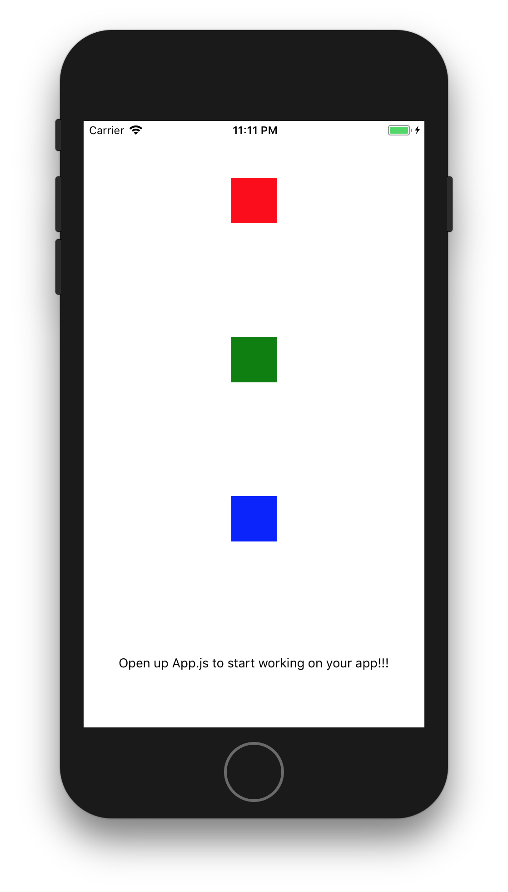
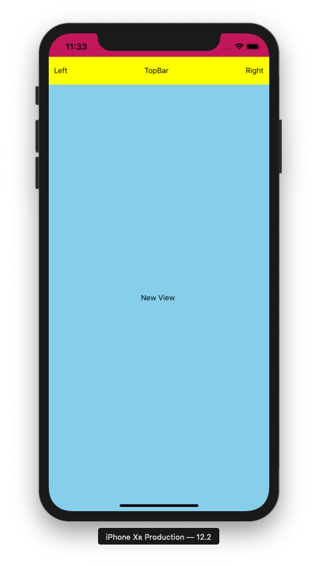

# React Native Tutorial: Show Me The Coin
(Build real native application with javascript, and Run on Expo)

![final][final]

[final]: ./screenshots/final.png "Show Me The Coin"

## Getting Started
(11.21.2017 세션 전에 시뮬레이터로 2챕터까지 미리 실행해보세요)

- [React Native Basics](https://facebook.github.io/react-native/docs/tutorial.html): Component, Props, State, [JSX](https://reactjs.org/docs/jsx-in-depth.html)...
- ES2015(ES6): `import`, `from`, `extends`, `=>`
- [Node.js](https://nodejs.org/en/): React Native uses `Node.js` to build code
- [Expo](https://expo.io):
> Our tools enable developers to build and share truly native apps that work across both iOS and Android. Everything is open source, free and uses React Native.
Download our tools

- iOS Simulator: XCode(with Mac). Strongly recommend it for fast build. You can to skip it if you build your project on you device only.(not recommend for Kosscon 2017)

- Android Simulator: [Genymotion](https://docs.genymotion.com/Content/01_Get_Started/Installation.htm)
> On Android we recommend the Genymotion emulator over the standard emulator — we have found it to be more feature complete, faster and easier to use.
Download Genymotion (free version) and follow the Genymotion installation guide. Once you’ve installed Genymotion, create a virtual device - we recommend a Nexus 5, the Android version is up to you. Start up the virtual device when it’s ready. If you run into any issues follow our Genymotion guide.

## 1. Create a New Project in Expo XDE

![expo][expo0]

- Create your project and open on Expo.
- Run your project on the simulator(Device Button on top-right ) or `Expo App` on your device
- Open development menus(Android: `cmd+m`, iOS: `ctrl+cmd+z` or `cmd+d`) and toggle `Hot/Live reloading` on Expo App
- Edit your text and feel the magic

* commnets may do not work on JSX area.

#### App.js

```js
import React from 'react';
import { StyleSheet, Text, View } from 'react-native';

export default class App extends React.Component {
  render() {
    return ( // JSX Area
      <View style={styles.container}>
      <Text>Open up App.js to start working on your app</Text> // Edit here
      </View>
    );
  }
}

const styles = StyleSheet.create({
  container: {
    flex: 1,
    backgroundColor: '#fff',
    alignItems: 'center',
    justifyContent: 'center',
  },
});
```

### Run and Test!!
- Turn on Hot reloading and edit the `Text` component in App.js



- Change your host in XDE to `LAN` or `localhost` for faster
> If you are using LAN, make sure your device is on the same wifi network as your development machine. This may not work on some public networks. localhost will not work for iOS unless you are in the simulator, and it only work on Android if your device is connected to your machine via usb.

- Development menus
  - Android Simulator: `cmd+m`
  - iOS Simulator: `ctrl+cmd+z` or `cmd+d`
  - Genymotion(Android): `Menu` or `cmd+m`


[Source](https://github.com/JeffGuKang/ReactNative-Tutorial/commit/68e9991f3c461359041ea71badc182a4129a566c)

[expo0]: ./screenshots/expo0.png "Expo Launch"

## 2. FlexBox Practice

- Change your applicaiton's layouts using Flexbox with `StyleSheet`

#### App.js

```js
import React from 'react';
import { StyleSheet, Text, View } from 'react-native';

export default class App extends React.Component {
  render() {
    return (
      <View style={styles.container}>
        <View style={[styles.box, {backgroundColor: 'red', flex:1}]}></View>
        <View style={[styles.box, {backgroundColor: 'green', flex:2}]}></View>
        <View style={[styles.box, {backgroundColor: 'blue', flex:3}]}></View>
        <Text>Open up App.js to start working on your app!!!</Text>
      </View>
    );
  }
}

const styles = StyleSheet.create({
  container: {
    flex: 1,
    // flexDirection: 'row',
    backgroundColor: '#fff',
    alignItems: 'center', // edit here
    justifyContent: 'space-around', // edit here using `center, space-around`
  },
  box: {
    backgroundColor: 'blue',
    width: 50,
    height: 50,
  }
});
```

### Run and Test!

- Change each color of `View` components
- Change styles as `backgroundColor`, `flex`, `alignItems` and `justifyContent`




[Source](https://github.com/JeffGuKang/ReactNative-Tutorial/commit/02504e27ab657ef24e0d901b4ee53813a452e63f)

## 3. Say Hello to a New Component: `CoinView`

- Make a new file: 'component/CoinView.js'
- Write a new component as below

#### CoinView.js

```js
import React from 'react'
import { StyleSheet, Text, View } from 'react-native';

class CoinView extends React.Component {
  render () {
    return (
      <View style={styles.container}>
        <Text>New View </Text>
      </View>
    )
  }
}

const styles = StyleSheet.create({
  container: {
    // width: '50%',
    // flex: 1,
    flexDirection: 'column', // row
    backgroundColor: 'skyblue',
    alignItems: 'center',
    justifyContent: 'space-around', // center, space-around
  },
});

export default CoinView;
```


#### App.js

```js
import React from 'react';
import { StyleSheet, Text, View } from 'react-native';
import CoinView from './components/CoinView'; // Call your new friend

export default class App extends React.Component {
  render() {
    return (
      <View style={styles.container}>
        <View style={[styles.box, {backgroundColor: 'red'}]}></View>
        <View style={[styles.box, {backgroundColor: 'green'}]}></View>
        <View style={[styles.box, {backgroundColor: 'blue'}]}></View>
        <CoinView></CoinView>
      </View>
    );
  }
}

const styles = StyleSheet.create({
  container: {
    flex: 1,
    flexDirection: 'row', // column
    backgroundColor: 'yellow',
    alignItems: 'center',
    justifyContent: 'space-between', // center, space-around
  },
  box: {
    backgroundColor: 'blue',
    width: 50,
    height: 50,
  }
});
```

### Run and Test!
- Change positions with `CoinView` and other components
- Feel the flex
- You may understand about component and styles with flexbox

[Source](https://github.com/JeffGuKang/ReactNative-Tutorial/commit/cacf5c4d9af9bf4d004f5476c4b70448072d9e58)

## 4. Good Bye StatusBar (Props)
- Hide status bar through `StatusBar` component

#### App.js

```js
...
import { StyleSheet, Text, View, StatusBar } from 'react-native'; // Use StatusBar component
...
render() {
  return (
    <View style={styles.container}>
      <StatusBar
        hidden={true}
        backgroundColor="blue"
        barStyle="light-content"
      />

      <CoinView></CoinView>
    </View>
  );
}
```

`StatusBar` is the component to control the app status bar. [link](https://facebook.github.io/react-native/docs/statusbar.html)

Most components can be customized with various parameters called `props`(properties).
And `hidden`, `backgroundColor` and `barStyle` are `StatusBar` component's props.

[Source](https://github.com/JeffGuKang/ReactNative-Tutorial/d53ea6be5c92efcadb38e9770e377056feeba678)

## 5. Top Bar

- Make another component called `TopBar`
- You will know how to make components and use after here

#### /components/TopBar.js

```js
import React from 'react'
import { StyleSheet, Text, View } from 'react-native';

class TopBar extends React.Component {
  render () {
    return (
      <View style={styles.container}> // You know what to do genius!
        <Text>Left</Text>
        <Text>TopBar</Text>
        <Text>Right</Text>
      </View>
    )
  }
}

const styles = StyleSheet.create({
  container: {
    width: '100%',
    height: 52,
    flexDirection: 'row', // row
    backgroundColor: 'yellow',
    alignItems: 'center',
    justifyContent: 'space-between', // center, space-around
  },
});

export default TopBar;
```

#### App.js

```js
...
import TopBar from './components/TopBar';

export default class App extends React.Component {
  render() {
    return (
      <View style={styles.container}>
        <StatusBar
          hidden={true}
          backgroundColor="blue"
          barStyle="light-content"
        />
        <TopBar></TopBar>
        <CoinView></CoinView>
      </View>
    );
  }
}
...
```

### Tada!



- Why did `TopBar` use only `height` and `CoinView` use `flexbox`?

## Continue...
