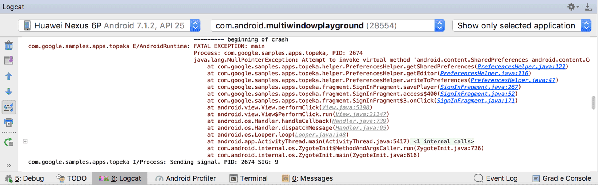
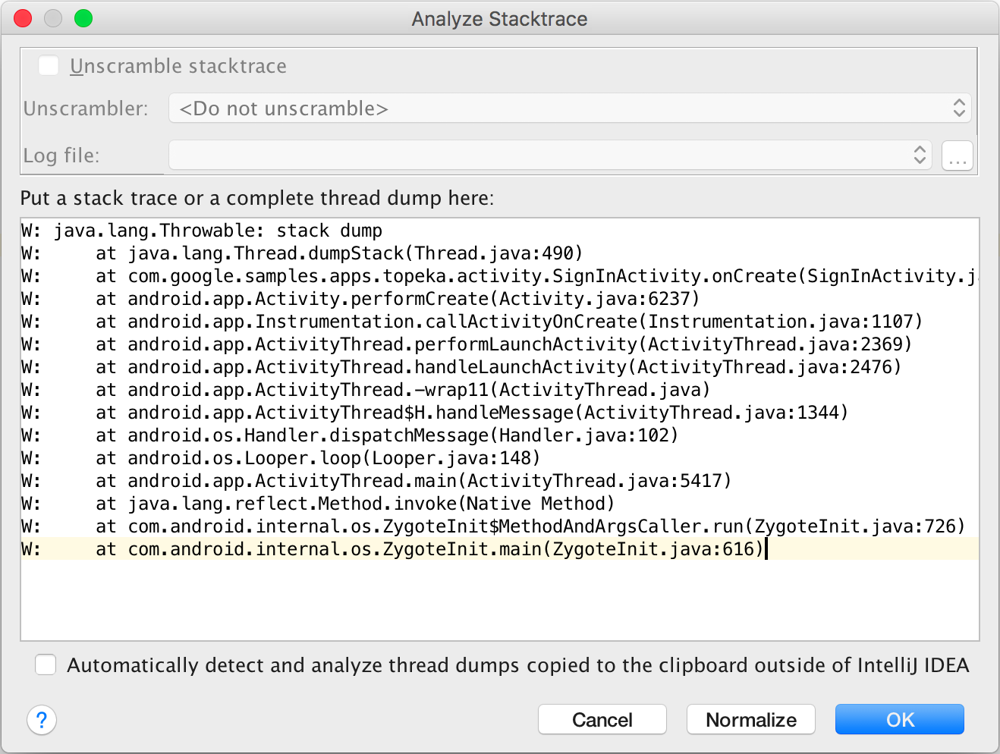
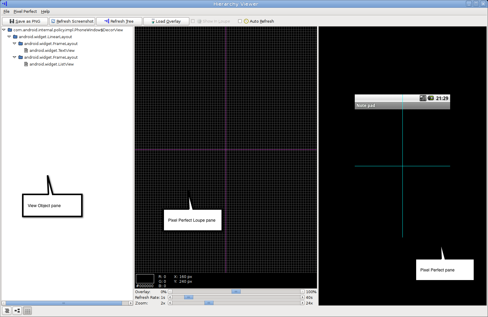
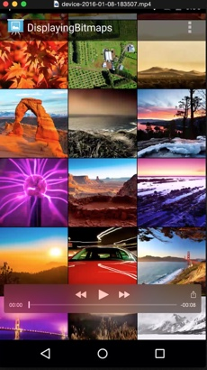
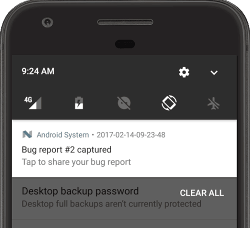
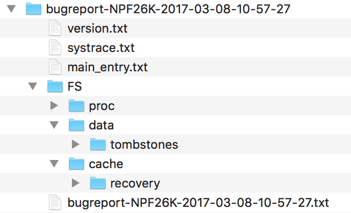

# 스택 추적 분석하기

앱을 디버깅하려면 종종 스택 추적 작업이 필요합니다. 오류나 예외로 인해 앱이 중단 될 때마다 스택 추적이 이루어집니다. [Thread.dumpStack()](https://developer.android.com/reference/java/lang/Thread.html?hl=ko#dumpStack())과 같은 메소드를 사용하여 앱 코드의 어느 시점에서나 스택 추적을 나오게 할 수 있습니다.

연결된 장치에서 앱이 디버그 모드로 실행되는 동안 Android Studio는 그림1과 같이 **logcat** view에서 스택 추적을 나타내고 강조 표시합니다.



그림1. A stacktrace in logcat.

스택 추적에는 호출이 발생한 파일 이름 및 줄 번호와 함께 예외가 발생하는 메소드 호출 목록이 표시됩니다. 강조 표시된 파일이름을 클릭하여 파일을 열고 메소드 호출 소스를 검사 할 수 있습니다. **Up the stack trace**와 **Down the stack trace**를 클릭하여 logcat 창에 표시된 스택 추적 line 사이들을 빠르게 이동합니다.

## 외부 소스의 오픈 스택 추적

때로는 디버깅하는 동안 발견 한 것과는 반대로 버그 보고서에서 공유된 스택 추적을 분석하려고 합니다. 예를 들어 사용자 기기에서 생성 된 스택 추적을 Google Play Console 또는 [Firebase Crash Reporting](https://firebase.google.com/docs/crash/?hl=ko)과 같은 다른 도구에서 수집 할 수 있습니다.

버그 보고서에서 외부 스택 추적을 강조 표시하고 클릭 할 수 있는 view를 얻으려면 다음 단계를 수행해야합니다:

1. Android Studio에서 프로젝트를 엽니다.

  
   >  ★ 참고: 보고있는 소스 코드가 스택 추적을 생성한 앱과 동일한 버전의 소스 코드인지 확인하십시오. 코드가 다르면 파일 이름과 줄 번호 또는 스택 추적과 프로젝트의 호출 순서가 일치하지 않습니다.


2. **Analyze** 메뉴에서 **Analyze Stack Trace**를 클릭합니다.

   

3. 스택 추적 텍스트를 **Analyze Stack Trace** 창에 붙여넣고 **OK**를 클릭합니다.

4. Android Studio는 실행 창 아래에 붙여 넣은 스택 추적과 함께 새로운 <Stacktrace>탭을 엽니다.

   

## 새로운 스택 추적을 위한 클립보드 모니터링

외부 스택 추적을 많이 사용하는 경우, Android Studio에서 새로운 스택추적들을 위해 시스템 클립보드를 지속적으로 모니터링함으로써 생산성을 향상시킬 수 있습니다.

1. **Analyze Stacktrace** 도구를 엽니다.
6. **intelliJ IDEA 체크박스의 외부 클립보드에 복사된 thread dumps 자동 감지 및 분석 확인 란**을 선택하십시오.
7. 다른 응용 프로그램(예: 웹 브라우저)의 스택 추적을 시스템 클립 보드에 복사합니다.
8. Android Studio 창으로 돌아오면, 스택 추적 창에 붙여 넣지 않아도 **실행** 창 아래에서 스택 추적이 자동으로 열립니다.


# 완벽한 픽셀!

>  ▲ Pixel Perfect는 더 이상 사용되지 않습니다. Android Studio 3.1부터는 Layout Inspector를 사용하여 앱 레이아웃을 디자인 모형과 비교하는거 대신에, 앱의 확대된 뷰를 표시하고 레이아웃 세부 정보를 검사해야합니다.

Pixel Perfect는 [`Android Device Monitor`](https://developer.android.com/studio/profile/monitor.html?hl=ko)에 내장 된 도구로 앱의 확대된 뷰를 표시하므로 레이아웃에서 개별 픽셀의 위치와 속성을 검사하고 앱의 레이아웃을 디자인 모형과 일치시키는데 도움을 줄 수 있습니다.


## Pixel Perfect 시작하기

6. 장치를 컴퓨터에 연결하십시오. 장치에 **Allow USB debugging?**이라는 대화 상자가 표시되면 **OK**를 누릅니다.

7. Android Studio에서 프로젝트를 열고 장치에서 [`빌드하고 실행`](https://developer.android.com/studio/run/index.html?hl=ko)합니다.

8. [Android Device Monitor](https://developer.android.com/studio/profile/monitor.html?hl=ko)를 시작합니다. 한번에 한 프로세스만이 adb를 통해 장치에 연결할 수 있고, Android Device Monitor가 연결을 요청하므로 Android Studio에서 **adb 통합 비활성화** 대화 상자가 표시 될 수 있습니다. **Yes**를 클릭합니다.

   그림 1은 처음에 Android Device Monitor에 나타나는 것들을 보여줍니다. 

9. 메뉴 바에서, **Window > Open Perspective**를 선택하고, **Pixel Perfect**를 클릭합니다.

10. 왼쪽의 **Windows** 탭에서 장치이름을 두 번 클릭합니다. 이것은 장치 디스플레이로 창을 채우고 **Pixel Perfect Tree** 탭으로 전환합니다.

    

    ​								   그림1. Android Device Monitor

## 도구들로 친숙해지기

다음과 같은 3개의 창이 나타납니다:

- **View Object** (left): 시스템에서 소요 한 객체를 포함하여 화면에 표시되는 [View](https://developer.android.com/reference/android/view/View.html?hl=ko) 객체의 계층 구조 목록입니다. 뷰를 클릭하면, 오른쪽의 Pixel Perfect pane에서 해당 위치가 강조 표시됩니다.

- Pixel Perfect Loupe** (center): 확대 된 화면 이미지입니다. 각 정사각형이 하나의 픽셀을 나타내는 격자로 오버레이됩니다. 픽셀 정보를 보려면, 정사각형을 클릭합니다. 색상 정보와 X/Y 좌표가 창의 맨 아래에 나타납니다. 

  분할 창의 십자선은 Pixel Perfect 창 (오른쪽)의 위치 결정 십자선에 해당합니다. 

  확대/축소하려면 창의 맨아래에 있는 **확대/축소** 슬라이더를 사용하거나 마우스의 스크롤 휠을 사용합니다.

- Pixel Perfect (right): device 화면이 표시됩니다. 이 창의 십자선은 loupe 창의 십자선에 해당합니다. 

  View Object 창에서 선택한 뷰도 여기에 굵은 빨간색으로 표시됩니다. 형제 및 부모뷰에는 얇은 빨간색 상자가 있습니다.

  레이아웃 상자에는 내부또는 외부에 다른 사각형이 있을 수 있으며 각 사각형은 뷰의 일부를 나타냅니다. 보라색 또는 초록색 사각형은 뷰 경계 상자를 나타냅니다. 레이아웃 상자안의 흰색 또는 검은 색 상자는 뷰 패딩을 나타냅니다. 바깥 쪽 흰색 또는 검은색 사각형은 여백을 나타냅니다. 레이아웃 배경이 검은색이면 패딩및 여백상자는 흰색이고, 그 반대도 마찬가지입니다.

  창 상단에서 **PNG로 저장**을 클릭하여 스크린 샷을 저장 할 수 있습니다.

  

  그림2. The Pixel Perfect window

기본적으로, 이 창은 화면의 UI가 변경 될 때 새로 고쳐지지 않습니다. 자동 새로 고침을 활성화하려면 창 상단에서 **Auto Refresh**를 활성화 한 다음 Loupe 창의 맨 아래에 있는 **Refresh Rate** 슬라이더를 사용하여 새로 고침 빈도를 설정합니다.

그렇지 않으면, 창의 맨 위에있는 **Refresh Screenshot**을 클릭하여 Pixel Perfect 창과 Loupe 창을 수동으로 새로 고침 할 수 있습니다. 창 상단에서 **Refresh Tree**를 클릭하여 View Object창을 새로 고침 해야 할 수도 있습니다.


## 오버레이 이미지 더하기

Pixel Perfect 창은 Pixel Perfect 창에서 비트 맵을 오버레이로 로드 할 수 있도록 하여 앱 레이아웃을 모형 이미지와 일치시키는것을 도와줍니다.

비트 맵 이미지를 오버레이로 사용하려면 다음 단계를 수행합니다:

- Pixel Perfect 상단에서, **Load Overlay**를 클릭하고 이미지를 선택합니다.

- Pixel Perfect는 Pixel Perfect창에서 화면 위에 오버레이를 표시합니다. 비트 맵 이미지의 왼쪽 아래 모서리 (X=0. Y=max값)는 화면의 가장 왼쪽 아래 픽셀 (X=0, Y=max 화면)에 고정됩니다. 

  기본적으로, 오버레이의 투명도는 50%입니다. loupe 창의 맨 아래에 있는 **오버레이** 슬라이더를 사용하여 이를 조정할 수 있습니다.

  또한 기본적으로, 오버레이는 Loupe 창에 표시되지 않습니다. 표시하려면 창 상단의 **Loupe에서 Show**를 설정합니다.

  


# 스크린 샷 찍기

많은 Android 기기에서 키-조합을 사용하여 스크린샷을 캡쳐 할 수 있습니다: 전원과 볼륨을 동시에 누릅니다. 다음과 같이 Android Studio로 스크린 샷을 캡쳐 할 수도 있습니다.

1. 연결된 장치 또는 에뮬레이터에서 앱을 실행합니다. 연결된 장치를 사용하는 경우 [`USB 디버깅을 활성화`](https://developer.android.com/studio/run/device.html?hl=ko#setting-up)했는지 확인합니다.

2. Android Studio에서, **View > Tool Windows > Logcat**을 선택하여 [`Logcat`](https://developer.android.com/studio/debug/am-logcat.html?hl=ko)을 엽니다.

3. 창의 맨 위에 있는 드롭-다운에서 장치 및 프로세스를 선택합니다.

4. 창의 왼쪽에서 **Screen Capture**를 클릭합니다. **Screenshoe Editor**창에서 스크린 샷이 나타납니다.

  
   >  ★ 팁: Android 7.0이상에서 설정을 열고, Developer options > Demo mode를 선택한 후, demo mode 표시를 사용합니다. 알림을 일시적으로 제거하도록 상태 표시 줄을 재설정하고 신호 및 배터리 잔량 가득으로 설정합니다. 자세한 내용은 장치내 개발자 옵션 구성을 참조합니다.

   

   그림1. Screenshot editor

5. 선택적으로 이미지를 변경합니다:

   - **Recapture**: 새로운 스크린 샷을 찍습니다.

   - **Rotate Left**: 이미지를 시계 반대 방향으로 90도 회전합니다.

   - **Rotate Right**: 이미지를 시계 방향으로 90도로 회전합니다.

   - **Frame Screenshot**: 실제 장치 아트웍으로 스크린 샷을 wrap할 장치를 선택합니다. **Drop Shadow, Screen Glare** 또는 둘 다를 선택하여 이미지에 이러한 효과를 추가합니다.

		>  ★ 참조: 캡쳐한 실제 장치와 다른 스크린 샷 프레임의 장치를 선택하면, 편집기가 장치 프레임의 크기에 맞게 이미지를 늘립니다. 대신 다른 인기있는 장치를 위한 장치 프레임을 제공하는 온라인 Device Art Genertator를 사용하고 싶을 수도 있습니다.

6. **저장**을 클릭하고, 위치와 파일 이름을 지정한 다음, **OK**를 클릭합니다.


# 비디오 녹화하기

[Logcat](https://developer.android.com/studio/debug/am-logcat.html?hl=ko)을 사용하면 최대 3분 동안 하드웨어 장치에서 MP4 비디오를 녹화 할 수 있습니다. 예를 들어 마케팅 자료나 디머깅에 비디오를 사용할 수 있습니다.

비디오 파일에는 오디오가 녹음되지 않습니다.

Wear OS를 실행하는 장치에는 비디오 녹화를 사용할 수 없습니다.

앱의 비동를 녹화하려면 다음을 수행해야 합니다:

12. 앱 프로젝트를 엽니다.

13. 하드웨어 장치에서 [`앱을 실행`](https://developer.android.com/studio/run/index.html?hl=ko#RunningApp)합니다.

14. **View > Tool Windows > Logcat**을 클릭합니다.

15. 하드웨어 장치의 디스플레이와 상호 작용하여 비디오 시작을 준비합니다.

16. Logcat 창의 왼쪽에서 **Screen Record**를 클릭합니다.

17. **Screen Recorder Options** 다이얼로그에서, 레코딩 옵션을 설정합니다:

    - **Bit Rate:** 비트 전송률을 입력합니다. 기본 설정은 4Mbps입니다.
    - **Resolution:** 너비와 높이 값을 픽셀 단위로 입력합니다. 값은 16의 배수여야합니다. 기본값은 장치의 해상도입니다.
    - **Show Taps:** 탭에 대한 시각적 피드백을 활성화합니다. 

18. **Start Recording**을 클릭하여 녹화를 시작합니다. 

19. **Stop Recording**을 클릭하여 녹화를 중지합니다. 

20. 다이얼로그에서, MP4파일을 **저장**합니다.

21. **Screen Recorder** 다이얼로그에서 버튼 중 하나를 클릭하여 파일 위치를 표시하거나 플레이어에서 녹음을 열거나 다이얼로그를 닫습니다.

    

    ​					               그림1. Record a video of your app


# 버그 보고서 캡쳐 및 읽기

버그 보고서에는 앱에서 버그를 찾고 수정하는데 도움이 되는 장치 로그, 스택 추적 및 기타 진단 정보가 포함되어 있습니다. 장치의 **버그 보고서** 개발자 가져오기 옵션, Android 에뮬레이터 메뉴 또는 개발 시스템의 `adb bugreport` 명령을 사용하여 장치에서 버그 보고서를 캡쳐할 수 있습니다.

버그 보고서를 작성하려면, 장치에서 [`Developer options`](https://developer.android.com/studio/run/device.html?hl=ko#developer-device-options)을 사용하도록 설정해야 **버그 보고서 작성** 옵션에 접근 할 수 있습니다. 


​							                  그림1. Developer options

## 장치에서 버그 보고서 캡쳐하기

장치에서 직접 버그 보고서를 받으려면 다음을 수행해야 합니다:

5. [Developer options](https://developer.android.com/studio/run/device.html?hl=ko#developer-device-options)이 활성화되어 있는지 확인합니다.

6. **Developer options **에서 **버그 보고서**를 누릅니다.

7. 원하는 버그 보고서 유형을 선택하고 **보고서**를 누릅니다.

   잠시 후, 버그 보고서가 준비되었다는 알림을 받습니다 (그림2 참조).

8. 버그 보고서를 공유하려면 알림을 누릅니다.

   

   ​						               그림2. The bug report is ready


## Android 에뮬레이터에서 버그 보고서 캡쳐하기

Android 에뮬레이터에서 확장 컨트롤의 **버그 제기** 기능을 사용할 수 있습니다.

4. 에뮬레이터 패널에서 More을 클릭합니다. 

5. **확장 제어** 창에서 왼쪽의 **버그 보고서**를 선택합니다.

   스크린 샷, AVD 구성 정보및 버그 보고서 로그와 같은 버그 보고서 세부 정보를 볼 수 있는 화면이 열립니다. 재현 단계가 있는 메시지를 입력하여 보고서와 함께 저장할 수도 있습니다.

6. 버그 보고서 수집이 안료될 때까지 기다린 다음 **보고서 저장**을 클릭합니다.


## adb를 이용해서 버그 리포트 캡쳐하기

장치가 하나만 연결된 경우 다음과 같이 adb를 사용하여 버그 보고서를 얻을 수 있습니다.

```
$ adb bugreport E:\Reports\MyBugReports
```

버그 리포트의 경로를 지정하지 않으면 로컬 디렉토리에 저장됩니다.

여러 장치가 연결된 경우 `-s` 옵션을 사용하여 장치를 지정해야합니다. 다음 [`adb`](https://developer.android.com/studio/command-line/adb.html?hl=ko)명령을 실행하여 장치 일련 번호를 확인하고 버그 보고서를 생성합니다.

```
$ adb devices
List of devices attached
emulator-5554      device
8XV7N15C31003476 device

$ adb -s 8XV7N15C31003476 bugreport
```


## 버그 보고서 ZIP 파일 검사하기

기본적으로 ZIP 파일은 `bugreport-BUILD_ID-DATE.zip`이며 여러 파일을 포함 할 수 있지만, 가장 중요한 파일은 `bugreport-BUILD_ID-DATE.txt`입니다. 버그 보고서이며 시스템 서비스 (`dumpsys`), 오류로그 (`dumpstate`) 및 시스템 메시지 로그 (`logcat`)에 대한 진단 출력을 포함합니다. 시스템 메시지에는 장치에서 오류가 발생했을 때의 스택 추적 및 [Log](https://developer.android.com/reference/android/util/Log.html?hl=ko) 클래스가 있는 모든 앱에서 작성된 메시지가 포함됩니다.

ZIP 파일에는 Android release 문자가 포함 된 `version.txt` 메타 데이터 파일이 포함되어 있으며, systrace가 활성화되면 ZIP파일에도systrace.txt파일이 포함됩니다. [`Systrace tool`](https://developer.android.com/studio/profile/systrace-commandline.html?hl=ko)는 애플리케이션 프로세스 및 기타 Android 시스템 프로세스의 실행 시간을 캡쳐하고 표시하여 애플리케이션 성능을 분석하는데 도움이 됩니다.

`dumpstate` 도구는 장치의 파일 시스템에서 FS 폴더 아래의 ZIP 파일로 파일을 복사하여 참조 할 수 있도록 합니다. 예를 들어, 장치의 `/dirA/dirB/fileC` 파일은 ZIP 파일에서`FS/dirA/dirB/fileC` 항목을 생성합니다.



​                                       	   그림3. Bug report file structure

자세한 내용은, [`Reading bug reports`](https://source.android.com/source/read-bug-reports.html?hl=ko)를 참조해야 합니다.

## 

## 사용자로부터 보고서 받기 

위에서 설명한대로 버그 보고서를 캡쳐하면 앱을 직접 사용할 때 도움이 되지만 최종 사용자는 이러한 유형의 버그 보고서를 쉽게 공유 할 수 없습니다. 실제 사용자의 스택 추적이 포함 된 충돌 보고서를 얻으려면 Google Play 및 firebase's crash reporting 기능을 활용해야 합니다.

### Google Play Console

[Google Play Console](https://play.google.com/apps/publish/?hl=ko)에서 보고서를 가져와 Google Play에서 앱을 설치 한 사용자의 충돌 및 응용 프로그램 응답 없음 (ANR) 오류에 대한 데이터를 볼 수 있습니다. 지난 6개월 동안의 데이터를 사용할 수 있습니다.

자세한 내용은 Play Console 도움말의 [`View crashes & application not responding (ANR) errors`](https://support.google.com/googleplay/android-developer/answer/6083203?hl=en&ref_topic=7071935)를 참조해야합니다.

### Firebase crash reporting

Firebase crash reporting은 앱의 오류에 대한 자세한 보고서를 생성합니다. 오류는 유사한 스택 추적을 기반으로 문제로 그룹화되고 사용자에게 미치는 영향의 심각도에 따라 분류됩니다. 자동 보고서 외에도 사용자 정의 이벤트를 기록하여 충돌로 이어지는 단계를 캡쳐할 수 있습니다.

Firebase 종속성을 build.gradle 파일에 추가하기만 하면 모든 사용자로 부터 충돌 보고서가 수신되기 시작합니다. 자세한 내용은 [Firebase crash reporting](https://firebase.google.com/docs/crash/?hl=ko)을 참조해야 합니다.

## 출처

- [스택 추적 분석하기](https://developer.android.com/studio/debug/stacktraces)
- [완벽한 픽셀!](https://developer.android.com/studio/debug/pixel-perfect)
- [스크린 샷 찍기](https://developer.android.com/studio/debug/am-screenshot)
- [비디오 녹화하기](https://developer.android.com/studio/debug/am-video)
- [버그 보고서 캡쳐 및 읽기](https://developer.android.com/studio/debug/bug-report)