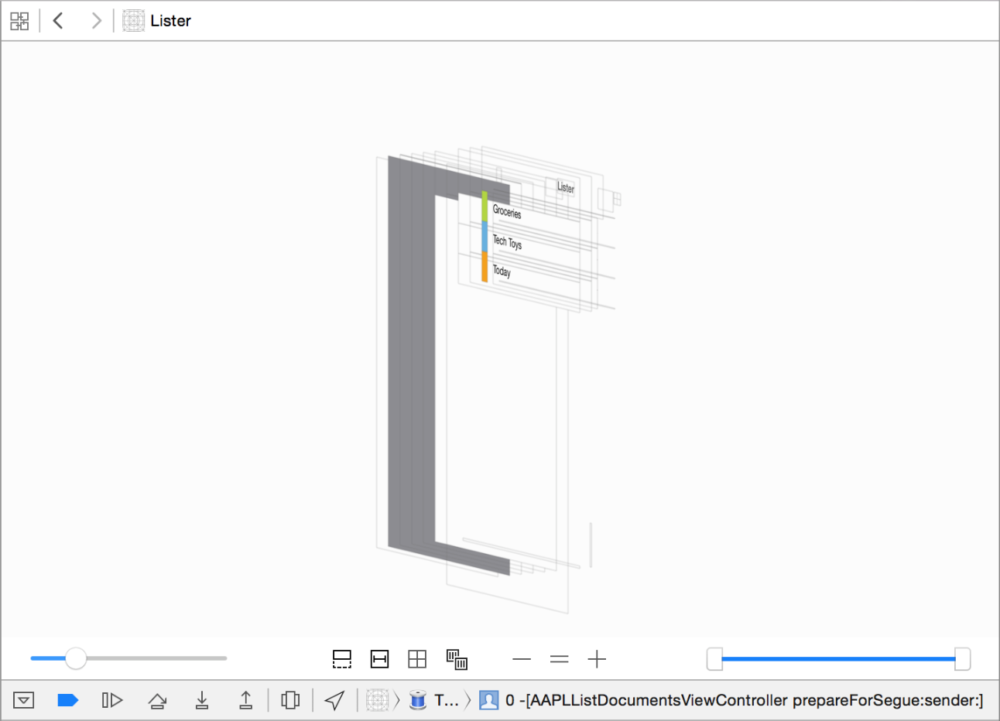
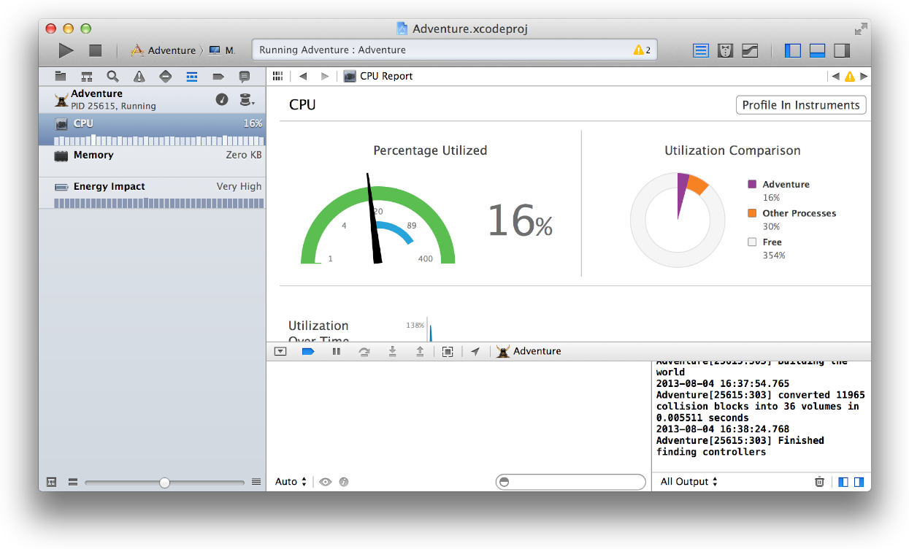
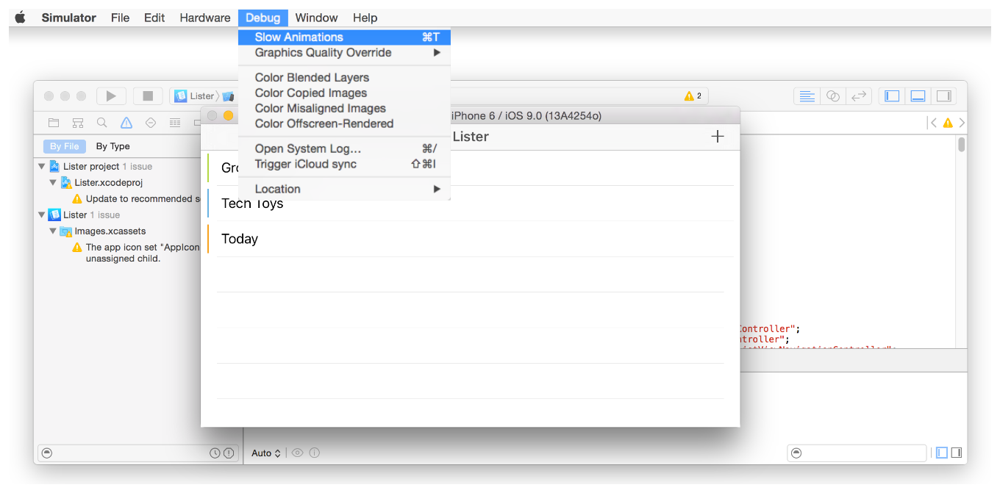
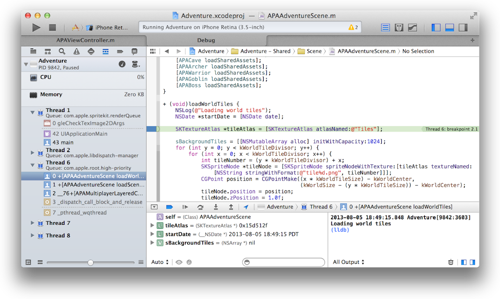

## 1. Using the Debugger

After you click the Run button in the workspace toolbar and your app builds successfully, Xcode runs your app and starts a debugging session. You can debug your app directly within the source editor with graphical tools such as data tips and Quick Look for the value of variables.

The debug area and the debug navigator let you inspect the current state of your running app and control its execution.

Creating a quality app requires that you minimize your app’s impact on your users’ systems. Use the debug gauges in the debug navigator to gain insight into your app’s resource consumption, and when you spot a problem, use Instruments to measure and analyze your app’s performance. Use the energy guides to minimize your impact on battery life. For more information, see *Energy Efficiency Guide for iOS Apps* and *Energy Efficiency Guide for Mac Apps*.

If you are developing an iOS or watchOS app, use Simulator to find major problems during design and early testing.

You can configure Xcode to help you focus on your debugging tasks. For example, when your code hits a breakpoint, you can make Xcode automatically play an alert sound and create a window tab named Debug, where Xcode displays the debug area, the debug navigator, and your code at the breakpoint.

### Controlling Execution

Xcode lets you step through your code line by line to view your program’s state at a particular stage of execution. Use the debug area to control the execution of your code, view program variables and registers, view its console output, and interact with the debugger. You can also use the debug area to navigate the OpenGL calls that render a frame and to view the rendering-state information at a particular call.

Display the debug area by clicking the center button () in the view selector in the workspace window toolbar.

You can suspend the execution of your app by clicking the pause button (which toggles between  to pause and  to continue) in the debug area toolbar. To set a breakpoint, open a source code file and click the gutter next to the line where you want execution to pause. A blue arrow () in the gutter indicates the breakpoint. For more information on breakpoints, including how to set breakpoint actions and the different kinds of breakpoints, see [Xcode Help](https://help.apple.com/xcode).

When your app is paused, the currently executing line of code is highlighted in green. You can step through execution of your code using the Step Over (), Step Into (), and Step Out () buttons located in the bar at the top of the debug area. Step over will execute the current line of code, including any methods. If the current line of code calls a method, step into starts execution at the current line, and then stops when it reaches the first line of the called method. Step out executes the rest of the current method or function.

### Viewing State Information

When execution pauses, the debug navigator opens to display a stack trace. Select an item in the debug navigator to view information about the item in the editor area and in the debug area. As you debug, expand or collapse threads to show or hide stack frames.

Hover over any variable in the source code editor to see a data tip displaying the value for the variable. Click the Inspector icon () next to the variable to print the Objective-C description of the object to the debug area console and to display that description in an additional popover.

Click the Quick Look icon () to see a graphical display of the variable’s contents. You can implement a custom Quick Look display for your own objects. See *Quick Look for Custom Types in the Xcode Debugger*.

### Finding Memory Corruption

Memory corruption crashes can be hard to reproduce and even harder to find. Address sanitizer adds instrumentation to your app that enables Xcode to stop your app where the corruption happens. Address sanitizer finds problems such as accessing deallocated pointers, buffer overflow and underflow of the heap and stack, and other memory issues.

To use address sanitizer, enable it in the debug scheme for your target, then run and use the app. Xcode monitors memory use and stops your app on the line of code causing the problem and opens the debugger. Use the debugger to isolate the cause.

For more information on using address sanitizer, see [Using the Address Sanitizer](https://developer.apple.com/library/archive/documentation/DeveloperTools/Conceptual/debugging_with_xcode/chapters/special_debugging_workflows.html#//apple_ref/doc/uid/TP40015022-CH9-SW23)

### Debugging Metal

Metal takes full advantage of modern GPUs so your apps can give the best user experience. You can use Metal to accelerate both graphics and computation, all using a streamlined API. For information on debugging Metal, see [Metal Tips and Techniques](https://developer.apple.com/library/archive/documentation/Miscellaneous/Conceptual/MetalProgrammingGuide/Dev-Technique/Dev-Technique.html#//apple_ref/doc/uid/TP40014221-CH8). For general information, see [Metal for Developers](https://developer.apple.com/metal/) on the developer website and *Metal Programming Guide*.

### Debugging OpenGL

When you build and run an OpenGL ES app on a connected device, the debug area toolbar includes a Frame Capture button (). Click that button to capture a frame. You can use OpenGL ES frame capture to:

- Inspect OpenGL ES state information
- Introspect OpenGL ES objects such as view textures and shaders
- Step through the state calls that precede each draw call and watch the changes with each call
- Step through draw calls to see exactly how the image is constructed
- See in the assistant editor which objects are used by each draw call
- Edit shaders to see the effect upon your app

The screenshot shows the use of the debugger to view components of a rendered frame. The debug navigator on the left shows parts of the rendering tree, and the main debug view shows the color and depth sources for the rendered frame as well as other image sources.

For more help debugging OpenGL ES, see related items in [Xcode Help](https://help.apple.com/xcode) and [Xcode Help](https://help.apple.com/xcode).

## 2. Examining the View Hierarchy

Click the Debug View Hierarchy button () in the bar at the top of the debug area to inspect a 3D rendering of the view hierarchy of your paused app. You can:

- Rotate the rendering by clicking and dragging in the canvas.
- Increase or decrease the spacing between the view layers using the slider on the lower left.
- Change range of visible views using the double ended slider on the lower right. Move the left handle to change the bottommost visible view. Move the right handle to change the topmost visible view.

- Reveal any clipped content of the selected view by clicking the Show clipped content button ().
- Reveal any Auto Layout constraints of the selected view by clicking the Show constraints button ().
- Increase and decrease the magnification using the Zoom In (+) and Zoom Out (-) buttons.

For more help debugging views, see [Debugging View Hierarchies](https://developer.apple.com/library/archive/documentation/DeveloperTools/Conceptual/debugging_with_xcode/chapters/special_debugging_workflows.html#//apple_ref/doc/uid/TP40015022-CH9-SW2).

## 3. Examining System Impact

The debug navigator displays gauges that provide insight into how your app is performing. For example, the CPU gauge shows a readout of your app’s CPU usage, making it easy to spot unexpected spikes. Depending on the capabilities of your app and the characteristics of its destination, gauges can report your app’s impact on memory, iCloud, OpenGL ES, energy, and the CPU.

To see a full report, click a gauge in the debug area. To perform a deeper analysis of your app’s performance, click the Profile in Instruments button.

For problem areas, the energy report offers a preliminary diagnosis of what may be plaguing your app.

For more help, see Using Debug Gauges.

## 4. Measuring Performance

## 성능 측정하기

The Instruments app, which is included with Xcode, gathers data from your running app and presents it in a graphical timeline. With Instruments, you can gather data about performance areas such as your app’s memory usage, disk activity, network activity, and graphics operations. By viewing the data together, you can analyze different aspects of your app’s performance to identify potential areas of improvement. You can also automate the testing of your iOS app’s user interface elements.

Xcode에 포함되어있는 Instruments(측정 도구들. 영어로 측정 기구, 기계를 뜻함) app은 실행중인 앱에서 데이터를 모으고, 그래픽 시간순서로 모아진 데이터를 보여줍니다. 측정 도구들로 앱의 메모리 사용량, 디스크 활동, 네트워크 활동, 그래픽 연산과 같은 성능 측면에 대한 데이터를 얻을 수 있습니다. 또한 데이터를 함께 봄으로써, 앱의 성능을 개선할 수 있는 잠재적안 부분을 명확히파악하는 등 다양한 측면을 분석하는 것이 가능합니다. IOS 앱안의 UI 요소 테스트들을 자동화할 수도 있습니다.

There are several ways to start Instruments from Xcode. For example:

- Click the Profile in Instruments button from a debug gauge report.
- Choose Product > Profile.
- Specify an Instrument in the Profile action for a scheme.

Xcode에서 성능 측정 도구들을 시작하는 여러 가지 방법이 있습니다. 

- 디버그 게이지 리포트에서 Instruments 버튼 안의 Profile을 클릭합니다.
- Product → Profile을 클릭합니다.
- Scheme에 Profile 활동 안의 Instrument를 명시합니다.

The Instruments app uses individual data collection modules, known as *instruments*, to gather data about a process over time. The Instruments app includes a library of templates. Each template contains instruments for obtaining a set of related information. The following figure shows the template selection that is displayed when you launch instruments for an app.

Intruments app은 앱의 실행 과정 전체의 데이터를 모으는 데이터 수집 모듈들을 사용할 수 있습니다. Instruments앱은 템플릿들을 포함하고 있고, 각 템플릿은 연관된 정보의 얻는데 사용되는 Instrument들을 포함합니다. 다음 사진은 Instruments 앱을 시작할 때 보여지는 템플릿 모음을 보여주고 있습니다.

After running a session, the Instruments window shows all the data for each instrument and provides many ways to explore the data.

앱을 실행하고 난 후에, Instruments 창은 각 Instrument에 대한 모든 데이터를 보여주고, 이 데이터들을 둘러보는 많은 방법들을 제공한다.

For more detailed information, see Performance Overview and Instruments User Guide.

좀 더 자세한 정보를 위해서는, [Performance Overview](https://developer.apple.com/library/archive/documentation/Performance/Conceptual/PerformanceOverview/Introduction/Introduction.html#//apple_ref/doc/uid/TP40001410) 와 [Instruments User Guide](https://developer.apple.com/library/archive/documentation/DeveloperTools/Conceptual/InstrumentsUserGuide/index.html#//apple_ref/doc/uid/TP40004652)를 참고하세요.

## 5. Simulating Problems

## 5. 시뮬레이터에 관련된 문제들

Simulator helps you find major problems in your app during design and early testing. For example, the Debug menu in Simulator offers tools that help you:

- Slow an animation to spot any problems
- Change the graphics quality
- Trigger iCloud sync
- Identify blended view layers that harm app performance
- Identify images whose source pixels aren’t aligned to the destination pixels
- See what content is rendered offscreen
- Simulate different locations

시뮬레이터는 디자인과 초기 테스트를 하는 동안 앱에서 문제점들을 찾을 수 있게 도와줍니다. 예를 들어 시뮬레이터의 Debug 메뉴는 다음과 같은 도구들을 제공하고 있습니다.

- 앱 안의 에러들을 발견하기 위해 앱의 실행 속도를 느리게 합니다.
- 그래픽 퀄리티를 변경할 수 있습니다.
- iCloud 동기화를 시작합니다.
- 앱 성능에 해가 되는 복잡한(혼합된) view 레이어들을 명확히 알려줍니다.
- 이미지 소스 픽셀들이 제대로 정렬되지 않은 이미지들을 명확히 알려줍니다.
- 화면에 렌더링되는 콘텐츠를 보여줍니다.
- 다른 위치에서 가상으로 앱을 실행합니다.

In every simulated environment in Simulator, the Home screen provides access to apps—such as Settings, Contacts, Maps, and Passbook—that are included with an iOS or watchOS device. You can perform preliminary testing of your app’s interaction with these apps in Simulator. For example, if you are testing a game, use Simulator to test that the game uses Game Center correctly.

시뮬레이터 내의 모든 가상 환경에서, 홈 스크린은 IOS또는 watchOS 장비의 앱들(세팅, 연락처, 지도, 결제 정보와 같은 것)에 대한 접근 권한을 제공합니다다. 시뮬레이터에서 이러한 정보들을 이용한 앱의 예비 테스트를 수행할 수 있습니다. 예를 들어, 만일 게임을 테스트한다면, 게임이 게임 센터를 정확하게 사용하는지 테스트하기 위해 시뮬레이터를 이용하면 됩니다.

The Accessibility inspector in Simulator helps you test the usability of your app regardless of a person’s limitations or disabilities by displaying information about each accessible element in your app. The inspector also enables you to simulate VoiceOver interaction with those elements. To start the Accessibility inspector, click the Home button in Simulator. Click Settings and go to General > Accessibility. Slide the Accessibility Inspector switch to On.

시뮬레이터에서 Inspector는 앱 안에서 접근할 수 있는 각 요소에 대한 정보를 게시함으로써, 사용자의 제한이나 장애에 관계 없이 앱의 이용성을 테스트하는 것을 돕습니다. inspector는 장애 요소들을 포함한 상태로 VoiceOver가 잘 작동하는지 테스트할 수도 있습니다. Inspector를 시작하기 위해서는 시뮬레이터에서 Home 버튼을 누르세요. Setting을 누르고 General > Accessibility를 클릭하고, Inspector 접근을 On으로 밀어서 활성화하면 됩니다.

You can test your app’s localizations in Simulator by changing the language. In Settings, go to General > International > Language.

기기의 언어를 바꾸는 것을 통해 시뮬레이터의 지역화를 테스트 할 수 있습니다. 세팅에서 General > International > Language에서 변경이 가능합니다.

Although you can test your app’s basic behavior in Simulator, the simulator is limited as a test platform for multiple reasons. For example:

- Because Simulator is an app running on a Mac, Simulator has access to the computer’s memory, which is much greater than the memory found on a device.
- Simulator runs on the Mac CPU rather than the processor of an iOS or watch OS device.
- Simulator doesn’t run all threads that run on devices.
- Simulator can’t simulate hardware features like the accelerometer, gyroscope, camera, or proximity sensor.

비록 시뮬레이터에서 앱의 기본적인 것들을 테스트할 수 있다고 할 지라도, 시뮬레이터는 다양한 이유 때문에 테스트 플랫폼으로서 제한 사항이 많습니다. 예를 들면 :

- 시뮬레이터는 기본적으로 Mac에서 동작합니다. 시뮬레이터는 컴퓨터 메모리에 접근할 수 있는데, 시뮬레이터가 사용하는  메모리는 실제 장비에서 사용하는 것보다 훨씬 많이 사용됩니다.
- 시뮬레이터는 Ios 또는 watchOS 장비의 프로세스가 아닌 Mac CPU에서 실행됩니다.
- 시뮬레이터는 실제 기기에서 실행하는 모든 스레드를 실행하지 않습니다.
- 시뮬레이터는 가속도계, 자이로스코프, 카메라 또는 근접 센서와 같은 하드웨어 기능을 실행할 수 없습니다.

While developing your app, run and test it on all of the devices and OS versions that you intend to support.

앱을 개발하는 동안 지원하길 원하는 모든 장비들과 OS 버전에서 테스트하고 실행하세요.

For more detailed information, see [Testing and Debugging in Simulator](https://developer.apple.com/library/archive/documentation/IDEs/Conceptual/iOS_Simulator_Guide/TestingontheiOSSimulator/TestingontheiOSSimulator.html#//apple_ref/doc/uid/TP40012848-CH4).

더 많은 정보를 위해서는 [Testing and Debugging in Simulator](https://developer.apple.com/library/archive/documentation/IDEs/Conceptual/iOS_Simulator_Guide/TestingontheiOSSimulator/TestingontheiOSSimulator.html#//apple_ref/doc/uid/TP40012848-CH4)를 참고하세요.

## 6. Customizing Your Workflow

## 6. 작업 과정 커스터마이징하기

Specify behaviors that affect your workflow through the Xcode Behaviors preferences. Choose Xcode > Behaviors to specify what should happen when a variety of events occur while building, running, and debugging your app.

Xcode Behaviors 환경 설정에서 작업 과정에서 중요한 작업들을 설정해보세요. 앱을 빌딩하고 실행하고, 디버깅하는 동안 다양한 이벤트가 일어날 때, 수행할 작업 과정을 설정하려면 Xcode > Behaviors 를 선택하세요.

For example, Xcode can display the debug area when your code pauses at a breakpoint, and it can display the issue navigator when a build fails.

예를 들어, Xcode는 앱의 코드가 breakpoint에서 멈출 때 debug 영역을 보여줄 수 있고, 빌드가 실패했을 때 issue navigator를 보여줄 수 있습니다.

In the screenshot below, behaviors are customized for whenever the code pauses. Here are some examples of customized behaviors:

- Play an alert sound at every pause.
- Create a tab named Debug in the workspace window for displaying the debug navigator.
- Show both the variables view and the console view in the Debug tab.
- Hide the utilities area in the Debug tab.

아래의 스크린샷에서, behaviors는 code가 멈추는 시점에 일어날 작업 과정이 커스터마이징되어있는 것을 볼 수 있습니다. 커스터마이즈된 behaviors의 몇 가지 예시가 있습니다.

- 모든 일시정지 상황 때마다 경고음을 실행합니다.
- workspace 창에 debug navigator를 보여주는 Debug라는 이름의 탭을 만듭니다.
- Debug 탭에서 variables, console 화면을 모두 보여줍니다.
- Debug tab에서 uitilities 영역을 숨깁니다.

As a result, when the code in the project hits a breakpoint, Xcode creates a Debug tab in the workspace window with the specified content.

결과적으로 프로젝트 안의 코드가 breakpoint에서 멈출 때, Xcode는 명시된 컨텐츠와 함께 workspace 창 안에 debug tab을 만듭니다.

You can design custom behaviors that are triggered by menu items or their keyboard equivalents. Choose Xcode > Preferences, select the Behaviors preferences pane, and click the Add button (+) at the bottom of the pane. Type the name of the new behavior, and press Return. Select checkboxes to specify what should happen when you invoke this behavior. For example, create a Unit Testing behavior that saves a snapshot of your project and runs your unit tests. After you’ve created a behavior, it appears in the Xcode > Behaviors menu.

메뉴 아이템들이나 키보드 동작과 같은 것들에 의해 일어나는 사용자 지정 동작을 설계할 수도 있습니다. Xcode > Preferences를 누르고, 동작 설정 화면 메뉴를 선택한 뒤, 화면 아래의 Add 버튼을 누르세요. 새로운 사용자 지정 동작의 이름을 기입하고, Return 버튼을 누르세요. 이 동작이 호출될 때 일어날 작업들을 명확하게 설정하기 위해 체크박스를 선택하세요. 구체적인 예시를 위해 프로젝트의 스냅샷을 저장하고 유닛 테스트들을 실행하는 Unit Testing 동작을 생성해보세요. 이 동작을 만든 후, 이 동작은 Xcode > Behaviors 메뉴에서 확인할 수 있습니다.

To assign a keyboard equivalent to a custom behavior, choose Xcode > Preferences and click Key Bindings. In the Key Bindings preferences pane, select the Customized tab to find the custom behavior you want. In the text field, enter the keys you want to use for the key binding in the text field, and click outside the text field to complete the operation.

사용자 지정 동작에 키보드 동작을 할당하려면, Xcode > Preferences 를 선택하고 Key Bingings를 선택하면 됩니다. Key Bindings preferences 화면에서 원하는 사용자 지정 동작을 찾기 위해 Customized 탭을 선택하세요. 텍스트 필드에서 텍스트 필드와 연결하길 원하는 키를 누르고 동작을 마무리하기위해 텍스트 필드 바깥을 선택하세요.

For more detail on types of breakpoints and breakpoint actions, see [Xcode Help](https://help.apple.com/xcode).

breakpoints와 breakpoint의 타입들에 대해 더 자세히 알려면 [Xcode Help](https://help.apple.com/xcode)를 참고하세요.