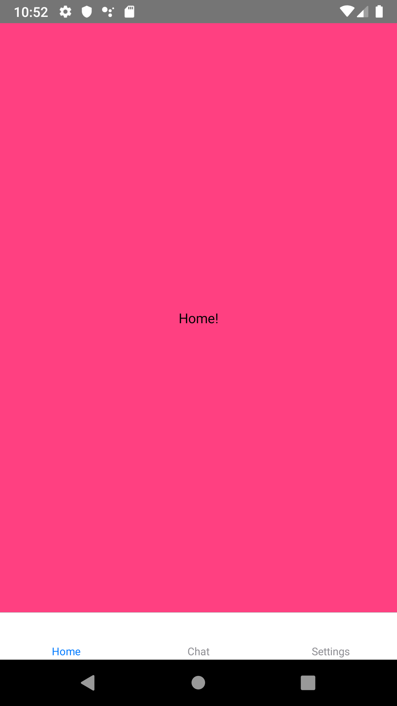
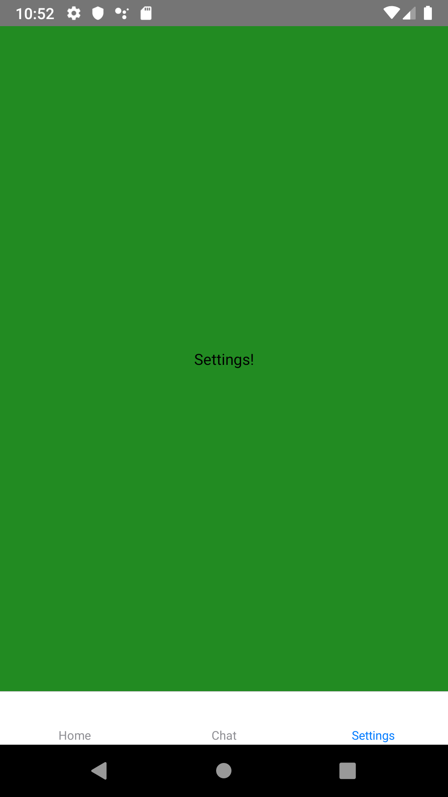
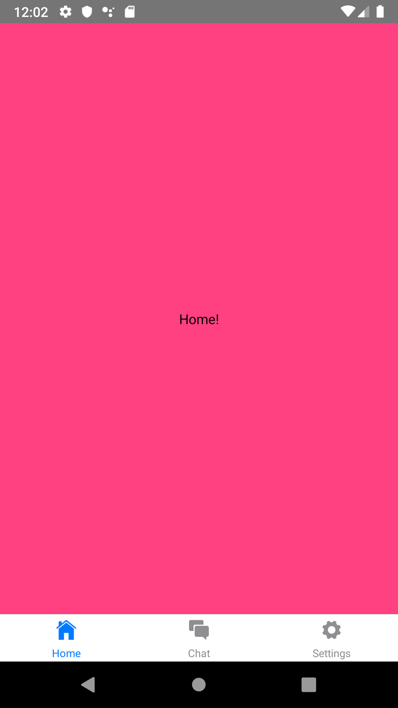
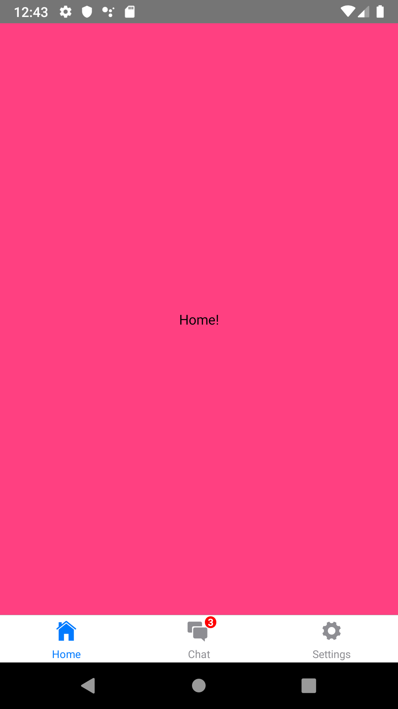

## React Navigation - Tab


1. #### RN Navigation tab 소개

   모바일 앱은 기본적으로 탭을 기반으로 한 네비게이션 스타일을 흔히 볼 수 있습니다. 탭은 주로 하단이나 헤더를 대신하여 상단에 주로 위치해있고, 이 탭을 이용하여 우리는 탭을 누르거나 swipe하는 방식으로  다른 라우트로 쉽게 전환할 수 있게 됩니다.  이번 튜토리얼에서는 React-Navigation을 사용하여 Tab Navigation을 만들어보겠습니다. 

   

2. #### RN Navigation tab 설치

   시작하기 전에 필요한 라이브러리들을 먼저 설치합니다.

   *// 이후 필요한 라이브러리 추가 예정*

   Install `react-navigation` dependency to import `createAppContainer`

   ```shell
   npm install -g react-native-cli
   ```

   Install `react-native-gesture-handler` dependency to support gesture navigation

   ```shell
   npm install react-native-gesture-handler --save
   ```

   Install `react-navigation-tabs` to import `createMaterialTopTabNavigator`

   ```shell
   npm install react-navigation-tabs --save
   ```

   Install `react-native-reanimated` for the tab animation (Used internally by react-navigation-tabs)

   ```shell
   npm install react-native-reanimated --save
   ```

   

   

3. #### createBottomTabNavigator, createMaterialBottomTabNavigator, createMaterialTopTabNavigator 

   어플리케이션에 탭을 추가하기 위해서는 React-Navigation에서는 기본적으로 3가지 라이브러리를 제공합니다.

   | **createBottomTabNavigator**         | **다른 라우트로 전환 할 수있는 간단한 탭이 화면 하단에 탭 네비게이션을 표시합니다.** |
   | **createMaterialBottomTabNavigator** | **화면 하단에 위치한 탭으로, material 스타일은 createBottomTabNavigator 보다 많은 스타일 효과를 제공합니다.** |
   | **createMaterialTopTabNavigator**    | **화면 상단에 위치한 탭으로, material 스타일은 createBottomTabNavigator 보다 많은 스타일 효과를 제공합니다.** |

   

4. #### RN navigation tab 기본 동작 예시

   *//프로젝트 파일 구조 넣을 예정*

   가장 먼저 탭을 누를 시 해당 라우트로 전환되는 기본 동작을 가진 예제입니다.

   createBottomTabNavigator을 사용하여 Home, Chat, Settings 총 3가지 화면으로 구성하였습니다.

   

   

   

   

   Home, Chat, Settings 3가지 화면에 대한 코드입니다.

   *HomeScreen.js*

   ```jsx
   import React from 'react';
   import {StyleSheet, Text, View} from 'react-native';
   
   class HomeScreen extends React.Component {
     render() {
       return (
         <View style={styles.container}>
           <Text>Home!</Text>
         </View>
       );
     }
   }
   
   const styles = StyleSheet.create({
     container: {
       flex: 1,
       justifyContent: 'center',
       alignItems: 'center',
       backgroundColor: '#ff4081',
     },
   });
   
   export default HomeScreen;
   ```

   *ChatScreen.js*

   ```jsx
   import React from 'react';
   import {StyleSheet, Text, View} from 'react-native';
   
   class ChatScreen extends React.Component {
     render() {
       return (
         <View style={styles.container}>
           <Text>Chat!</Text>
         </View>
       );
     }
   }
   
   const styles = StyleSheet.create({
     container: {
       flex: 1,
       justifyContent: 'center',
       alignItems: 'center',
       backgroundColor: '#673ab7',
     },
   });
   
   export default ChatScreen;
   ```

   *SettingsScreen.js*

   ```jsx
   import React from 'react';
   import {StyleSheet, Text, View} from 'react-native';
   
   class SettingsScreen extends React.Component {
     render() {
       return (
         <View style={styles.container}>
           <Text>Settings!</Text>
         </View>
       );
     }
   }
   
   const styles = StyleSheet.create({
     container: {
       flex: 1,
       justifyContent: 'center',
       alignItems: 'center',
       backgroundColor: '#228B22',
     },
   });
   
   export default SettingsScreen;
   
   ```

   App.js에서는 다음과 같이 navigator을 만들어주고 이를 navigate 할 수 있는 route들을 지정해줍니다.

   *App.js*

   ```jsx
   import {createAppContainer} from 'react-navigation';
   import {createBottomTabNavigator} from 'react-navigation-tabs';
   import HomeScreen from './screens/HomeScreen';
   import ChatScreen from './screens/ChatScreen';
   import SettingsScreen from './screens/SettingsScreen';
   
   const TabNavigator = createBottomTabNavigator({
     Home: {
       screen: HomeScreen,
     },
     Chat: {
       screen: ChatScreen,
     },
     Settings: {
       screen: SettingsScreen,
     },
   });
   
   export default createAppContainer(TabNavigator);
   ```

   

5. #### RN navigation tab에 react-native-vector-icons을 이용한 아이콘 및 뱃지 추가

   

   

   Tab Navigator에서 defaultNavigationOptions를 사용하여 Tab bar의 아이콘을 지정할 수 있습니다. react-native-vector-icons등을 사용하여 더 예쁘게 구현할 수 있습니다.

   [IonIcons]: https://ionicons.com/

   이 예제에서는 IonIcons의 IOS style 아이콘을 적용하였으며 위 링크에서 필요한 아이콘을 찾아 라우트 각각의 iconName을 설정해주었습니다.

   *App.js*
   
   ```jsx
   import React from 'react';
   import {createAppContainer} from 'react-navigation';
   import {createBottomTabNavigator} from 'react-navigation-tabs';
   import Ionicons from 'react-native-vector-icons/Ionicons';
   import HomeScreen from './screens/HomeScreen';
   import ChatScreen from './screens/ChatScreen';
   import SettingsScreen from './screens/SettingsScreen';
   
   const TabNavigator = createBottomTabNavigator(
     {
       Home: {
         screen: HomeScreen,
       },
       Chat: {
         screen: ChatScreen,
       },
       Settings: {
         screen: SettingsScreen,
       },
     },
     {
       defaultNavigationOptions: ({navigation}) => ({
         tabBarIcon: ({horizontal, tintColor}) => {
           const {routeName} = navigation.state;
           let iconName;
           if (routeName === 'Home') {
             iconName = 'ios-home';
           } else if (routeName === 'Chat') {
             iconName = 'ios-chatboxes';
           } else if (routeName === 'Settings') {
             iconName = 'ios-settings';
           }
           return (
             <Ionicons
               name={iconName}
               size={horizontal ? 20 : 25}
               color={tintColor}
             />
           );
         },
       }),
     },
   );
   export default createAppContainer(TabNavigator);
   

   ```

   + **아이콘에 뱃지 추가**

   아이콘에 뱃지가 필요한 경우 뷰 컨테이너를 추가하여 아이콘 방식으로 추가시켜줍니다.

   (아래 예제는 UI 상에서만 뱃지를 추가한 상태입니다.  redux, mobx 등을 통하여 상태관리를 해주어야합니다.)

   

   *IconWithBadge.js*
   
   ```jsx
   import React from 'react';
   import {StyleSheet, Text, View} from 'react-native';
   import Ionicons from 'react-native-vector-icons/Ionicons';
   
   export default class IconWithBadge extends React.Component {
     render() {
       const {name, badgeCount, color, size} = this.props;
       return (
         <View style={styles.container}>
           <Ionicons name={name} size={size} color={color} />
           {badgeCount > 0 && (
             <View style={styles.badge}>
               <Text style={styles.text}>{badgeCount}</Text>
             </View>
           )}
         </View>
       );
     }
   }
   
   const styles = StyleSheet.create({
     container: {
       width: 24,
       height: 24,
       margin: 5,
     },
     badge: {
       position: 'absolute',
       right: -6,
       top: -3,
       backgroundColor: 'red',
       borderRadius: 6,
       width: 12,
       height: 12,
       justifyContent: 'center',
       alignItems: 'center',
     },
     text: {
       color: 'white',
       fontSize: 10,
       fontWeight: 'bold',
    },
   });
   
   
   ```
   
   *App.js*
```jsx
   import React from 'react';
   import {createAppContainer} from 'react-navigation';
   import {createBottomTabNavigator} from 'react-navigation-tabs';
   import Ionicons from 'react-native-vector-icons/Ionicons';
   import HomeScreen from './screens/HomeScreen';
   import ChatScreen from './screens/ChatScreen';
   import SettingsScreen from './screens/SettingsScreen';
   import IconWithBadge from './IconWithBadge';
   
   const HomeIconWithBadge = props => {
     return <IconWithBadge {...props} badgeCount={3} />;
   };
   
   const TabNavigator = createBottomTabNavigator(
     {
       Home: {
         screen: HomeScreen,
       },
       Chat: {
         screen: ChatScreen,
       },
       Settings: {
         screen: SettingsScreen,
       },
     },
     {
       defaultNavigationOptions: ({navigation}) => ({
         tabBarIcon: ({horizontal, tintColor}) => {
           const {routeName} = navigation.state;
           let IconComponent = Ionicons;
           let iconName;
           if (routeName === 'Home') {
             iconName = 'ios-home';
           } else if (routeName === 'Chat') {
             iconName = 'ios-chatboxes';
             IconComponent = HomeIconWithBadge;
           } else if (routeName === 'Settings') {
             iconName = 'ios-settings';
           }
           return (
             <IconComponent
               name={iconName}
               size={horizontal ? 20 : 25}
               color={tintColor}
             />
           );
         },
       }),
     },
   );
export default createAppContainer(TabNavigator);
   
```

------


#### ?. 탭에서의 이동(뒤 챕터로 수정 예정)

   뷰에서 다른 뷰로 전환할 때 아래에 코드를 사용합니다.

```jsx
   this.props.navigation.navigate('Home');
```

   

*App.js*

   ```jsx
   
   import React from 'react';
   import {StyleSheet, Button, Text, View} from 'react-native';
   
   class SettingsScreen extends React.Component {
     render() {
       return (
         <View style={styles.container}>
           <Text>Settings!</Text>
           <Button
             title="Go to Home"
             onPress={() => this.props.navigation.navigate('Home')}
           />
         </View>
       );
     }
   }
   
   const styles = StyleSheet.create({
     container: {
       flex: 1,
       justifyContent: 'center',
       alignItems: 'center',
       backgroundColor: '#228B22',
     },
   });
   
export default SettingsScreen;
   
   ```

   