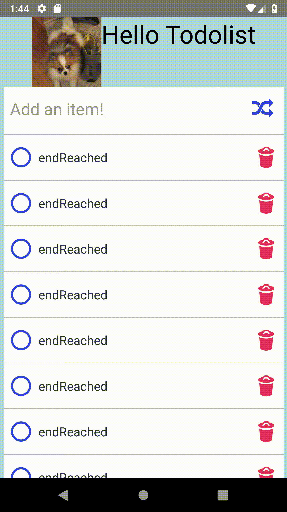

## 6. Flat List
In this sample we will change ScrollView to FlatList

## Steps to build it
* Copy [master](https://github.com/JeffGuKang/react-native-tutorial)
* Go to /Examples/BasicTutorial/AdvancedFeatures/04-shuffle
* Install npm packages:
```
npm install 
```

* We will change ScrollView to FlatList.
With [FlatList](https://facebook.github.io/react-native/docs/flatlist) you can easily make an efficient scrolling list of data. Imagine you have 10000+ items to render in scrolling list. If you use ScrollView, It will try to render all items at once, in that case your application may shuts down or cause performance issue. and for this reson your user could be unhappy.
In addition, it is supporting the most handy features:
1. Fully cross-platform.
2. Optional horizontal mode.
3. Configurable viewability callbacks.
4. Header support.
5. Footer support.
6. Separator support.
7. Pull to Refresh.
8. Scroll loading.
9. ScrollToIndex support.
10. Multiple column support.


[./pages/todoListPage/TodoListPage.js](https://github.com/JeffGuKang/react-native-tutorial/blob/c9b24deacfccb812259fc26ec1eda23a97e1dec1/Examples/BasicTutorial/AdvancedFeatures/06-flatlist/pages/todoListPage/TodoListPage.js)


* Disable image loading when todos of state updates.

```diff
import React, { useEffect, useState } from "react";
import { StyleSheet, View, Text, Image } from 'react-native';
import { TodoList } from "./todoList";
import axios from "../../config/axios";

const TodoListPage = props => {
    // todo: { id: number, text: string, checked: boolean }
    const [todos, setTodos] = useState([]);
    const [imageUrl, setImageUrl] = useState("https://facebook.github.io/react-native/img/tiny_logo.png");

    // componentWillUpdate
    // call api and get a dog image when todos updates
    useEffect(() => {
        requestAdorablePomeranianImage();

        // componentWillUnmount
        return () => {
            // cancel axios when componentWillUnmount()
            axios.cancel();
        }
-   }, [todos])
+   }, [])

    const requestAdorablePomeranianImage = () => {
        axios.get("pomeranian/images/random").then(res => {
            setImageUrl(res.data.message);
        }).catch(err => {
            console.log(err);
        })
    }

    return (
        <View style={styles.container}>
            <View style={styles.titleContainer}>
                <Image style={styles.titleImage} source={{ uri: imageUrl }} />
                <Text style={styles.title}>Hello Todolist</Text>
            </View>
            <TodoList todos={todos} setTodos={setTodos} />
        </View>
    )
}

```

[./pages/todoListPage/todoList/TodoList.js]()

* Let's change ScrollView to FlatList.


```diff
  import React, { useState } from 'react';
- import { StyleSheet, ScrollView, View } from 'react-native';
+ import { StyleSheet, FlatList, View } from 'react-native';
  import Item from './Item';
  import TextField from "./TextField";
  import runToast from "../../../components/toast"
  import shuffle from "../../../util/shuffle";

  const TodoList = ({ todos, setTodos }) => {
    const [text, setText] = useState("");
+   const [isRefreshing, setIsRefreshing] = useState(false);

    const onInputChangeHandler = text => {
      setText(text);
    };

    const addTodoHandler = e => {
      addTodo(text);
      setText('');
    };

    const addTodo = text => {
      if (!text) { return; }

      setTodos([
        ...todos,
        { id: Math.floor(Math.random() * 10000 + 1), text: text, checked: false },
      ]);
    };

    const removeTodo = id => {
      setTodos(todos.filter(todo => todo.id !== id));
    };

    const toggleCheckedTodo = id => {
      setTodos(
        todos.map(todo =>
          todo.id === id ? { ...todo, checked: !todo.checked } : todo,
        ),
      );
    };

    const onRemoveButtonClickHandler = id => e => {
      removeTodo(id);
      runToast(`${id}: is deleted!`, "LONG", "CENTER");
    }

    const onCheckButtonClickHandler = id => e => {
      toggleCheckedTodo(id);
    }

    const onShuffleClickHandler = e => {
      setTodos(shuffle(todos));
   }

+   const onRefreshHandler = async () => {
+     setIsRefreshing(true);
+     // Await for 1 sec.
+     await setTimeout(() => { }, 1000);
+     addTodo("refreshing");
+     setIsRefreshing(false);
+   }

+   const onEndReachedHandler = (info) => {
+     addTodo("endReached");
+   }

  return (
    <View>
      <TextField onSubmitEnd={addTodoHandler} value={text} onTextChange={onInputChangeHandler} onShuffleClick={onShuffleClickHandler} />
-     <ScrollView contentContainerStyle={styles.todoListContainer}>
-       {todos.map(todo => (
-         <Item
-           key={todos.id}
-           todo={todo}
-           onRemove={onRemoveButtonClickHandler}
-           onCheck={onCheckButtonClickHandler}
-         />
-       ))}
-     </ScrollView>
+     <FlatList
+       contentContainerStyle={styles.todoListContainer}
+       data={todos}
+       renderItem={({ item, index }) => (<Item
+         key={index}
+         todo={item}
+         onRemove={onRemoveButtonClickHandler}
+         onCheck={onCheckButtonClickHandler}
+       />)}
+       keyExtractor={todo => todo.id}
+       initialNumToRender={30}
+       inverted={false}
+       horizontal={false}
+
+       onRefresh={onRefreshHandler}
+       refreshing={isRefreshing}
+
+       onEndReachedThreshold={0.5}
+       onEndReached={onEndReachedHandler}
+     />
    </View>
  );
};

const styles = StyleSheet.create({
  todoListContainer: {
    backgroundColor: 'white'
  }
});

export default TodoList;
```

* Now try: 
```
npm start
```



