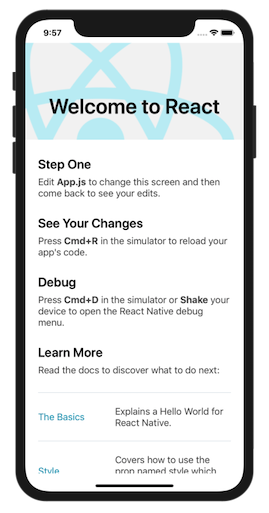
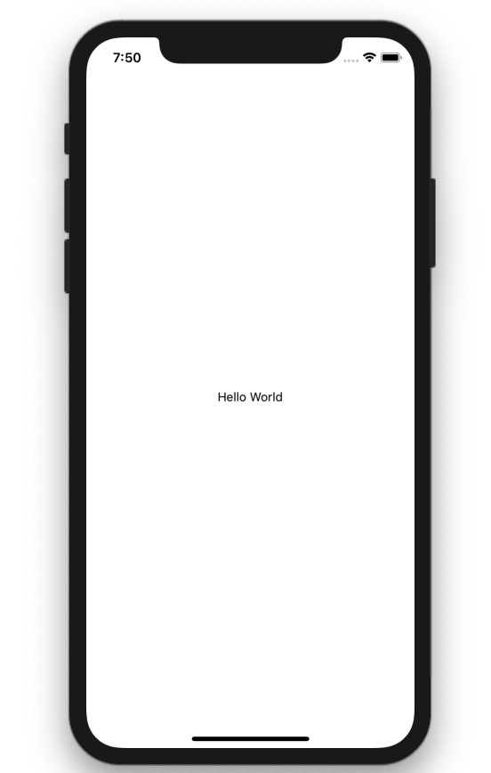

## 튜토리얼 소개

React Native를 사용하여 간단한 할 일 목록 애플리케이션을 만드는 튜토리얼 입니다. React Native로 만든 애플리케이션은 기본적으로 iOS와 안드로이드 플랫폼에서 모두 동작합니다. 하지만 iOS와 안드로이드 환경 간 레이아웃이나 기타 설정 등에 차이가 있을 수 있습니다. 이번 튜토리얼에서는 iOS를 기본 개발 환경으로 두고 진행합니다.

React Native 애플리케이션을 만드는 방법으로는 Expo 또는 React Native CLI를 사용할 수 있습니다. Expo를 사용하면 쉽게 프로젝트를 설치하고 실행할 수 있는 장점이 있지만 개발 환경이 Expo에서 제공하는 기능에 한정되어 Native 환경을 모두 이용할 수는 없다는 단점이 있습니다. React Native CLI를 이용하면 설치와 실행이 Expo보다는 다소 까다롭지만 Native 모듈에서 제공하는 기능을 모두 이용할 수 있다는 장점이 있습니다. 본 튜토리얼에서는 React Native CLI를 이용해 진행하겠습니다.

### 개발 환경 설정

튜토리얼을 시작하기 전에 개발 환경 설정을 하도록 하겠습니다.

환경설정 방법은 React Native 공식 홈페이지에 자세히 나와있습니다. 아래 링크를 참고하셔서 설정하시면 됩니다.

- [https://facebook.github.io/react-native/docs/0.60/getting-started](https://facebook.github.io/react-native/docs/0.60/getting-started)

### Create New Project

환경 설정을 모두 마치셨으면, React Native CLI 명령어로 React Native 프로젝트를 만들어보겠습니다.

폴더명은 "ReactNativeTodos"로 하여 프로젝트를 생성합니다.

```
react-native init ReactNativeTodos
```

ReactNativeTodos 프로젝트 폴더로 이동해서 `react-native run-ios` 명령어를 입력합니다.

```
cd ReactNativeTodos
react-native run-ios
```

시뮬레이터에서 아래와 같이 기본 화면이 뜨는 걸 확인합니다.



### Creating a Todo Application

**app.js** 파일을 다음과 같이 변경해보겠습니다.

```javascript
import React from 'react';
import {SafeAreaView, StyleSheet, Text} from 'react-native';

const App = () => {
  return (
    <SafeAreaView style={styles.container}>
      <Text>Hello World</Text>
    </SafeAreaView>
  );
};

const styles = StyleSheet.create({
  container: {
    flex: 1,
    backgroundColor: '#fff',
    alignItems: 'center',
    justifyContent: 'center',
  },
});

export default App;
```

터미널에 아래 명령어를 입력합니다.

```
react-native run-ios
```

다음과 같이 "Hello World"라는 글자가 나오는 걸 확인합니다.


