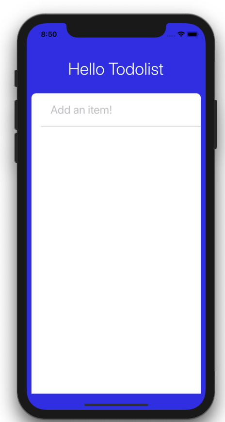

## Card View 추가하기

타이틀과 배경색을 변경했으면 다음은 스타일을 적용해서 모서리가 둥근 종이 모양의 뷰(view)를 만들어 보겠습니다. 이번에 만들 Card View는 할 일 목록을 입력하는 창과 목록 리스트를 보여주는 부분이 됩니다.

아래 코드를 앱 타이틀 바로 아래에 추가합니다.

```js
<View style={styles.card}>
  <TextInput style={styles.input} placeholder="Add an item!" />
</View>
```

컴포넌트의 `style` 속성을 이용하면 `StyleSheet`에 설정한 스타일이 적용됩니다.

```js
import React from 'react';
import {SafeAreaView, StyleSheet, TextInput, View, Text} from 'react-native';

const App = () => {
  return (
    <SafeAreaView style={styles.container}>
      <Text style={styles.appTitle}>Hello Todolist</Text>
      <View style={styles.card}>
        <TextInput style={styles.input} placeholder="Add an item!" />
      </View>
    </SafeAreaView>
  );
};

const styles = StyleSheet.create({
  container: {
    flex: 1,
    backgroundColor: '#3143e8',
  },
  appTitle: {
    color: '#fff',
    fontSize: 36,
    marginTop: 30,
    marginBottom: 30,
    fontWeight: '300',
    textAlign: 'center',
    backgroundColor: '#3143e8',
  },
  card: {
    backgroundColor: '#fff',
    flex: 1,
    borderTopLeftRadius: 10, // to provide rounded corners
    borderTopRightRadius: 10, // to provide rounded corners
    marginLeft: 10,
    marginRight: 10,
  },
  input: {
    padding: 20,
    borderBottomColor: '#bbb',
    borderBottomWidth: 1,
    fontSize: 24,
    marginLeft: 20,
  },
});

export default App;
```


