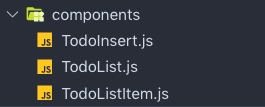

## 기능 별로 컴포넌트 분리하기

이제 애플리케이션의 기본 구조는 모두 갖추어졌으니 본격적으로 컴포넌트를 분리하여 UI를 만들어봅시다. 컴포넌트는 다음과 같이 세 가지로 분리하겠습니다.

- TodoInsert.js
- TodoList.js
- TodoListItem.js

**TodoInsert** 컴포넌트는 텍스트 입력창과 추가 버튼이 들어갈 부분입니다.

**TodoList** 컴포넌트는 추가된 아이템을 스크롤 뷰를 통해 보여주는 부분입니다.

**TodoListItem** 컴포넌트는 추가된 아이템 하나를 나타내는 부분입니다. 해당 아이템이 완료 되었는지 아닌지의 여부를 나타내는 상태값을 가지게 되며 완료 체크 이벤트와 삭제 이벤트 기능을 다루게 됩니다.

아래 그림을 참고하여 components 폴더를 만들고 해당 폴더 아래에 위의 세가지 컴포넌트 파일을 추가합니다.

