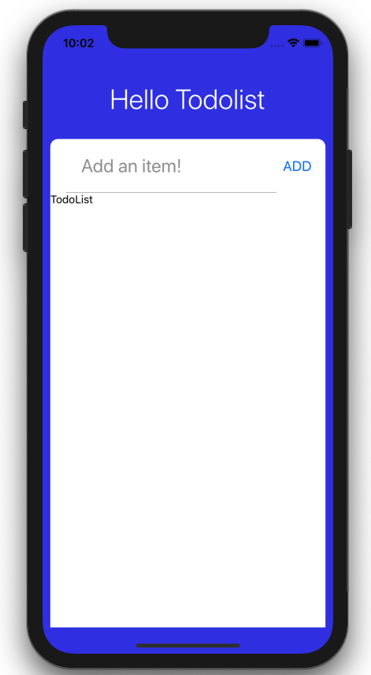

## TodoInsert

TodoInsert 컴포넌트 파일에 아래 코드를 추가합니다.

```js
// components/TodoInsert.js
import React from 'react';
import {Button, StyleSheet, TextInput, View} from 'react-native';

const TodoInsert = () => {
  return (
    <View style={styles.inputContainer}>
      <TextInput
        style={styles.input}
        placeholder="Add an item!"
        placeholderTextColor={'#999'}
        autoCorrect={false}
      />
      <View style={styles.button}>
        <Button title={'ADD'} />
      </View>
    </View>
  );
};

const styles = StyleSheet.create({
  inputContainer: {
    flexDirection: 'row',
    justifyContent: 'space-between',
    alignItems: 'center',
  },
  input: {
    flex: 1,
    padding: 20,
    borderBottomColor: '#bbb',
    borderBottomWidth: 1,
    fontSize: 24,
    marginLeft: 20,
  },
  button: {
    marginRight: 10,
  },
});

export default TodoInsert;
```

app.js 파일에서 TodoInsert 컴포넌트를 임포트 합니다.

```js
// App.js
...
import TodoInsert from './components/TodoInsert';

const App = () => {
  return (
    <SafeAreaView style={styles.container}>
      <Text style={styles.appTitle}>Hello Todolist</Text>
      <View style={styles.card}>
        <TodoInsert />
        <ScrollView>
          <View>
            <Text>TodoList</Text>
          </View>
        </ScrollView>
      </View>
    </SafeAreaView>
  );
};

const styles = StyleSheet.create({
...
}
```

앱을 실행하면 다음과 같은 화면이 나오게 됩니다.

