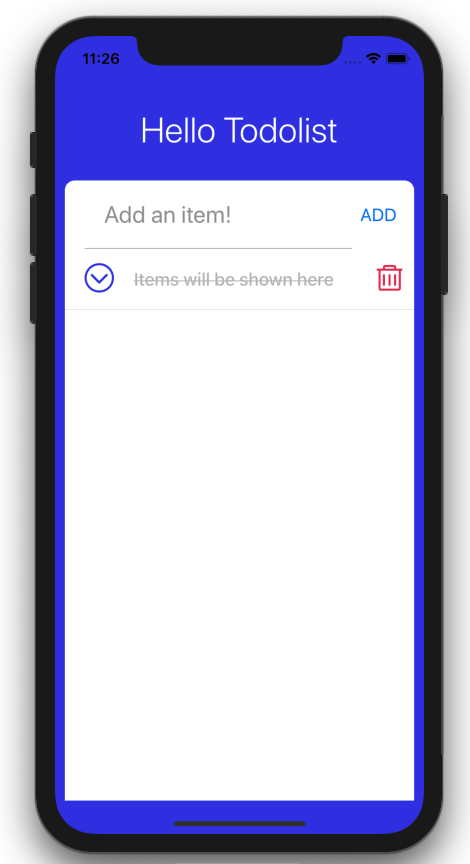

## 아이콘 추가하기

TodoListItem 컴포넌트 안에는 사용자가 입력한 할 일 목록 내용이 담기게 됩니다. 또한 해당 목록을 완료했는지 체크할 수 있는 체크 박스와 삭제 버튼을 추가해봅시다. 아이콘은 `react-native-vector-icons` 을 설치해서 사용하겠습니다.

터미널에 다음 명령어를 입력합니다.

```
yarn add react-native-vector-icons
```

iOS 또는 Android 프로젝트에서 해당 라이브러리를 설치한 후에는 네이티브 모듈에 링크(link)를 해줘야 합니다. 아래 명령어를 터미널에 입력해서 네이티브 모듈에 링크 시킵니다.

```
react-native link react-native-vector-icons
```

만약 위 명령어를 실행해도 잘 되지 않는다면 `react-native-vector-icons` [README](https://github.com/oblador/react-native-vector-icons/blob/master/README.md) 를 참고하시기 바랍니다. 설치 방법과 오류 해결 방법이 자세히 나와있습니다.

iOS 프로젝트의 경우 추가로 `pod install`을 해주어야 합니다. 본 튜토리얼은 iOS 개발 환경을 기준으로 하고 있으므로 아래 명령어를 입력하여 `pod install` 을 진행합니다.

```
cd ios && pod install && cd ..
```


`react-native-vector-icons`는 다양한 아이콘을 제공합니다. 첨부한 링크에 들어가서 본인 취향에 따라 다양한 아이콘을 선택해 사용하시면 됩니다. [https://oblador.github.io/react-native-vector-icons/](https://oblador.github.io/react-native-vector-icons/)

TodoListItem 컴포넌트에서 `react-native-vector-icons`를 임포트 하겠습니다.

```js
import Icon from 'react-native-vector-icons/AntDesign';
```

`StyleSheet` 속성 안에 완료한 목록을 표시해주는 스타일을 추가하겠습니다.

```js
const styles = StyleSheet.create({
  ...
  completeCircle: {
    marginRight: 20,
    marginLeft: 20,
  },
  strikeText: {
    color: '#bbb',
    textDecorationLine: 'line-through',
  },
  unstrikeText: {
    color: '#29323c',
  },
  buttonContainer: {
    marginVertical: 10,
    marginHorizontal: 10,
  },
});
```

설정한 스타일을 아이콘과 텍스트에 적용합니다.

```js
const TodoListItem = () => {
  return (
    <View style={styles.container}>
      <TouchableOpacity>
        <View style={styles.completeCircle}>
          <Icon name="circledowno" size={30} color="#3143e8" />
        </View>
      </TouchableOpacity>
      <Text style={[styles.text, styles.strikeText]}>
        Items will be shown here
      </Text>
    </View>
  );
};
```

앱을 실행하여 스타일이 적용된 것을 확인합니다.


### Icon for remove button

다음은 삭제 버튼을 추가해보겠습니다. 아래 코드를 `</Text>` 아래에 추가합니다.

```js
<TouchableOpacity style={styles.buttonContainer}>
    <Text style={styles.buttonText}>
      <Icon name="delete" size={30} color="#e33057" />
    </Text>
</TouchableOpacity>
```

삭제 버튼이 추가되었습니다.


