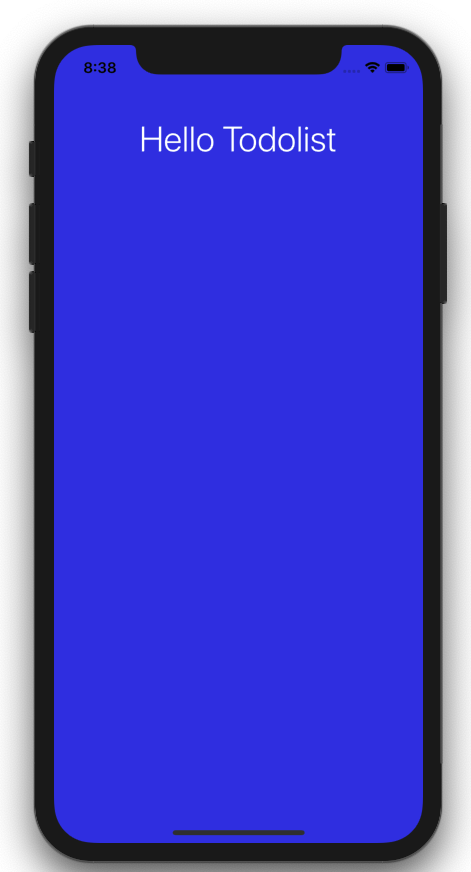

## Change Background and App Title

Here is the full code for our **app.js**

```js
import React from 'react';
import {SafeAreaView, StyleSheet, Text} from 'react-native';

const App = () => {
  return (
    <SafeAreaView style={styles.container}>
      <Text style={styles.appTitle}>Hello Todolist</Text>
    </SafeAreaView>
  );
};

const styles = StyleSheet.create({
  container: {
    flex: 1,
    backgroundColor: '#3143e8',
  },
  appTitle: {
    color: '#fff',
    fontSize: 36,
    marginTop: 30,
    marginBottom: 30,
    fontWeight: '300',
    textAlign: 'center',
    backgroundColor: '#3143e8',
  },
});

export default App;
```

You can see the app title and the background color applied.

