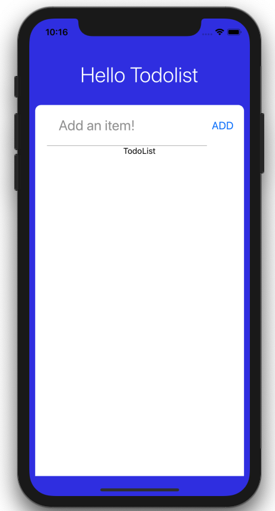

## TodoList

Add all of this code in TodoList component.

```js
// components/TodoList.js
import React from 'react';
import {StyleSheet, ScrollView, Text} from 'react-native';

const TodoList = () => {
  return (
    <ScrollView contentContainerStyle={styles.listContainer}>
      <Text>TodoList</Text>
    </ScrollView>
  );
};

const styles = StyleSheet.create({
  listContainer: {
    alignItems: 'center',
  },
});

export default TodoList;
```

In app.js, we need to import the TodoList component from our components folder.

```js
// App.js
...
import TodoList from './components/TodoList';

const App = () => {
  return (
    <SafeAreaView style={styles.container}>
      <Text style={styles.appTitle}>Hello Todolist</Text>
      <View style={styles.card}>
        <TodoInsert />
        <TodoList />
      </View>
    </SafeAreaView>
  );
};

const styles = StyleSheet.create({
...
}
```

