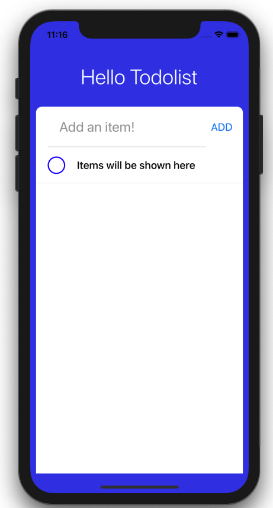

Add all of this code in TodoListItem component.

```js
// components/TodoListItem.js
import React from 'react';
import {View, Text, StyleSheet, TouchableOpacity} from 'react-native';

const TodoListItem = () => {
  return (
    <View style={styles.container}>
      <TouchableOpacity>
        <View style={styles.circle} />
      </TouchableOpacity>
      <Text style={styles.text}>TodoList items will be shown here</Text>
    </View>
  );
};

const styles = StyleSheet.create({
  container: {
    flex: 1,
    borderBottomColor: '#bbb',
    borderBottomWidth: StyleSheet.hairlineWidth,
    flexDirection: 'row',
    alignItems: 'center',
    justifyContent: 'space-between',
  },
  text: {
    flex: 5,
    fontWeight: '500',
    fontSize: 18,
    marginVertical: 20,
    width: 100,
  },
  circle: {
    width: 30,
    height: 30,
    borderRadius: 15,
    borderColor: 'blue',
    borderWidth: 2,
    marginRight: 20,
    marginLeft: 20,
  },
});

export default TodoListItem;
```

In TodoList.js, we need to import TodoListItem.

Add TodoListItem component inside ScrollView.

```js
// components/TodoList.js
...
import TodoListItem from './TodoListItem';

const TodoList = () => {
  return (
    <ScrollView contentContainerStyle={styles.listContainer}>
      <TodoListItem />
    </ScrollView>
  );
};

const styles = StyleSheet.create({
  listContainer: {
    alignItems: 'center',
  },
});

export default TodoList;
```

Run the app and check if the item we added appears.

