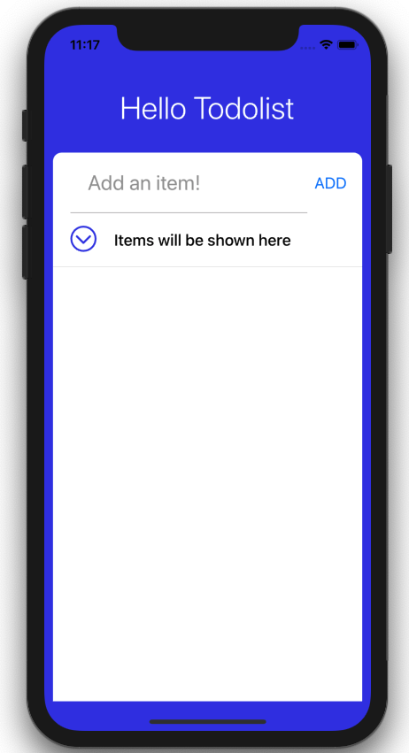

## Adding Icons

TodoListItem has a text value describing what to do and a circle to show it is completed or not. The circle in an item will be checked if it is completed. We also need to remove an item. So let's add icons of checked circle and remove button. We will use react native icons. 

First, install `react-native-vector-icons`

```
yarn add react-native-vector-icons
```

Before you can use them in your iOS or Android project, you also have to link the native modules. The quick way to do this is by using the following command:

```
react-native link react-native-vector-icons
```

If for any reason you have problems using `react-native link` to link the native modules, the `react-native-vector-icons` [README](https://github.com/oblador/react-native-vector-icons/blob/master/README.md) also provides detailed instructions 

We also need to run commands as below because we are using iOS in this project.

```
cd ios && pod install && cd ..
```

You can select various icons from this link: [https://oblador.github.io/react-native-vector-icons/](https://oblador.github.io/react-native-vector-icons/)

import `react-native-vector-icons` in TodoListItem component.

```js
import Icon from 'react-native-vector-icons/AntDesign';
```

Let's add style properties for marking completed item.

```js
const styles = StyleSheet.create({
  ...
  completeCircle: {
    marginRight: 20,
    marginLeft: 20,
  },
  strikeText: {
    color: '#bbb',
    textDecorationLine: 'line-through',
  },
  unstrikeText: {
    color: '#29323c',
  },
  buttonContainer: {
    marginVertical: 10,
    marginHorizontal: 10,
  },
});
```

Apply style on the Icon and text value.

```js
const TodoListItem = () => {
  return (
    <View style={styles.container}>
      <TouchableOpacity>
        <View style={styles.completeCircle}>
          <Icon name="circledowno" size={30} color="#3143e8" />
        </View>
      </TouchableOpacity>
      <Text style={[styles.text, styles.strikeText]}>
        Items will be shown here
      </Text>
    </View>
  );
};
```



### Icon for remove button

Let's add a remove button. Put the code just below </Text>

```js
<TouchableOpacity style={styles.buttonContainer}>
    <Text style={styles.buttonText}>
      <Icon name="delete" size={30} color="#e33057" />
    </Text>
</TouchableOpacity>
```