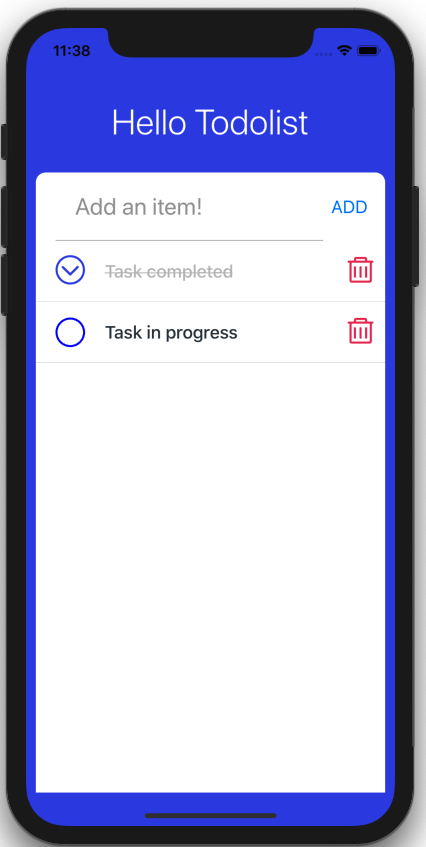

# React Native Tutorial: Hello Todolist - 2019

Build real native simple application with javascript



## How to run

Project sources: [Examples/BasicTutorial/BasicFeatures/TodoList]()

```
cd Examples/BasicTutorial/BasicFeatures/TodoList
yarn # Install dependencies
yarn start # run react-native ios app
```
