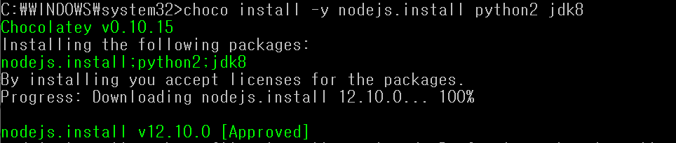
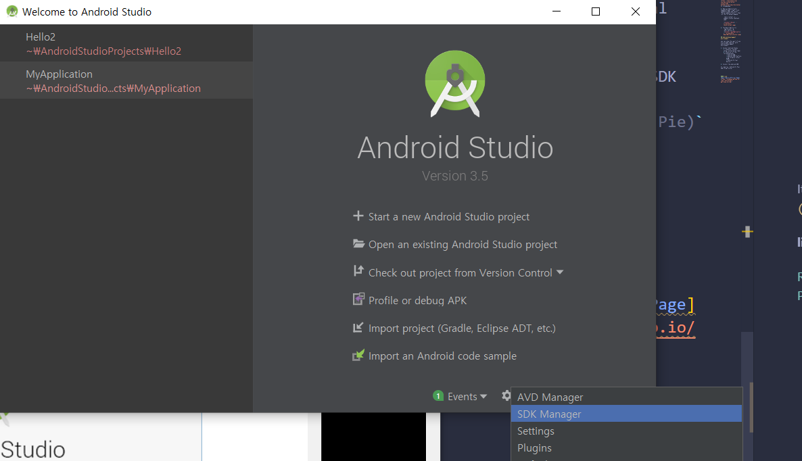
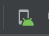
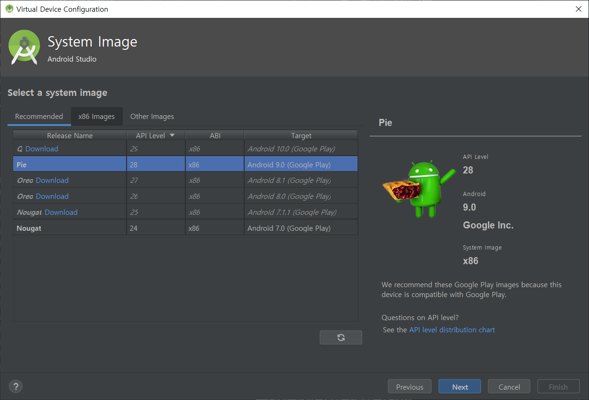
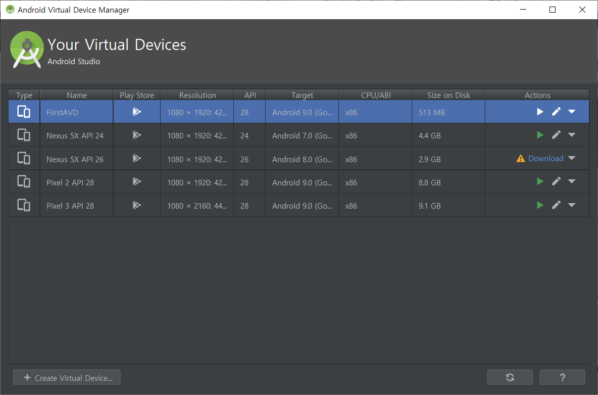

# Learn Additional Basic Functions Of React Native


# React Native CLI Quickstart

This is a basic setting for debugging chapter. if you already installed every dependency, you can go to debugging chapter.

__Development OS:__ Windows

__Target OS:__ Android

## Installing dependencies

What you will need: __Node, Python2, JDK__

(Make sure node 8.3 or newer, JDK is verson 8 or newer)

1. Installing Node and Python2 via [Chocolatatey](https://chocolatey.org/courses/installation/installing?method=installing-chocolatey) is recommended

2. Open an Administrator Command Prompt (right click Command Prompt and select "Run as Administrator"), then run the following command:

         choco install -y nodejs.install python2 jdk8

    

3. The React Native Cli

            npm install -g react-native-cli

    

## Android development environment

You can skip this part if you are already familiar with android development environment.

1. Install Android Studio
    1. Choose a 'Custom' setup (Installation type)
    2. Check all of the following boxes
        + Android SDK
        + Android SDK Platform
        + Performance (Intel HAXM)
        + Android Virtual Device

2. Install the Android SDK

    It requires `Android 9 (Pie)` SDK in particular
   
   
    1. Click on `Configure`
   
   2. Select `SDK Manager`

    Or you can find the SDK Manager withing the "Preferences" dialog,
    under Apprearance & Behavior → System Settings → Android SDK

    3. Select the `SDK Platforms` tab from within the SDK Manager
    
    4. Check the box next to `Show Package Details` in the bottom right corner.

    5. Expand `Android 9 (Pie)` entry
    
    6. Check the following items are selected
        + `Android SDK Platform 28`
        + `Intel x86 Atom_64 System Image` or `Google APIs Intel x86 Atom System Image`

    7. Select `SDK Tools` tab and check the box next to `Show Package Details`
    
    8. Expand the `Android SDK Build-Tools` entry and make sure that `28.0.3` is selected

    9. Click `Apply` to download and install Android SDK and related build tools


        

3. Configure the ANDROID_HOME environment variable

    + Open system pane and `System and Security`
    + Click on New
    + Open `Advanced tab and click on `Environment Variables`
    +Click on New 

    Copy this path and paste it

    ```c:\Users\YOUR_USERNAME\AppData\Local\Android\Sdk```

    + Open cmd to ensure the new environment variable is loaded 
    + You can find location of the SDK in Android Studio `Preferenced`, under `Appearance &Behavior` > `System Settings` > `Android SDK` 

4. Add platform-tools to Path

    + Open the system pane under System and Security
    + Click on Change settings
    + Open the Advanced tab and click on Environment Variables
    + Select the Path variable, then click Edit
    + Click New and add the path to platform-tools to the list

    The default location:

    ```c:\Users\YOUR_USERNAME\AppData\Local\Android\Sdk\platform-tools```

5. Creating a new application

            react-native init my_first_project

    And then you can start with this project 

    

6. Preparing the Android device

    You can use physical Android device or Android Virtual Device, either way will be available.

    1. Using a physical device
        plug it into your computer using a USB cable 

    2. Using a virtual device 
       +Open `./my_first_project/android

        

       +You can see the list of available Android Virtual Devices(AVDs) by opening the "AVD Manager"

        

     


       If you have just installed Android Studio, you will likely need to create a new AVD.

       + Select `Create Virtual Device`

         

       + Pick any phone from the list and click `Next`

         

       + Select the `Pie API Level 28 image`

            

       + Click `Next` then `Finish`
       + You should be able to click on the green tangle button to launch AVD 

            
       
        
        


    7.Running your React Native application

     ```
        cd my_first_project
        react-native run-android
     ```

    

    8. Modifying your app

        + Open `App.js` in your text edior and edit some lines
        + Press `R` twice or select `Reload` from Developer Mesu (`Ctrl + M`) to see your changes

    I changed some lines like this in app.js 

        <View style={styles.body}>
            <View style={styles.sectionContainer}>
              <Text style={styles.sectionTitle}>I changed a little bit.
              Press R key twice to reload. 
              </Text>

            </View>
          </View>
        
    


# Let's proceed next part!

- [Debugging](../debugging/debugging.md)
- [Improve-user-interface](../improve-user-interface.md)

## Source

[React Native Official Page](https://facebook.github.io/react-native/docs/getting-started)