# 디버깅

## 키보드 단축키 사용 설정

+ ios (필수조건)
    + 하드웨어 메뉴를 열고 키보드를 선택한 다음 하드웨어 키보드 연결이 체크되어 있는지 확인한다
    

## 어플 개발 메뉴(In-App) 접근법


+ 개발 메뉴 사용법
    1. 실제 디바이스를 흔들거나 하드웨어 메뉴에 있는 "흔들기"를 선택한다 (iOS 에뮬레이터)

    2. 키보드 단축키
        + `⌘D` (iOS 에뮬레이터)
        + `⌘M` (안드로이드 에뮬레이터, Mac OS)
        + `Ctrl+M` (Windows, Linux)
        + 개발 메뉴를 열기 위해 다음 명령어를 친다 
        `adb shell input keyevent 82` 
        

    ``` 개발 메뉴는 release builds에서는 사용할 수 없다.```

    + 개발 메뉴를 열고  **Toggle Selector** 를 선택한다

    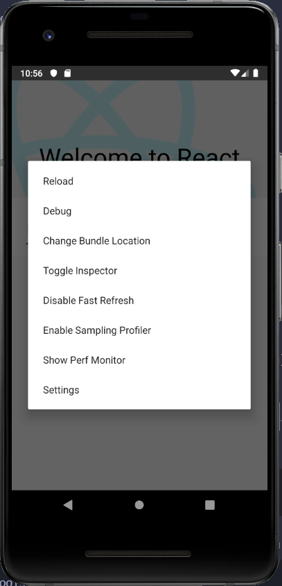
    
    + Inspector는 UI(사용자 인터페이스)를 클릭하면 그에 관한 정보를 보여준다 


    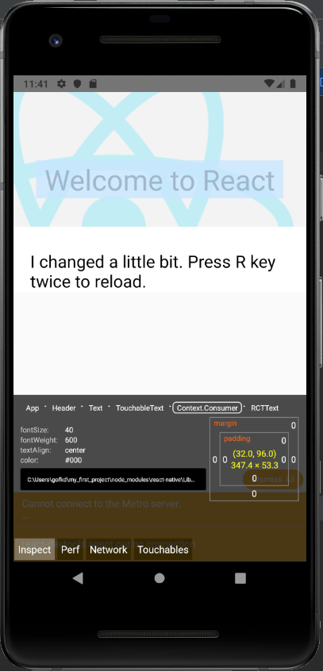

    + 개발 메뉴를 열고 Debug를 선택한다

     

    
    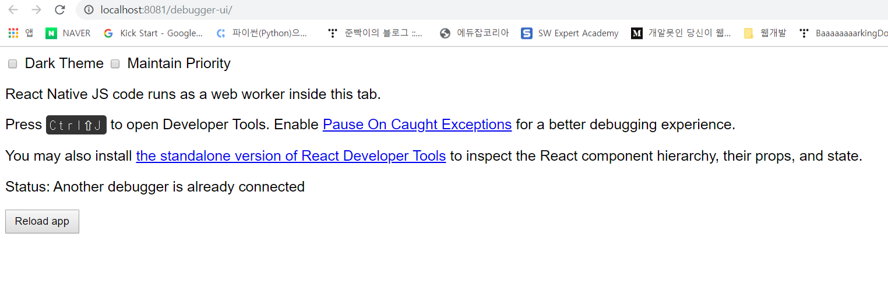


# 리액트 개발 툴 React Developer Tools

[리액트 개발 툴 스탠달론 버전](https://github.com/facebook/react/tree/master/packages/react-devtools)

+ 리액트 개발 툴 명령어 설치

            npm install -g react-devtools


+  `React-devtools`를 실행한다. 

        react-devtools

**리액트 버전**에 따라서 다음과 같이 업그레이드를 해준다.

        
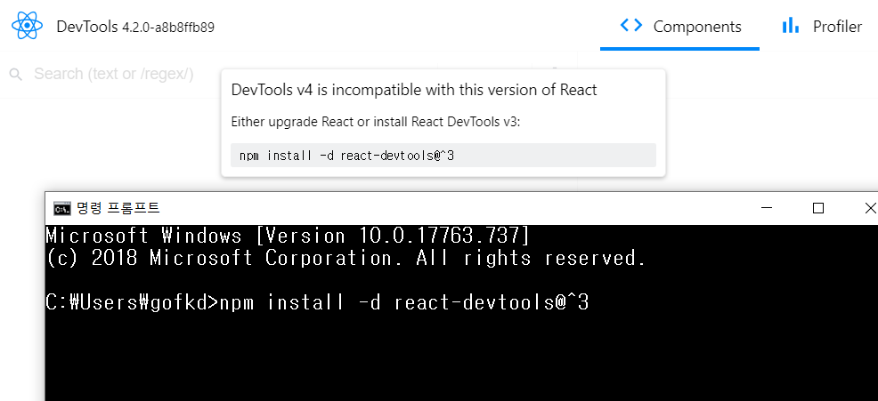

Package.json 파일에 *"devtools": react-devtools* 를 추가한다. 

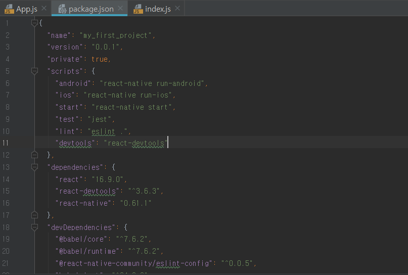

실행시키기 

            npm run devtools


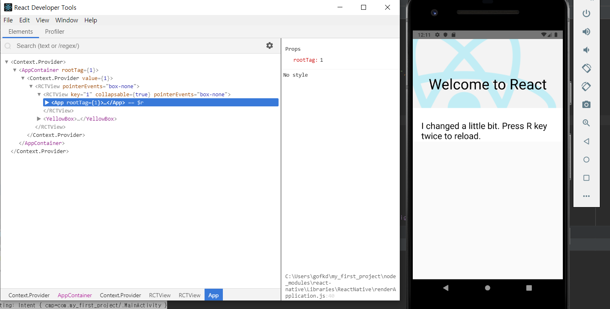

# React Native Inspector와 통합 사용법

1. 개발 메뉴를 열고 "Toggle Inspector" 를 선택한다. 

DevTools를 기본 UI로 사용한다.

2. 시뮬레이터에서 아무거나 선택을 해보자.
Devtools에 관련 컴포넌트가 표시된다.

텍스트 컴포넌트를 선택하면 다음과 같은 화면이 된다.

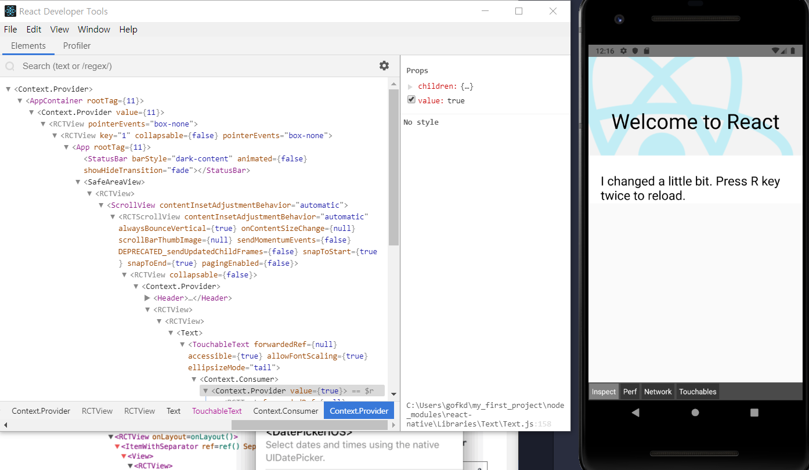

*Welcome to React*를 선택할 경우 화면: 


# 컴포넌트 인스턴스 살펴보기

브라우저 콘솔에서 리액트 컴포넌트의 props와 state를 살펴볼 수 있다.


 + 크롬 콘솔에 있는 드롭다운에 debuggerworker.js가 있는지 확인한다(필수)

    

 1. React DevTools에서 리액트 컴포넌트를 선택한다.

    

 2. 크롬 콘솔의 드랍리스트에서 debuggerworker.js를 선택한다.

     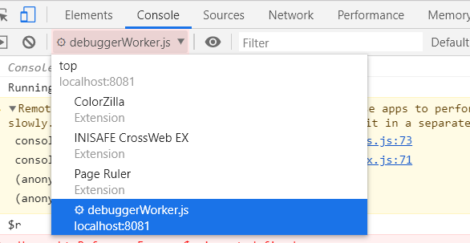

 3. 선택한 것을 크롬 콘솔에서 `$r`로 사용할 수 있다.
 (관련 props, state, 인스턴스 속성을 살펴볼 수 있다)

    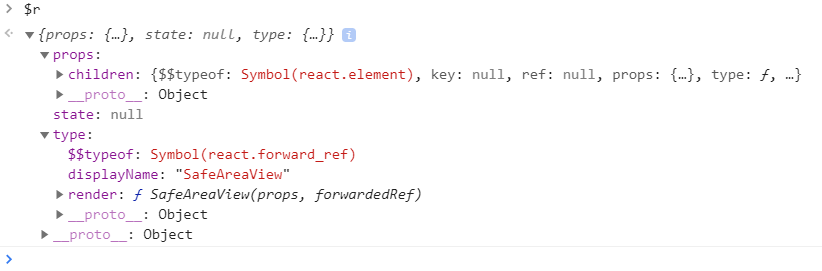


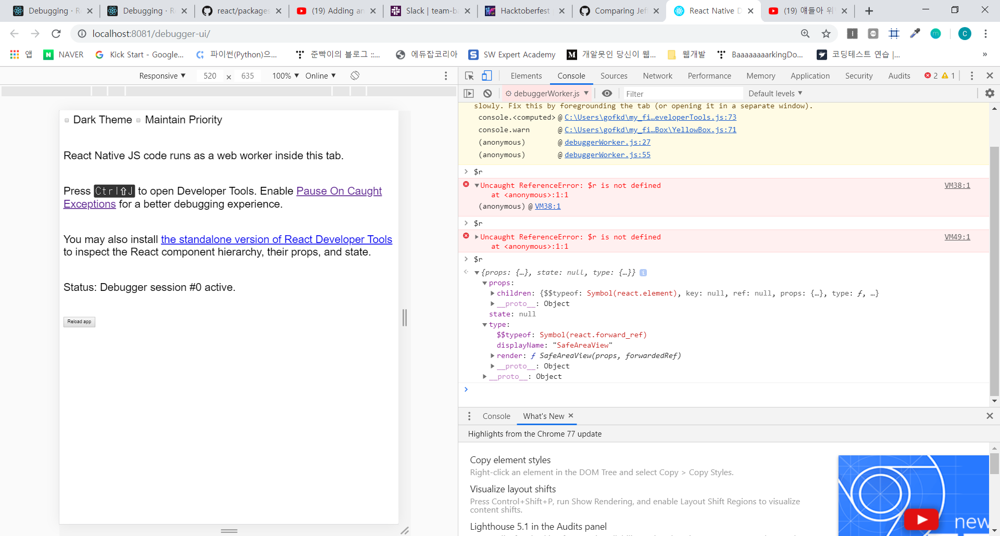
 
   


# 크롬 개발툴 

`주의: 리액트 개발 툴 크롬 익스텐션은 리액트 네이티브에서는 작동되지 않는다. 하지만 ` [standalone version](debugging.md#React-developer-tools)`버전을 사용할 수 있다.`


+ 개발 메뉴에서`Debug JS Remotely`를 선택한다.
 [http://localhost:8081/debugger-ui.](http://localhost:8081/debugger-ui.)


+ 크롬 메뉴에서 `Tools → Developer Tools`를 클릭하고 `Developer Tools.`을 연다.

+ 키보드 단축키
 + `⌘⌥I` (macOs)
 + `Ctrl+Shift+I` (Windows)

 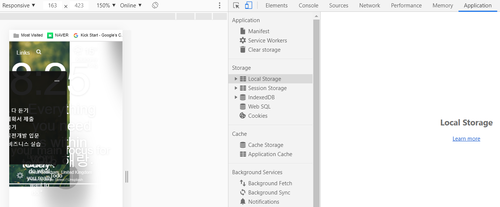

+ 한 단계 더 나가기 [Pause On Caught Exceptions](https://stackoverflow.com/questions/2233339/javascript-is-there-a-way-to-get-chrome-to-break-on-all-errors/17324511#17324511)


# 사파리 개발 툴

 ios버전의 어플을 `Debug JS Remotely`없이 디버그할 수 있다.

 + `Preferences → Advanced → "Show Develop menu in menu bar" 선택` 
 + JS Context 선택: `Develop → Simulator → JSContext` 
 + 콘솔과 디버거가 있는 사파리의 웹 Inspector가 열릴 것이다.

 ### 단점

 1. 디버깅 시에 소스맵이 없다.
 2. 어플이 로드될 때마다(라이브 리로드이든, 수동적인 리로드던지 간에) 새로운 JS Context가 만들어진다.
 3. `Automatically Show Web Inspectors for JSContext`를 선택하면 최신의 JSContext를 수동적으로 선택하지 않아도 된다.
 


# 어플 내 (In-app) 에러와 경고

에러와 경고는 개발 빌드에서 어플 내에 표시된다.


## 에러 표시

어플 내 에러표시는 어플 배경에 빨간 색 전체 화면으로 표시된다. (레드박스)

`console.error()`를 사용해서 수동적으로 생기게 할 수 있다.


## 경고 표시

경고 표시는 노란색 배경으로 표시된다.
(엘로우 박스라고 불린다)

+ 정보 더보기 (alerts를 선택하거나 무시할 수 있다.)

    `console.warn()`를 사용해서 수동적으로 만들 수 있다.

+ 개발 도중에 엘로우 박스를 설정해제하는 방법
 
    `console.disableYellowBox=true;` 

+ 특정 경고표시들은 다음과 같이 프로그램적으로 무시시킬 수 있다.

    ``` 
    import {YellowBox} from `react-native`;
    YellowBox.ignoreWarnings(['Warning: ...']);
    ```

+ CI/Xcode

    옐로우 박스는 `IS_TESTING` 환경 변수를 설정해서 설정해제 시킬 수 있다.

 레드박스와 옐로우 박스는 릴리즈 빌드 버전에서는 자동적으로 무시시킬 수 있다.


 # 다른 챕터 보기

- [리액트 네이티브 프로젝트 시작 환경 세팅하기](../01-basic-setting/baseic-settings-kr.md)
- [사용자 인터페이스 향상시키기](../03-improve-user-interface/improve-user-interface-kr.md)

# 출처

[리액트 네이티브 공식 페이지 - 디버깅](https://facebook.github.io/react-native/docs/debugging#reloading-javascript)


