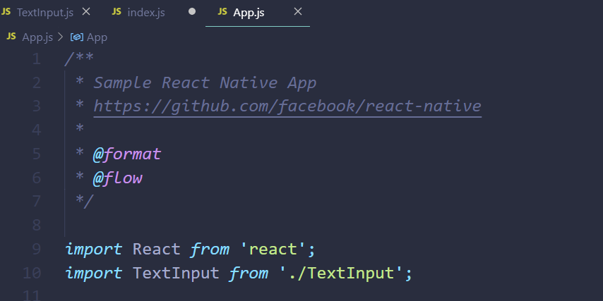
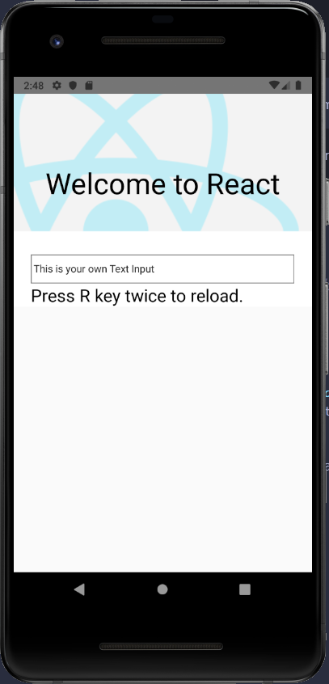
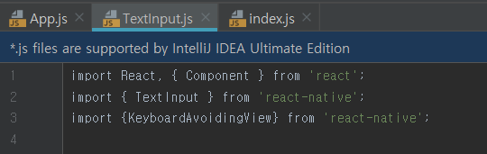
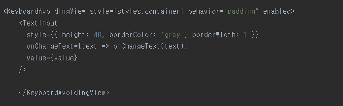
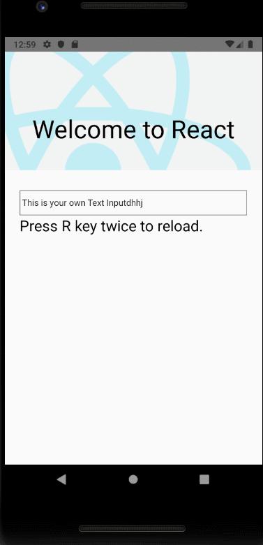

# Make Your Text Input 

  1. Make *TextInput.js* file (I made it at the same path with app.js and index.js)

     
         import React, { Component } from 'react';
         import { TextInput } from 'react-native';

          export default function UselessTextInput() {
            const [value, onChangeText] = React.useState('This is your own Text Input');

            return (
              <TextInput
                style={{ height: 40, borderColor: 'gray', borderWidth: 1 }}
                onChangeText={text => onChangeText(text)}
                value={value}
              />
            );
          }

  2. Import `textInput.js` from `app.js`

          import TextInput from './\TextInput';

      

  3. Reload your Android emulator 

      

# Make *Keyboard Avoiding View*

  < *Keyboard Avoiding View* >

  1. This component makes views to move out of the way of the virtual keyboard.

  2. It adjusts its height, position, or bottom padding based on the position of the keyboard automatically.

          import {KeyboardAvoidingView} from 'react-native';

          <KeyboardAvoidingView style={styles.container behavior="padding" enabled>
            ... your UI ...
          </KeyboardAvoidingView>;

  ## Example

  1. Import *KeyboardAvoidingView* from *TextInput.js* file
  
      

  2. Surround your *TextInput UI* with *KeyboardAvoidingView*

      

  3. Example Screen

      

  

    