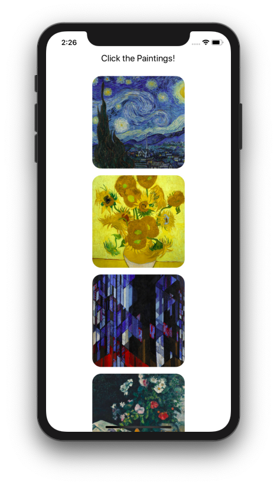

## Click the Painting! React Native 튜토리얼

이 앱은 이미지 리스트를 보여주고 이를 클릭하면 이미지의 세부 정보를 보여주는 간단한 예제입니다. 

아래와 같은 특징을 갖고 있습니다.

- React만 적용한 Level1 및 Redux와 Redux-Thunk를 추가한 Level2로 구성됩니다. 
- React Native CLI를 사용합니다. 
- 여러 화면을 사용하기 위한 라우팅 라이브러리로 React-Router를 사용합니다. 
- 디버깅 툴로는 In-app Inspector와 React-Devtools를 사용합니다.
- 모든 컴포넌트는 함수형으로 작성합니다.   

## 시작하기 전에

- [공식 문서](https://facebook.github.io/react-native/docs/getting-started)의 **React Native CLI Quickstart**를 참조하여 각자의 OS에 따라 필요한 소프트웨어를 설치합니다. 
- 전체 코드는 [Examples/Debugging](https://github.com/JeffGuKang/react-native-tutorial/tree/master/Examples/Debugging)에서 확인할 수 있습니다.