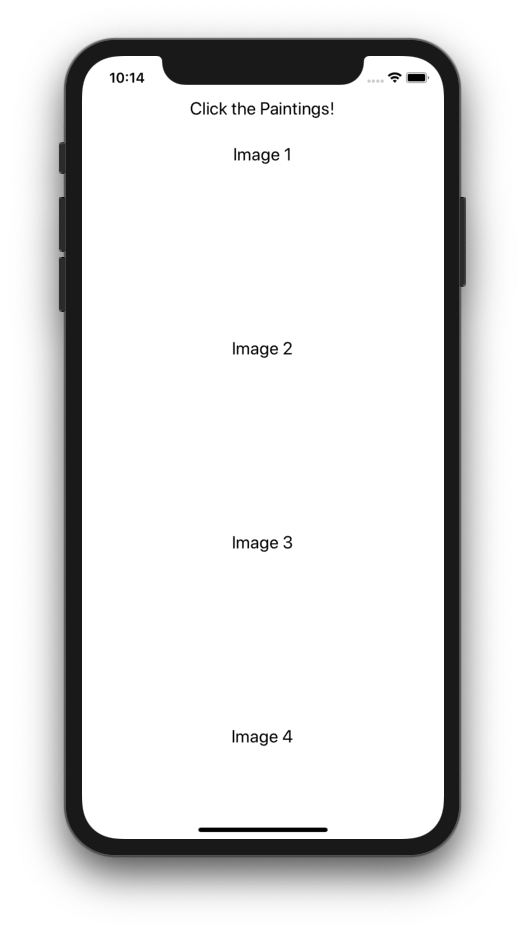

## Project 생성

프로젝트를 생성하기 전에 터미널에서 다음 명령어를 한 번 쳐보세요.

```bash
# NPM
$ npm list -g --depth=0

# Yarn
$ yarn global list --depth=0
```


글로벌 설치가 된 패키지를 확인하는 명령입니다. 이 중 `react-native-cli`가 포함되어 있다면 프로젝트를 생성하면 됩니다. 만약 포함되어 있지 않다면 먼저 설치해주세요.

```bash
$ npm install -g react-native-cli 
```

이제 프로젝트를 생성하고자 하는 상위 폴더에서 아래와 같이 명령하면 ClickThePaintings 라는 폴더가 생성될 것입니다. 이 작업은 생각보다 시간이 소요됩니다. 특히 `Installing required CocoaPods dependencies` 라는 문구가 나오고 오랜 시간 정지한 것처럼 보일 수도 있습니다. 하지만 설치 시간이 오래걸리는 것일뿐이므로, 프로세스를 중간에 exit하지 말고 더 기다려주세요. 

```bash
$ react-native init ClickThePaintings
```

폴더가 정상적으로 생성되었다면 이제 그 폴더 안으로 이동하세요. 

```bash
$ cd ClickThePaintings
```
그리고 정상적으로 빌드되는지 실행해보겠습니다. 다음 명령어를 치면 시뮬레이터가 자동으로 연결될 것입니다. 

```bash
$ react-native run-ios
```

## 폴더 생성 및 App.js 이동

디렉토리 구조를 만들고 시작하겠습니다. 앞으로 리액트 네이티브 코드들은 모두 src 라는 별도 폴더에 넣어 보관하려고 합니다. src 폴더를 생성한 뒤 루트 컴포넌트인 App.js 파일을 src 폴더 내부로 옮겨주세요. 그리고 src 폴더 내부에 **components**, **data**, **imgs** 폴더를 각각 생성해주세요. 

components는 리액트 네이티브 컴포넌트들을 보관할 폴더입니다. imgs에는 에제 구현에 필요한 이미지 파일을 넣어 두면 됩니다. data 폴더에는 컴포넌트에서 불러다가 사용할 수 있는 데이터를 만들어 넣을 것입니다.

```
├── src
|   ├── components
|   ├── data
|   ├── imgs
|   └── App.js
├── index.js
```

폴더를 전부 만들었다면, 마지막으로 index.js 파일에서 App의 임포트 경로를 `import App from './src/App';` 이렇게 바꾸어 주세요. App.js를 src 폴더 내부로 옮겼기 때문에 경로를 바꿔주어야 제대로 인식합니다. 

이제 필요한 패키지를 설치해보겠습니다. 

## React-Router-Native 설치하기

라우팅을 위해서 `react-router-native`를 사용하겠습니다. React Native에서는 앱을 여러 화면으로 구성하기 위한 여러가지 라우팅 라이브러리 옵션이 있습니다. 그 중 [공식 문서](https://facebook.github.io/react-native/docs/navigation)에도 언급되어 있는 라이브러리는 [React Navigation](https://reactnavigation.org/docs/en/getting-started.html)입니다. 

하지만 이번 예제에서는 [React Router Native](https://reacttraining.com/react-router/native/guides/quick-start)를 사용해보겠습니다. 웹에서 `react-router-dom`을 사용해본 적이 있다면 거의 똑같은 문법으로 앱에서도 적용할 수 있기 때문입니다. 

```bash
$ npm install --save react-router-native
```

다음은 모듈 시스템에서 절대 경로를 사용하기 위한 플러그인을 설치할 것입니다. 이 예제에서는 절대 경로를 사용하겠지만 구현하며 상대 경로를 사용할 것이라면 생략해도 무방합니다. 


## 절대 경로를 사용하기 위한 Babel 플러그인 설치하기(Optional)

모듈을 임포트할 때 절대 경로를 사용하기 위한 Babel 플러그인([babel-plugin-module-resolver](https://github.com/tleunen/babel-plugin-module-resolver))을 설치하겠습니다. 이 간단한 예제에서는 상대 경로를 사용해도 전혀 복잡하지 않습니다. 하지만 앱의 규모가 커지고 복잡해질수록, 모듈 임포트 경로가 `../../../src` 이런 식으로 복잡해질 수 있겠죠. alias를 활용한 절대 경로 사용은 이런 문제를 해결할 수 있습니다. 이 예제에서는 src의 alias를 `@`로 설정해서 사용해보도록 하겠습니다.

```bash
$ npm install --save-dev babel-plugin-module-resolver
```

플러그인을 설치했으면 이를 위한 설정을 추가해야합니다. babel.config.js 파일에 아래와 같은 코드를 추가하세요.

***babel.config.js***

```js
const path = require('path');
const commonPlugins = [
  [
    require.resolve('babel-plugin-module-resolver'),
    {
      root: [path.resolve('./')],
      alias: {'@': './src'},
    },
  ],
];

module.exports = {
  presets: ['module:metro-react-native-babel-preset'],
  plugins: [...commonPlugins],
};
```

위 코드에서 `alias` 부분에서 `./src`를 `@`로 설정합니다. 다만 `alias`를 사용하면서 에디터의 자동완성 기능을 사용하려면 추가 설정이 필요합니다. 이 부분은 사용하는 에디터마다 방식이 조금씩 다를 수 있으니 [공식 문서](https://github.com/tleunen/babel-plugin-module-resolver)에서 **Editors autocompletion** 부분을 참고하세요. 

설정이 끝났습니다. 이제 본격적으로 컴포넌트 코드를 작성해보도록 하겠습니다.

## TopBar 컴포넌트 작성하기

우리가 만들 예제는 앱에 접속했을 때

1. 이미지 리스트를 보여줍니다.
2. 특정 이미지를 클릭했을 때 해당 이미지의 세부 정보를 보여줍니다.
3. 간단하게 앱의 제목을 보여줍니다.
  
이 3가지 기능을 아래와 같은 이름으로 컴포넌트화해서 만들어 보겠습니다. 

1. ListView
2. DetailView
3. TopBar

먼저 TopBar를 만들어보겠습니다. 이 컴포넌트는 앱의 상단에 보여지며 앱의 이름이나 페이지 제목 등의 텍스트를 렌더링할 것입니다. src/components 폴더 밑에 *TopBar.js*를 생성하고 아래와 같이 작성해주세요.

***TopBar.js***

```jsx
import React from 'react';
import {View, Text, StyleSheet} from 'react-native';

const TopBar = () => {
  return (
    <View style={styles.container}>
      <Text style={styles.text}>Click the Paintings!</Text>
    </View>
  );
};

const styles = StyleSheet.create({
  container: {
    alignSelf: 'stretch',
    height: 100,
    flexDirection: 'row',
    backgroundColor: 'white',
    alignItems: 'center',
    justifyContent: 'center', 
    paddingLeft: 10,
    paddingRight: 10,
  },
  text: {
    paddingTop: 20,
    fontSize: 20,
  },
});

export default TopBar;
```

이제 작성한 TopBar 컴포넌트를 App 컴포넌트에서 렌더링합니다. 여기서 TopBar를 임포트할 때에 사용된 alias `@`는 src 폴더를 가리킵니다. [ScrollView](https://facebook.github.io/react-native/docs/using-a-scrollview)는 앞으로 렌더링할 이미지 리스트들이 스크롤되도록 하기 위해 사용한 것입니다. 

***App.js***

```jsx
import React from 'react';
import {StyleSheet, ScrollView} from 'react-native';
import TopBar from '@/components/TopBar';

const App = () => {
  return (
    <ScrollView style={styles.container}>
      <TopBar />
    </ScrollView>
  );
};

const styles = StyleSheet.create({
  container: {
    flex: 1,
  },
});

export default App;
```

앱의 제목을 나타내는 Click the Paintings!가 앱의 상단에 렌더링됩니다. 


## ListView 컴포넌트 작성하기

이제 이미지 리스트를 나타낼 ListView를 작성해보겠습니다. src/components 폴더 밑에 *ListView.js*를 만들어주세요. 실제 이미지 데이터를 사용하기 전에 테스트용 데이터를 넣어서 리스트가 잘 나오는지 확인해 봅니다. 

***ListView.js***

```jsx
import React from 'react';
import {
  View,
  StyleSheet,
  Dimensions,
  TouchableOpacity,
} from 'react-native';

const deviceWidth = Dimensions.get('window').width;

const ListView = () => {
  const data = [1,2,3,4,5] // 테스트용 데이터
  const imgList = data.map((item,index) => (
    <TouchableOpacity style={styles.row} key={index} activeOpacity={0.75}>
        <Text>Image {item}</Text>      
    </TouchableOpacity>
  ));

  return <View style={styles.container}>{imgList}</View>;
};

const styles = StyleSheet.create({
  container: {
    flex: 1,
    flexDirection: 'row',
    flexWrap: 'wrap',
  },
  row: {
    alignItems: 'center',
    backgroundColor: 'white',
    width: deviceWidth,
    height: deviceWidth / 2,
    marginBottom: 15,
  },
  image: {
    width: deviceWidth / 2,
    height: deviceWidth / 2,
    borderRadius: 20,
  },
});

export default ListView;

```

나중에는 실제 이미지를 넣겠지만 지금은 리스트가 잘 나오는지 확인하기 위해 테스트용 데이터 배열을 작성합니다. 

먼저 `data` 변수에 [1,2,3,4,5] 배열을 할당합니다. 그 다음 map()메서드를 통해 배열의 각 원소를 `Text` 컴포넌트와 `TouchableOpacity` 컴포넌트로 감싼 뒤 `imgList` 변수에 할당합니다. 그러고 나서 `imgList`를 리턴하여 렌더링합니다. 

***App.js***

```jsx
import React from 'react';
import {StyleSheet, ScrollView} from 'react-native';
import ListView from '@/components/ListView';
import TopBar from '@/components/TopBar';

const App = () => {
  return (
    <ScrollView style={styles.container}>
      <TopBar />
      <ListView />
    </ScrollView>
  );
};

...
```

이제 App에서 ListView 컴포넌트를 렌더링합니다. 



## In-app Inspector 사용하기 

리스트뷰를 렌더링하고 보니 margin이나 padding, height 등을 수정하고 싶을 수 있습니다. 이 때 어느 정도 수정해야 적당할지 시각적으로 확인할 수 있으면 좋을 것 같습니다. 

[Inspector](https://facebook.github.io/react-native/docs/debugging)를 사용하면 시뮬레이터에서 UI 엘리먼트의 속성을 확인할 수 있습니다. 시뮬레이터에서 `control + command + z` 또는 `command + D`를 누르거나 Hardware 메뉴에서 Shake Gesture를 클릭하세요. Debug Menu가 나타납니다. 이 중 Show Inspector를 클릭한 뒤 확인하고 싶은 UI 엘리먼트를 선택하면 해당 엘리먼트의 속성이 나옵니다. 이를 통해 엘리먼트들의 위계와 스타일 속성이 어떻게 적용되어 있는지 시각적으로 확인할 수 있습니다. Inspector를 숨기고 싶다면 다시 Debug Menu를 실행시키고 Hide Inspector를 클릭하면 됩니다. 


## Router 연결하기

리스트를 나타냈습니다. 이제 해야할 일은 해당 리스트 아이템을 클릭하면 세부 정보를 보여주는 화면으로 바뀌도록 해야 합니다. 이는 React-Router가 현재 경로에 따라 보여주는 컴포넌트를 다르게 렌더링함으로써 이루어집니다. *App.js*에 라우터 설정을 해보겠습니다. 

***App.js***

```jsx
...

import DetailView from '@/components/DetailView';
import {NativeRouter, Route} from 'react-router-native';

const App = () => {
  return (
    <NativeRouter> 
      <ScrollView style={styles.container}>
        <TopBar />
        <Route path="/" component={ListView} /> 
        <Route path="/detail/:id" component={DetailView} />
      </ScrollView>
    </NativeRouter>
  );
};

...
```

먼저 라우터를 사용하기 위해 `NativeRouter`로 감쌉니다. 그리고 `Route` 컴포넌트를 사용하여 어떤 **path**로 접근하면 어떤 **component**를 보여줄지 설정합니다. 우리는 루트 경로(`/`)로 접근하면 ListView 컴포넌트를 보여주도록 하고, `/detail/:id`로 접근하면 해당 id의 DetailView를 보여주도록 설정합니다. 여기서 /detail 뒤에 붙는 /:id는 해당 URL에 id를 패러미터로 전달하는 문법입니다.

예를 들어 
1. Image 1을 클릭하면 `/detail/1` 이라는 주소로 라우팅하도록 합시다. 
2. 그러면 /detail/ 뒤에 붙은 숫자 1이 패러미터로 전달될 것입니다. 이를 전달받아서 ID가 1인 아이템의 세부 정보를 보여주는 DetailView를 렌더링하면 됩니다.

위에서 1번 작업을 하기 위해서 ListView에서 [Link](https://reacttraining.com/react-router/native/api/Link) 컴포넌트를 사용할 것입니다. a 태그와 동일한 기능을 하지만 리액트 라우터를 사용할 때에는 a 태그 대신 Link 컴포넌트를 사용해야 합니다. a 태그는 페이지를 새로 불러오면서 컴포넌트가 갖고 있던 상태를 모두 날려버리기 때문입니다. 

2번 작업은 이미 [Route](https://reacttraining.com/react-router/native/api/Route) 컴포넌트로 DetailView를 만들었으니, 실제로 *DetailView.js*를 작성하여 id 패러미터가 잘 전달되는지 확인해 보겠습니다. 
   
이제 1번 작업부터 해보겠습니다. 

## ListView에서 Link 컴포넌트 사용하기

***ListView.js***

```jsx
...

import {Link} from 'react-router-native';

const deviceWidth = Dimensions.get('window').width;

const ListView = () => {
  const data = [1, 2, 3, 4, 5];

  const imgList = data.map((item, index) => (
    <TouchableOpacity style={styles.row} key={index} activeOpacity={0.75}>
      <Link to={`/detail/${item}`}> 
        <Text style={{fontSize: 20}}>Image {item}</Text>
      </Link>
    </TouchableOpacity>
  ));

  return <View style={styles.container}>{imgList}</View>;
};

...
```

data의 각 원소를 Link 컴포넌트로 감싼 부분만 추가되었습니다. 클릭하면 해당 DetailView로 라우팅되도록 `to` Props에 아이템 숫자를 그대로 넘겨주었습니다. 예를 들어 1번 아이템을 클릭하면 /detail/1로 라우팅 되도록 말입니다. 

이제 위에서 2번 작업에 해당하는, DetailView에서 해당 id를 패러미터로 전달받을 수 있도록 작성해보겠습니다. 

## DetailView 작성하기 

src/components 폴더 밑에 *DetailView.js*를 생성한 다음 아래처럼 작성해주세요. 

***DetailView.js***

```jsx
import React from 'react';
import {View, StyleSheet, Text, Button} from 'react-native';

const DetailView = ({match, history}) => {
  const handleBack = () => {
    history.goBack();
  };
  const id = match.params.id;

  return (
    <>
      <View>
        <Button onPress={handleBack} title="Back" />
      </View>
      <View style={styles.container}>
        <Text style={styles.heading}>Detail {id}</Text>
      </View>
    </>
  );
};

const styles = StyleSheet.create({
  container: {
    flex: 1,
    alignItems: 'center',
    flexDirection: 'column',
  },
  heading: {
    marginTop: 20,
    fontSize: 24,
    fontWeight: '600',
  },
});

export default DetailView;
```

라우트로 사용되는 컴포넌트라면 `match`, `history`, `location` 객체를 Props로 전달받게 됩니다. DetailView 컴포넌트는 App.js에서 확인할 수 있듯이 라우트로 설정하였기 때문에 위 객체들에 접근할 수 있습니다. DetailView 컴포넌트 내부에서는 이 중 match와 history만 사용할 것이므로 이 두 객체를 Props를 받아옵니다. 이 때 비구조화 할당 문법을 사용했는데 이에 익숙지 않다면 Destructing Props in React 등의 키워드로 검색해보세요. 

`history` 객체는 컴포넌트 내부 메서드에서 라우터 API를 사용할 수 있도록 합니다. 예를 들어서 페이지 이탈을 방지하거나 로그인 후 화면을 전환하는 등의 작업을 할 수 있습니다. 우리는 history 객체의 `goBack()` 메서드를 사용하여 특정 버튼을 누르면 뒤로 가도록 하는 기능을 구현하겠습니다.

`match` 객체는 내부에 params 객체를 갖고 있고, params 객체를 통해 URL 패러미터 값을 참조할 수 있습니다. 우리는 id 패러미터를 전달하도록 설정하였으므로 DetailView 컴포넌트에서는 `match.params.id` 로 전달된 패러미터 값을 조회할 수 있습니다. 

`location` 객체는 앱의 현재 주소에 대한 정보를 담고 있습니다. 

이제 리스트 아이템을 클릭하여 실제로 라우팅이 잘 일어나는지, DetailView에 위 객체들이 잘 전달되고 있는지 확인해보겠습니다.

이를 위해서 리액트 디버깅 툴인 [react-devtools](https://www.npmjs.com/package/react-devtools)를 설치하겠습니다. 

```bash
$ npm install -g react-devtools@^3 
```

여기서 글로벌 설치를 명령하는 g 플래그를 꼭 넣어주세요. 현재(19.11) 최신 버전(v4)으로 설치할 경우 React Native 지원이 되지 않을 수 있으니 3.x 버전으로 설치를 해줍니다. 

설치가 끝나면 터미널에 react-devtools 를 칩니다. 그러면 아래와 같이 창이 뜹니다. 만약 자동으로 시뮬레이터와 연결되지 않으면 시뮬레이터를 리로드(ctrl+r)해주세요. 


리스트 아이템을 클릭하면 DetailView 컴포넌트가 나타나고, React Devtools의 오른쪽 바에서 `history`, `location`, `match` 객체가 전달되고 있음을 알 수 있습니다. 그리고 각각 다른 아이템을 클릭할 때마다 경로와 id가 바뀌는 것도 확인할 수 있습니다.

하지만 이상하죠. 분명히 리스트 아이템을 클릭하면 DetailView로 화면 전환이 되어야 하는데 ListView가 그대로 렌더링되고 있습니다. React-Devtools에서는 분명히 DetailView가 나타나고 있습니다. 스크롤링해서 내려보면 DetailView가 앱의 하단에 보여지고 있다는 것을 알 수 있습니다. 즉 의도한 바와 다르게 ListView와 DetailView가 *같이* 보여지고 있는 것이죠.

이는 *App.js*에서 라우트 컴포넌트에서 path 설정할 때 빠뜨린 부분이 있기 때문입니다. 원래는 아래처럼 작성되어야 합니다. 

***App.js***

```jsx
...

const App = () => {
  return (
    <NativeRouter> 
      <ScrollView style={styles.container}>
        <TopBar />
        <Route path="/" exact component={ListView} /> 
        <Route path="/detail/:id" component={DetailView} />
      </ScrollView>
    </NativeRouter>
  );
};

...
```

뭐가 다른지 알겠나요? ListView를 렌더링하는 라우트 컴포넌트에서 `exact`가 추가되었습니다. 이는 정확히 `/` 경로일 때에만 ListView를 렌더링하라는 의미입니다. 이것이 추가되지 않으면 `/`가 포함된 다른 경로, 즉 `/detail/1` 이라는 주소일 때에도 ListView가 렌더링됩니다. 그렇기 때문에 정확한 라우팅을 위해서는 `exact`을 포함시키거나 `Switch` 컴포넌트를 사용해야 합니다. 여기서는 `exact`를 넣어주세요.

이제는 의도한 대로 스크린 전환이 됩니다. 

## 실제 이미지 렌더링하기 

이제 실제 이미지를 넣어 보겠습니다. src/imgs 폴더에 렌더링하고자 하는 png 파일들을 넣어주었습니다. 만약 예제 그림을 그대로 사용하고자 한다면 [깃허브](https://github.com/JeffGuKang/react-native-tutorial/tree/master/Examples/Debugging/ClickThePaintings/src/imgs)에서 파일을 다운로드하면 됩니다. 

imgs 폴더에 이미지 파일들을 넣었다면 이번엔 src/data 폴더 밑에 *index.js*를 만들고 아래 형식처럼 작성해주세요. 이미지 소스의 경로(imgSrc)는 반드시 포함되어야 하며 경로를 require()로 감싸주세요.

***data/index.js***

```jsx
export const data = [
  {
    id: 1,
    title: 'The-Starry-Night',
    artist: 'Vincent van Gogh',
    createAt: 1889,
    collector: 'MoMA New York',
    contents:
      '만든 위치: Saint-Rémy-de-Provence\n' +
      '크기: w921 x h737 mm\n' +
      'Style: Post-Impressionism\n' +
      'Provenance: Acquired through the Lillie P.Bliss Bequest\n' +
      'Original Title: La nuit étoilée',
    imgSrc: require('@/imgs/The-Starry-Night.png'),
  },
  {
    id: 2,
    title: 'Sunflowers',
    artist: 'Vincent van Gogh',
    createAt: 1889,
    collector: 'Van Gogh Museum Amsterdam',
    contents:
      '만든 위치: Arles\n' +
      '크기: w73 cm x h95 cm\n' +
      '작품유형: Still life\n',
    imgSrc: require('@/imgs/Sunflowers.png'),
  },
  {
    id: 3,
    title: 'The Cathedral',
    artist: 'František Kupka',
    createAt: 1913,
    collector: 'Museum Kampa Prague',
    contents:
      '만든 위치: Arles\n' +
      '크기: w1500 x h1800 mm\n' +
      'Style: abstract-art\n' +
      '작품유형: Painting\n' +
      '재료: Oil on Canvas',
    imgSrc: require('@/imgs/The-Cathedral.png'),
  },
  {
    id: 4,
    title: 'Still Life with Flowers and Fruit',
    artist: 'Paul Cézanne',
    createAt: 1890,
    collector: 'Alte Nationalgalerie, Staatliche Museen zu Berlin',
    contents:
      '크기: w82.0 x h65.5 cm\n' +
      '작품유형: Painting\n' +
      '재료: Oil on Canvas',
    imgSrc: require('@/imgs/still-life-with-flowers-and-fruit.png'),
  },
];
```

이제 ListView와 DetailView 컴포넌트도 수정하겠습니다. 테스트용 숫자 배열이었던 data를 임포트해온 data로 대체합니다. 그리고 이미지 소스와 id를 Image 컴포넌트의 Props로 제공합니다. 

***ListView.js***

```jsx
import React from 'react';
import {
  View,
  StyleSheet,
  Dimensions,
  Image,
  TouchableOpacity,
} from 'react-native';
import {Link} from 'react-router-native';
import {data} from '@/data';

const deviceWidth = Dimensions.get('window').width;

const ListView = () => {
  const imgList = data.map(item => (
    <TouchableOpacity style={styles.row} key={item.id} activeOpacity={0.75}>
      <Link to={`/detail/${item.id}`}>
        <Image
          key={item.id}
          source={item.imgSrc}
          resizeMode="cover"
          style={styles.image}
        />
      </Link>
    </TouchableOpacity>
  ));

  return <View style={styles.container}>{imgList}</View>;
};

const styles = StyleSheet.create({
  container: {
    flex: 1,
    flexDirection: 'row',
    flexWrap: 'wrap',
  },
  row: {
    alignItems: 'center',
    backgroundColor: 'white',
    width: deviceWidth,
    height: deviceWidth / 2,
    marginBottom: 15,
  },
  image: {
    width: deviceWidth / 2,
    height: deviceWidth / 2,
    borderRadius: 20,
  },
});

export default ListView;
```

DetailView 컴포넌트에서도 data를 불러옵니다. 그리고 data 배열의 인덱스는 0부터 시작하지만 id는 1부터 시작하므로, `data[id-1]`로 해당 이미지를 찾아 `detail`이라는 변수에 저장합니다. 그 다음 해당 객체의 키값을 키와 같은 변수 이름으로 저장한 다음 스타일을 입혀 렌더링합니다. 

***DetailView.js***

```jsx
import React from 'react';
import {View, StyleSheet, Text, Button, Image, Dimensions} from 'react-native';
import {data} from '@/data';

const deviceWidth = Dimensions.get('window').width;
const DetailView = ({match, history}) => {
  const handleBack = () => {
    history.goBack();
  };
  const id = match.params.id;
  const detail = data[id - 1];
  const {title, artist, createAt, collector, contents, imgSrc} = detail;
  return (
    <>
      <View>
        <Button onPress={handleBack} title="Back" />
      </View>
      <View style={styles.container}>
        <Text style={styles.heading}>{title}</Text>
        <Text style={styles.subheading}>{artist}</Text>
        <Image style={styles.img} source={imgSrc} />
        <View style={styles.subcontainer}>
          <Text>CreateAt: {createAt}</Text>
          <Text>Collector: {collector}</Text>
          <Text>{contents}</Text>
        </View>
      </View>
    </>
  );
};

const styles = StyleSheet.create({
  container: {
    flex: 1,
    alignItems: 'center',
    flexDirection: 'column',
  },
  heading: {
    marginTop: 20,
    fontSize: 24,
    fontWeight: '600',
  },
  subheading: {
    fontSize: 18,
    fontWeight: '600',
    marginBottom: 30,
  },
  subcontainer: {
    margin: 30,
    alignItems: 'flex-start',
  },
  img: {
    height: (deviceWidth * 2) / 3,
    width: (deviceWidth * 2) / 3,
    borderRadius: 20,
  },
});
export default DetailView;

```


이제 이미지 리스트가 보여집니다! 이제 마지막으로 하나만 더 해보겠습니다. 이미지를 클릭하고 DetailView 컴포넌트가 렌더링될 때, 위에 TopBar의 Text를 바꾸고 싶습니다. *Click the Paintings!*가 아닌 *Painting Detail*로요. 

그러면 DetailView가 렌더링되고 있다는 것을 TopBar 컴포넌트가 알 수 있게 하고, 그 때 Text를 다르게 설정하면 됩니다. React Router의 `location`을 이용해서 할 텐데요. 위에서 언급했듯이 `location`은 앱의 현재 주소에 대한 정보를 담고 있으므로, 현재 주소가 `/detail/id`인지 `/`인지 확인하고 그에 따라 다르게 텍스트를 설정하면 되겠죠. 

단 문제가 하나 있습니다. `history`, `match`, `location` 객체는 Route로 사용된 컴포넌트에게 Props로 주어지는 것입니다. *App.js*에서 확인할 수 있듯이 라우트로 사용된 컴포넌트는 ListView와 DetailView 뿐입니다. 

라우트 컴포넌트가 아닌 컴포넌트에서도 위 객체들에 접근할 수 있는 방법이 있습니다. 바로 [withRouter](https://github.com/ReactTraining/react-router/blob/master/packages/react-router/docs/api/withRouter.md)라는 [HOC(Higher Order Components)](https://ko.reactjs.org/docs/higher-order-components.html)를 사용하는 것입니다. 

*TopBar.js*를 아래처럼 수정해주세요. `withRouter`를 import한 뒤 TopBar 컴포넌트를 export할 때에 감쌉니다. 그리고 `location`을 Props로 받아 현재 주소를 나타내는 pathname에 따라 다른 Text를 설정합니다. 

***TopBar.js***

```jsx
import React from 'react';
import {StyleSheet, Text, View} from 'react-native';
import {withRouter} from 'react-router-native';

const TopBar = ({location}) => (
  <View style={styles.container}>
    <Text style={styles.text}>
      {location.pathname === '/' ? 'Click the Paintings!' : 'Painting Detail'}
    </Text>
  </View>
);

const styles = StyleSheet.create({
  container: {
    alignSelf: 'stretch',
    height: 100,
    flexDirection: 'row', // row
    backgroundColor: 'white',
    alignItems: 'center',
    justifyContent: 'center', // center, space-around
    paddingLeft: 10,
    paddingRight: 10,
  },
  text: {
    paddingTop: 20,
    fontSize: 20,
  },
});

export default withRouter(TopBar);
```


이제 주소에 따라 TopBar Text가 다르게 보여집니다! State와 Props를 이용한 앱 구현은 여기까지이고 다음 단계에서는 실제 API를 활용하여 Redux, Redux-Thunk를 사용해 보겠습니다.