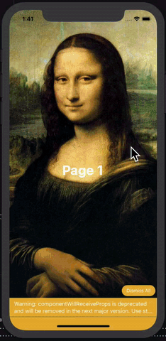
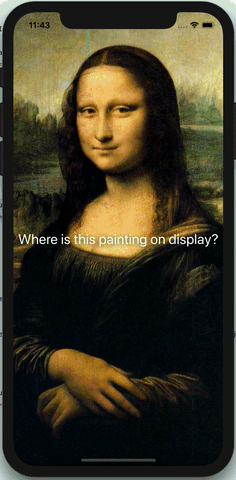
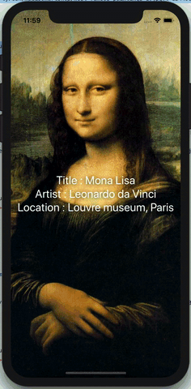
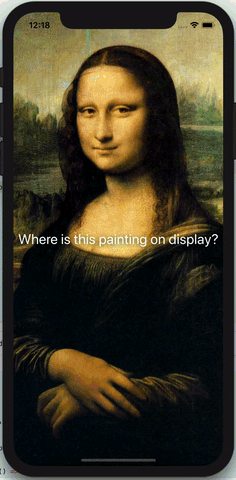
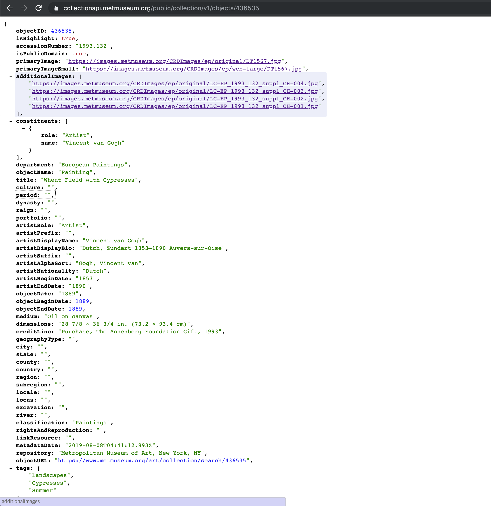
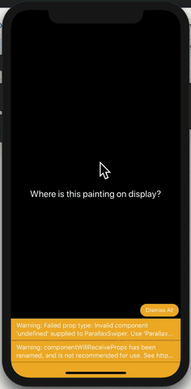
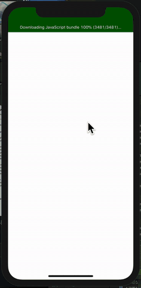

# Level 1. State + Props

튜토리얼의 1단계 난이도입니다. 이 단계에서는 State와 Props만 사용하여 예제를 구현해봅니다.


## 예제 생성

```bash
react-native init WhereIsThisPainting
```


## 실행

```bash
cd WhereIsThisPainting
react-native run-ios
```


## React-native-parallax-swiper 설치

WhereIsThisPainting 튜토리얼에서는 역동적인 효과를 위해 외부 라이브러리인 [React Native Parallax Swiper](https://github.com/zachgibson/react-native-parallax-swiper)를 사용하였습니다.

```bash
yarn add react-native-parallax-swiper --save
```


## React-native-parallax-swiper 적용

App.js의 내용을 모두 지우고,  [다음](https://github.com/zachgibson/react-native-parallax-swiper#usage)과 같이 코드를 작성합니다.

***App.js***

```jsx
import React from "react";
import {
  Animated,
  Text,
  View,
  Image,
  StyleSheet,
  Dimensions
} from "react-native";

import {
  ParallaxSwiper,
  ParallaxSwiperPage
} from "react-native-parallax-swiper";

const { width, height } = Dimensions.get("window");

export default class App extends React.Component {
  myCustomAnimatedValue = new Animated.Value(0);

  getPageTransformStyle = index => ({
    transform: [
      {
        scale: this.myCustomAnimatedValue.interpolate({
          inputRange: [
            (index - 1) * (width + 8), // Add 8 for dividerWidth
            index * (width + 8),
            (index + 1) * (width + 8)
          ],
          outputRange: [0, 1, 0],
          extrapolate: "clamp"
        })
      },
      {
        rotate: this.myCustomAnimatedValue.interpolate({
          inputRange: [
            (index - 1) * (width + 8),
            index * (width + 8),
            (index + 1) * (width + 8)
          ],
          outputRange: ["180deg", "0deg", "-180deg"],
          extrapolate: "clamp"
        })
      }
    ]
  });

  render() {
    return (
      <ParallaxSwiper
        speed={0.5}
        animatedValue={this.myCustomAnimatedValue}
        dividerWidth={8}
        dividerColor="black"
        backgroundColor="black"
        onMomentumScrollEnd={activePageIndex => console.log(activePageIndex)}
        showProgressBar={true}
        progressBarBackgroundColor="rgba(0,0,0,0.25)"
        progressBarValueBackgroundColor="white"
      >
        <ParallaxSwiperPage
          BackgroundComponent={
            <Image
              style={styles.backgroundImage}
              source={{ uri: "https://goo.gl/wtHtxG" }}
            />
          }
          ForegroundComponent={
            <View style={styles.foregroundTextContainer}>
              <Animated.Text
                style={[styles.foregroundText, this.getPageTransformStyle(0)]}
              >
                Page 1
              </Animated.Text>
            </View>
          }
        />
        <ParallaxSwiperPage
          BackgroundComponent={
            <Image
              style={styles.backgroundImage}
              source={{ uri: "https://goo.gl/gt4rWa" }}
            />
          }
          ForegroundComponent={
            <View style={styles.foregroundTextContainer}>
              <Animated.Text
                style={[styles.foregroundText, this.getPageTransformStyle(1)]}
              >
                Page 2
              </Animated.Text>
            </View>
          }
        />
        <ParallaxSwiperPage
          BackgroundComponent={
            <Image
              style={styles.backgroundImage}
              source={{ uri: "https://goo.gl/KAaVXt" }}
            />
          }
          ForegroundComponent={
            <View style={styles.foregroundTextContainer}>
              <Animated.Text
                style={[styles.foregroundText, this.getPageTransformStyle(2)]}
              >
                Page 3
              </Animated.Text>
            </View>
          }
        />
      </ParallaxSwiper>
    );
  }
}

const styles = StyleSheet.create({
  backgroundImage: {
    width,
    height
  },
  foregroundTextContainer: {
    flex: 1,
    alignItems: "center",
    justifyContent: "center",
    backgroundColor: "transparent"
  },
  foregroundText: {
    fontSize: 34,
    fontWeight: "700",
    letterSpacing: 0.41,
    color: "white"
  }
});
```

이제 앱을 실행해봅니다. 다음과 같은 화면이 나왔다면 성공입니다.


## 좋아하는 명화로 링크 변경

이제 각자 좋아하는 명화의 이미지로 링크를 변경해볼까요? image태그 안에 있는 기존 링크를 구글에서 검색한 이미지 URL로 변경해보도록하겠습니다. 추후에는 직접 이미지 파일을 다운로드 받아, 앱 안에 넣어놓는 것이 더 좋겠죠? URL은 언제 어떻게 바뀔지 모르니까요.

```jsx
<ParallaxSwiperPage
  BackgroundComponent={
    <Image
      style={styles.backgroundImage}
      source={{ uri: "좋아하는 명화의 URL로 변경" }}
    />
  }
  ...
/>
```

아래 예시처럼 좋아하는 명화가 렌더링 되고 있나요?



## 명화에 대한 정보 저장하고 보여주기

이제 명화를 클릭하면, 자신이 좋아하는 명화에 대한 정보를 보여주도록 해보겠습니다. 먼저 다음과 같이 components라는 폴더를 만들고 PaintingInfo.js 파일을 생성해주세요. 그리고 이 파일에 PaintingInfo 컴포넌트를 만들어보겠습니다. 다음과 같이 클래스형 컴포넌트의 기초 뼈대를 잡아주세요.

***components/PaintingInfo.js***

```jsx
import React, {Component} from 'react';

class PaintingInfo extends Component {
  constructor(props) {
    super(props);
    this.state = {
      
    };
  }

  render() {
    return (
      
    );
  }
}
```

이제 앱에 넣어놓은 명화에 대한 정보를 조사한 뒤, 각 명화에 대한 정보를 배열에 담아 변수 하나에 저장하세요. ES6의 [template literal](https://developer.mozilla.org/ko/docs/Web/JavaScript/Reference/Template_literals)을 통해 개행까지 한 번에 해결할 수 있습니다.

***components/PaintingInfo.js***

```jsx
import React, {Component} from 'react';

const info = [
  `
Title : Mona Lisa
Artist : Leonardo da Vinci
Location : Louvre museum, Paris
`,
  `
Title : Liebespaar
Artist : Gustav Klimt
Location : osterreichische galerie belvedere, Austria
`,
  `
Title : The Son of Man
Artist : René Magritte
Location : Private Collection
`,
];

class PaintingInfo extends Component {
	...
}
```

이제 아래와 같이 기초 컴포넌트를 추가하고, CSS 스타일링을 해줍니다. 

***components/PaintingInfo.js***

```jsx
import React, {Component} from 'react';
import {View, Text, StyleSheet} from 'react-native';

const info = [
	...
];

class PaintingInfo extends Component {
  constructor(props) {
    super(props);
    this.state = {

    };
  }

  render() {
    return (
      <View style={styles.container}>
        <View style={styles.button}>
          <Text style={styles.welcome}>
              Where is this painting on display?
          </Text>
        </View>
      </View>
    );
  }
}

const styles = StyleSheet.create({
  container: {
    flex: 1,
    justifyContent: 'center',
    alignItems: 'center',
    backgroundColor: '#FFFFFF00',
  },
  welcome: {
    fontSize: 25,
    textAlign: 'center',
    margin: 10,
    color: '#FFFFFF',
    backgroundColor: '#FFFFFF00',
    textShadowColor: 'rgba(0, 0, 0, 0.75)',
    textShadowOffset: {width: -1, height: 1},
    textShadowRadius: 10,
  },
  button: {
    backgroundColor: '#FFFFFF00',
    borderRadius: 100,
    height: 200,
    width: 400,
    justifyContent: 'center',
    alignItems: 'center',
  },
});

export default PaintingInfo;
```

이제 App.js 파일로 돌아가 방금 만든 PaintingInfo를 렌더링해봅니다. 

***App.js***

```jsx
...
  <ParallaxSwiperPage
		...
    ForegroundComponent={
      <View style={styles.foregroundTextContainer}>
        <PaintingInfo/>
      </View>
  	}
  />
  <ParallaxSwiperPage
		...
    ForegroundComponent={
      <View style={styles.foregroundTextContainer}>
        <PaintingInfo/>
      </View>
  	}
  />
  <ParallaxSwiperPage
		...
    ForegroundComponent={
      <View style={styles.foregroundTextContainer}>
        <PaintingInfo/>
      </View>
  	}
  />
...
```

아래와 같이 잘 렌더링 되시나요?




## props와 state를 통해 보여줄 명화 정보 index 관리하기

여러 명화들의 정보가 하나의 배열에 담겨있기 때문에, PaintingInfo는 어떤 정보를 보여줘야 할 지 알 수 없습니다. 따라서 부모컴포넌트에서 props를 통해 PaintingInfo 컴포넌트에 배열 안에 담긴 해당 명화 정보의 index(순서)를 알려줍니다. 그리고 부모컴포넌트에서 props를 통해 받은 이 index를 state에 저장하고, 이 state를 통해 어떤 정보를 보여줄 지 판단하게 됩니다.

먼저 App.js에서 PaintingInfo를 렌더링 할 때에 다음과 같이 해당 명화에 맞는 Info 배열의 index를 props로 넘겨줍니다.

***App.js***

```jsx
...
  <ParallaxSwiperPage
		...
    ForegroundComponent={
      <View style={styles.foregroundTextContainer}>
        <PaintingInfo index={0} />
      </View>
  	}
  />
  <ParallaxSwiperPage
		...
    ForegroundComponent={
      <View style={styles.foregroundTextContainer}>
        <PaintingInfo index={1} />
      </View>
  	}
  />
  <ParallaxSwiperPage
		...
    ForegroundComponent={
      <View style={styles.foregroundTextContainer}>
        <PaintingInfo index={2} />
      </View>
  	}
  />
...
```

이제 Paintinginfo.js에서는 props로 받은 index를 state에 저장하고, state의 값을 참고하여 각 명화의 정보를 보여줍니다. Javascript 문법 사용을 위해 `{}`를 사용하는 것도 잊지 마세요!

***components/PaintingInfo.js***

```jsx
import React, {Component} from 'react';
import {View, Text, StyleSheet} from 'react-native';

const info = [
	...
];

class PaintingInfo extends Component {
  constructor(props) {
    super(props);
    this.state = {
      index: this.props.index,
    };
  }

  render() {
    return (
      <View style={styles.container}>
        <View style={styles.button}>
          <Text style={styles.welcome}>
            {info[this.state.index]}
          </Text>
        </View>
      </View>
    );
  }
}

const styles = StyleSheet.create({
  container: {
    flex: 1,
    justifyContent: 'center',
    alignItems: 'center',
    backgroundColor: '#FFFFFF00',
  },
  welcome: {
    fontSize: 25,
    textAlign: 'center',
    margin: 10,
    color: '#FFFFFF',
    backgroundColor: '#FFFFFF00',
    textShadowColor: 'rgba(0, 0, 0, 0.75)',
    textShadowOffset: {width: -1, height: 1},
    textShadowRadius: 10,
  },
  button: {
    backgroundColor: '#FFFFFF00',
    borderRadius: 100,
    height: 200,
    width: 400,
    justifyContent: 'center',
    alignItems: 'center',
  },
});

export default PaintingInfo;
```

이제 다음과 같이 순서에 따라 정보가 잘 보이시나요?




## 버튼 클릭 이벤트 연결하기

이제 명화에 대한 정보를 저장하고 보여주는 것을 완료했으니, 처음에는 명화에 대한 정보가 보여지지 않다가 버튼을 클릭하면 보여지도록 클릭 이벤트를 설정해보도록하겠습니다.

React Native에서 클릭이벤트에 주로 사용하는 TouchableHighlight 컴포넌트를 import 합니다.

***components/PaintingInfo.js***

```jsx
import React, {Component} from 'react';
import {TouchableHighlight, View, Text, StyleSheet} from 'react-native';
...
```

클릭이 되었는 지 안 되었는 지를 판단하기 위한 isPressed state를 추가합니다.

***components/PaintingInfo.js***

```jsx
...
class PaintingInfo extends Component {
  constructor(props) {
    super(props);
    this.state = {
      isPressed: false,
      index: this.props.index,
    };
  }
...
```

클릭이벤트가 일어나면 방금 추가한 isPressed state를 변경하는 함수를 생성합니다.

***components/PaintingInfo.js***

```jsx
...
  _onPressToggle = () => {
    this.setState({isPressed: !this.state.isPressed});
  };
...
```

이제 import한 TouchableHighlight 컴포넌트로 명화의 정보를 보여주는 컴포넌트를 감싸고, click할 때마다 isPressed state를 변경하는 `_onPressToggle` 함수를 호출하도록 연결합니다. TouchableHighlight에 대한 CSS 스타일링도 추가합니다.

***components/PaintingInfo.js***

```jsx
...
  render() {
      return (
        <View style={styles.container}>
          <TouchableHighlight
            onPressIn={this._onPressToggle}
            style={styles.touchable}
            underlayColor="#FFFFFF00">
            <View style={styles.button}>
              <Text style={styles.welcome}>
                {!this.state.isPressed
                  ? 'Where is this painting on display?'
                  : info[this.state.index]}
              </Text>
            </View>
          </TouchableHighlight>
        </View>
      );
    }
...
const styles = StyleSheet.create({
  ...
  touchable: {borderRadius: 100, backgroundColor: '#FFFFFF00'},
  ...
});
```

Click 이벤트까지 연결된 PaintingInfo의 전체 코드 입니다.

***components/PaintingInfo.js***

```jsx
import React, {Component} from 'react';
import {TouchableHighlight, View, Text, StyleSheet} from 'react-native';

const info = [
  `
Title : Mona Lisa
Artist : Leonardo da Vinci
Location : Louvre museum, Paris
`,
  `
Title : Liebespaar
Artist : Gustav Klimt
Location : osterreichische galerie belvedere, Austria
`,
  `
Title : The Son of Man
Artist : René Magritte
Location : Private Collection
`,
];

class PaintingInfo extends Component {
  constructor(props) {
    super(props);
    this.state = {
      isPressed: false,
      index: this.props.index,
    };
  }

  _onPressToggle = () => {
    this.setState({isPressed: !this.state.isPressed});
  };

  render() {
    return (
      <View style={styles.container}>
        <TouchableHighlight
          onPressIn={this._onPressToggle}
          style={styles.touchable}
          underlayColor="#FFFFFF00">
          <View style={styles.button}>
            <Text style={styles.welcome}>
              {!this.state.isPressed
                ? 'Where is this painting on display?'
                : info[this.state.index]}
            </Text>
          </View>
        </TouchableHighlight>
      </View>
    );
  }
}

const styles = StyleSheet.create({
  container: {
    flex: 1,
    justifyContent: 'center',
    alignItems: 'center',
    backgroundColor: '#FFFFFF00',
  },
  welcome: {
    fontSize: 25,
    textAlign: 'center',
    margin: 10,
    color: '#FFFFFF',
    backgroundColor: '#FFFFFF00',
    textShadowColor: 'rgba(0, 0, 0, 0.75)',
    textShadowOffset: {width: -1, height: 1},
    textShadowRadius: 10,
  },
  touchable: {borderRadius: 100, backgroundColor: '#FFFFFF00'},
  button: {
    backgroundColor: '#FFFFFF00',
    borderRadius: 100,
    height: 200,
    width: 400,
    justifyContent: 'center',
    alignItems: 'center',
  },
});

export default PaintingInfo;
```

이제 새로고침을 눌러서 다시 한 번 앱을 실행해보세요. 다음과 같이 클릭하면 해당 명화에 대한 정보가 나타나나요?




## 실제 API 연결해보기

그런데 그 사실 알고 계시나요? 박물관 중에는 명화에 관한 정보를 알려주는 API를 제공하는 곳들이 있습니다. 이번에는 저희가 직접 입력한 정보가 아니라, 실제 API를 이용해서 명화들의 정보를 받아오고, 그 정보를 보여주겠습니다. 사용할 API는 메트로폴리탄 박물관의 API입니다. 주소는 아래와 같습니다.

[https://metmuseum.github.io/](https://metmuseum.github.io/)

위의 문서를 보시는게 익숙하지 않은 분도 계시겠죠? 저희가 사용할 API는

`https://collectionapi.metmuseum.org/public/collection/v1/objects/[objectID]`

위와 같은 주소를 사용합니다. `[objectID]` 에 저희가 원하는 명화의 ID를 입력하면 해당 명화의 정보를 객체 형태로 반환해줍니다. 먼저 브라우저에 직접 테스트해볼까요?

저는 chrome 브라우저를 사용하겠습니다. 

문자열로 돌아오는 결과를 좀 더 알아보기 쉽게 하기 위해 `JSONView`라는 크롬 확장프로그램을 설치해주세요.

[https://chrome.google.com/webstore/detail/jsonview/chklaanhfefbnpoihckbnefhakgolnmc?hl=en](https://chrome.google.com/webstore/detail/jsonview/chklaanhfefbnpoihckbnefhakgolnmc?hl=en)

이제 아래 주소를 주소창에 입력해보세요

[https://collectionapi.metmuseum.org/public/collection/v1/objects/436535](https://collectionapi.metmuseum.org/public/collection/v1/objects/436535)

아래 이미지와 같은 결과가 나오나요?



API 요청에 대한 응답 결과는 한 줄로 길게 나열된 문자열이지만 **JSON(JavScript Ojbect Notation, 자바스크립트의 객체)**형태로 이루어져있기 때문에 확장프로그램을 사용하면 위의 이미지처럼 볼 수 있습니다. Postman과 같은 API 테스트 툴을 통해서도 위와 같이 조회가 가능합니다. 

이제 앱에서 이 API를 통해 위의 결과를 받아 온 후, 결과 값들을 화면에 보여주는 코드를 작성해보겠습니다.

API 요청을 간편하게 할 수 있도록 해주는 라이브러리인 Axios를 설치해보겠습니다.

```bash
$ yarn add axios --save
```

lib 폴더를 만든 후, lib 폴더 안에 api.js 파일을 만들어줍니다.

이 api.js 파일에서는 axios 인스턴스에게 <u>우리가 사용하는 API 주소</u>, <u>API결과를 어떤 형태로 반환할지</u>에 대해서 알려주고, 이에 맞춰 axios 인스턴스를 생성하여 반환합니다. 다른 곳에서 이 api.js 파일을 import하여  좀 더 편하게 API 요청을 보낼 수 있습니다.

***lib/api.js***

```jsx
import axios from 'axios';

export default axios.create({
  baseURL: 'https://collectionapi.metmuseum.org/public/collection/v1/',
  responseType: 'json',
});
```

이제 App.js 파일에서 API를 호출하는 코드를 작성해보겠습니다.

메트로 폴리탄에 있는 명화들의 Id를 배열에 저장하고, 이 배열을 순회함면서 각 Id를 API 호출의 파라미터로 넘겨주어 API를 호출해보겠습니다.

먼저 명화 Id를 저장한 배열을 변수에 저장합니다.

***App.js***

 ```jsx
...
import API from './lib/api';

const paintingIds = [436535, 436528, 436532];

export default class App extends React.Component {
  ...
 ```

이제 이 paintingIds라는 배열을 순회하면서 각 Id에 대한 정보를 API를 통해 얻어보도록 하겠습니다.

API 호출은 `componentDidMound()`에서 하라고 [React 공식 문서](https://reactjs.org/docs/faq-ajax.html#where-in-the-component-lifecycle-should-i-make-an-ajax-call)에서 가이드하고 있습니다. 저희도 공식 문서를 따라 `componentDidMount()`에서 axios를 사용해 API 호출을 해보겠습니다.

***App.js***

```jsx
import API from './lib/api';

const paintingIds = [436535, 436528, 436532];

export default class App extends React.Component {
  constructor(props) {
		...
  }
  componentDidMount() {
    paintingIds.map(id => {
      API.get(`/objects/${id}`, {
        params: {
          results: 1,
          inc: 'primaryImage,title,artistDisplayName,objectEndDate,repository',
        },
      })
        .then(result => result.data)
        .then(result => {
          this.setState({info: [...this.state.info, result]});
        });
    });
  }
...
```

위의 코드가 조금 어렵게 느껴지시는 분들도 있으실테니, 잠깐 살펴볼까요?

paintingIds 배열을  자바스크립트의 반복 메서드인 `map()` 함수를 통해 순회하고 있습니다. `map()` 함수는 배열의 모든 요소에 대해서 인자로 넘겨지는 콜백 함수를 실행하고, 그 결과를 새로운 배열로 만들어서 반환합니다. 

paintingIds 의 Id들을 인자로 받아서 axios 인스턴스의 `.get()` 메서드를 통해 메트로폴리탄 박물관의 api를 호출합니다. 그리고 그 결과의 data 속성을 받아서, `setState()` 함수를 통해 state의 info에 저장합니다. `setState()` 함수를 실행했기 때문에 info state를 참조하고 있는 모든 컴포넌트들은 자동으로 업데이트 됩니다.

비동기 작업을 위한 객체인 Promise를 잘 이해하지 못 하면 위의 코드가 잘 이해가 되지 않을 수도 있습니다. 간단하게 설명하고 넘어가 볼까요? 본래 자바스크립트에서는 `콜백 지옥`  이 고민이었습니다. 어떤 함수를 실행하고 받은 결과 값을 다른 함수 재사용하고 싶으면, 다른 함수를 인자로 넘겨서 사용해야했는데요. 함수의 내용이 조금만 길어지더라도 한 눈에 보기가 어려워 많은 개발자들이 코드를 읽는 데에 어려움을 호소했습니다. 

```javascript
function A(param, callback){  
}
```

위의 구조를 반복하면?

```javascript
function A(param, 
  function B(param, 
		function C(param, 
			function D(param,
        ...    
      ){...}
    ){...}
  ){...}
){...}  
```

위와 같이 어마어마한 콜백 지옥이 탄생합니다.

그런데 ES6에서 Promise 객체가 등장하면서, 위와 같은 콜백 지옥을 좀 더 가독성이 좋게 해결할 수 있게 되었습니다. promise 객체의 반환값은 `.then()`메서드를 통해 바로 재사용이 가능했기 떄문이죠.

Promise 객체를 반환하는 함수가 있다면 아래와 같이 구현이 가능해집니다.

```javascript
function A(param){
	return new Promise((resolve, reject)=>{
    if(){
      resolve(result);
    }else{
      reject(result);
    }
  })
}

A()
.then((result)=>{console.log(result)})
.then((result)=>{console.log(result)})
...
```

위처럼 긴 함수들이 중첩된 것보다는 훨씬 더 코드를 읽기가 수월해졌죠?

자, 이제 우리 코드도 잘 이해가 되시나요?

```jsx
  componentDidMount() {
    paintingIds.map(id => {
      API.get(`/objects/${id}`, {
        params: {
          results: 1,
          inc: 'primaryImage,title,artistDisplayName,objectEndDate,repository',
        },
      })
        .then(result => result.data)
        .then(result => {
          this.setState({info: [...this.state.info, result]});
        });
    });
  }
```

`API.get()` 메서드를 통해 받은 result를 `.then()` 함수를 통해 가져오고, 이 result의 data속성을 반환합니다. 그리고 다시 반환된 result.data 속성을 `this.setState()` 메서드에서 info state에 저장합니다.

어려워보이지만, 막상 보니 그리 어렵지 않죠? 이해가 잘 안되신다면, [공식 문서](https://developer.mozilla.org/ko/docs/Web/JavaScript/Reference/Global_Objects/Promise)와 Promise에 대해 설명한 다른 블로그 포스팅들을 참고하시기를 추천합니다.


## API 요청을 통해 받은 결과 보여주기

자, 이제 API에서 받은 결과를 보여줘야겠죠? API 호출로 받은 결과는 info state에 저장했으니, 이 info state의 값들을 하위 컴포넌트들에게 props로 넘겨주겠습니다. 기존의 Image 태그를 대신하는 PaintingImage 컴포넌트를 만들고 이 컴포넌트에는 이미지 주소를 넘겨줍니다. 이미 만들어 놓았던 PaintingInfo 컴포넌트에는 그림에 관한 전반적인 정보를 모두 넘겨줍니다.

***App.js***

```jsx
...  
  render() {
    return (
     <ParallaxSwiper
        speed={0.5}
        animatedValue={this.myCustomAnimationValue}
        dividerWidth={8}
        dividerColor="black"
        backgroundColor="black"
        onMomentumScrollEnd={activePageIndex => console.log(activePageIndex)}
        progressBarBackgroundColor="rgba(0,0,0,0.25)"
        progressBarValueBackgroundColor="white">
        {this.state.info.map((element, index) => (
          <ParallaxSwiperPage
            BackgroundComponent={
              <PaintingImage
                id={element.ojbectId}
                width={width}
                height={height}
                imageURL={element.primaryImage}
              />
            }
            ForegroundComponent={
              <View style={styles.foregroundTextContainer}>
                <PaintingInfo
                  id={element.objectId}
                  title={element.title}
                  artist={element.artistDisplayName}
                  year={element.objectEndDate}
                  location={element.repository}
                />
              </View>
            }
            key={index}
          />
        ))}
      </ParallaxSwiper>
    );
  }
}
```

***components/PaintingImage.js***

```jsx
import React, {Component} from 'react';
import {StyleSheet, Image, Dimensions} from 'react-native';
import API from '../lib/api';

const {width, height} = Dimensions.get('window');

class PaintingImage extends Component {
  constructor(props) {
    super(props);
    this.state = {
      imageURL: this.props.imageURL,
      width,
      height,
    };
  }

  render() {
    return (
      <Image
        style={styles.backgroundImage}
 source={{
          uri: `{this.state.imageURL}`,
        }}
      />
    );
  }
}

const styles = StyleSheet.create({
  backgroundImage: {
    width,
    height,
    resizeMode: 'cover',
  },
});

export default PaintingImage;
```

***components/PaintingInfo.js***

```jsx
import React, {Component} from 'react';
import {TouchableHighlight, View, Text, StyleSheet} from 'react-native';
import API from '../lib/api';

class PaintingInfo extends Component {
  constructor(props) {
    super(props);
    this.state = {
      isPressed: false,
      id: this.props.id,
      title: this.props.title,
      artist: this.props.artist,
      year: this.props.year,
      location: this.props.location,
    };
  }

  _onPressToggle = () => {
    this.setState({isPressed: !this.state.isPressed});
  };

  render() {
    return (
      <View style={styles.container}>
        <TouchableHighlight
          onPressIn={this._onPressToggle}
          style={styles.touchable}
          underlayColor="#FFFFFF00">
          <View style={styles.button}>
            <Text style={styles.welcome}>
              {!this.state.isPressed
                ? 'Where is this painting on display?'
                : `Title: ${this.state.title}\nArtist: ${
                    this.state.artist
                  }\nYear: ${this.state.year}\nLocation: ${
                    this.state.location
                  }`}
            </Text>
          </View>
        </TouchableHighlight>
      </View>
    );
  }
}
const styles = StyleSheet.create({
  container: {
    flex: 1,
    justifyContent: 'center',
    alignItems: 'center',
    backgroundColor: '#FFFFFF00',
  },
  welcome: {
    fontSize: 20,
    textAlign: 'center',
    margin: 10,
    color: '#FFFFFF',
    backgroundColor: '#FFFFFF00',
    textShadowColor: 'rgba(0, 0, 0, 0.75)',
    textShadowOffset: {width: -1, height: 1},
    textShadowRadius: 10,
    padding: 10,
  },
  touchable: {borderRadius: 100, backgroundColor: '#FFFFFF00'},
  button: {
    backgroundColor: '#FFFFFF00',
    borderRadius: 100,
    height: 200,
    width: 400,
    justifyContent: 'center',
    alignItems: 'center',
  },
});

export default PaintingInfo;
```

자, 이제 아래와 같이 정상적으로 API 결과를 보여주나요?




## 로딩 스피너 추가하기

그런데 API 요청이 많아지면 요청 응답을 받을 때까지 오랜 시간이 걸릴 수도 있겠죠? 그래서 API의 모든 응답이 올 때까지 보여지는 로딩 스피너를 추가해보도록하겠습니다. 

먼저  isLoading이라는 state를 추가하겠습니다.

***App.js***

```jsx
...
export default class App extends React.Component {
  constructor(props) {
    super(props);
    this.state = {
      info: [],
      isLoading: true,
    };
  }
...
```

이번에는 API를 호출하는 `componentDidMount()` 에서 모든 promise 객체가 resolve되면 실행되는 `Promise.all() `메서드를 사용한 뒤, `Promise.all()` 이 실행되면 isLoading state가  false로 바뀌도록  `setState() `메서드를 호출하겠습니다. 현재 예제에서는 API 호출이 3번 밖에 일어나지 않아 로딩 스피너가 보이지 않으므로,  `setTimeout() `함수를 통해 3초정도 `setState() `메서드를 지연시키겠습니다.

```jsx
...
  componentDidMount() {
    Promise.all(
      paintingIds.map(id => {
        API.get(`/objects/${id}`, {
          params: {
            results: 1,
            inc:
              'primaryImage,title,artistDisplayName,objectEndDate,repository',
          },
        })
          .then(result => result.data)
          .then(result => {
            this.setState({info: [...this.state.info, result]});
          });
      }),
    ).then(() => {
      setTimeout(() => {
        this.setState({...this.state, isLoading: !this.state.isLoading});
      }, 3000);
    });
  }
...
```

그리고  `return()` 메서드에서 isLoading이 true이면 로딩 스피너를 보여주고,  false이면 기존의 컴포넌트를 보여주도록합니다.

```jsx
...
  render() {
    return this.state.isLoading ? (
      <View style={[styles.spinnerContainer, styles.horizontal]}>
        <ActivityIndicator size="large" color="#00ffff" />
      </View>
    ) : (
      <ParallaxSwiper
...
```

 이제 새로고침을 해보세요! 아래처럼 로딩스피너가 잘 동작하나요? 




이로써 레벨 1의 모든 단계가 끝났습니다. 어떤가요 뿌듯하죠? 다음 단계에서는 레벨 1의 예제에 Redux를 입혀보도록하겠습니다.