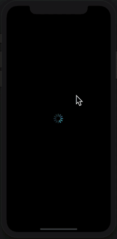

# Level 2. State + Props + Redux

튜토리얼의 2단계 난이도입니다. 이 단계에서는 기존 1단계 예제에서 state로 관리하던 `isLoading` 데이터를 Redux로 관리하도록 변경해봅니다.

Redux는 프레임워크에 상관없이 사용할 수 있는 라이브러리이지만 React에서 Redux를 사용할 때는 대부분 React-redux라는 라이브러리와 같이 쓰입니다. 따라서 이번 예제에서는 React와 React-redux를 사용하여 구현해보도록 하겠습니다.


## Redux, Redux-react 패키지 설치

터미널에서 프로젝트 경로로 이동하여 redux, redux-react 패키지를 실행합니다.

```bash
yarn add redux react-redux --save
```


## Redux의 개념

Redux는 생소하지만, 그리 어렵지 않습니다. 우리는 예제 1에서 `isLoading`이라는 state를 만들어서 state가 `true`이면 Loading spinner가 보이게 하고, `false`이면 명화가 보이게 했었죠? 아주 간단했습니다. 그런데 만약 이런 `isLoading`과 같은 state가 많아지고, 이 state들을 여러 컴포넌트에서 사용한다면 어떻게될까요? 코드를 수정하려면 특정 state를 사용하는 모든 컴포넌트를 찾아다니면서 코드를 수정해야 할 겁니다. 이렇게 되면 유지보수에 너무 큰 어려움이 있겠죠? 그래서 이러한 어려움을 해결하기 위해 Redux가 나왔습니다.

Redux에서는 `isLoading`과 같은 state들을 Store라는 하나의 객체 안에 모두 저장합니다. 그리고 store 객체 안에 저장된 state가 필요한 컴포넌트들은 직접 store 객체에 접근한 후, 데이터를 가져와서 사용하는 방식이죠. 만약 store 안의 특정 state가 변경되면, 해당 state를 사용하는 모든 컴포넌트를 자동으로 다시 렌더링되면서 갱신됩니다. (이 부분이 바로 자동화되어 있는 부분인거죠!)

이러한 형태는 Redux만의 개념이 아니라 Flux라는 개념을 차용한 것입니다. 

그럼 간단하게 개념을 알아볼까요?

* **Action** : 하나의 큰 객체인 Store에 저장된 여러 개의 state 중에서 무엇을 변경할 지를 알려주는 객체입니다. type이라는 속성을 필수로 가지고 있어야하며, 이 type이 있어야 알맞은 reducer를 실행시킬 수 있습니다.
  * **ActionCreator** : 그런데 하나의 객체인 action에 type말고도 수십 개의 속성이 있다면 어떻게 될까요? action을 만들 때마다 수십 개의 속성을 적어서 생성해야 할 것입니다. 그러면 너무 귀찮겠죠? 따라서 이 action을 만들어서 반환해주는 함수를 만드는데, 이 함수가 바로 actionCreator입니다.
* **Reducer** : state와 action을 인자로 받은 후 로직을 통해 새로운 state를 만들어서 반환하는 함수입니다. 위에서 action에는 type이 있다고 했었죠? reducer는 자신이 인자로 받은 action 객체에서 type 속성을 검사하고, reducer함수 안에 있는 여러 가지 로직 중 해당 type에 맞는 로직을 실행하여 state를 변경합니다. 그리고 변경된 state를 **<u>새로운 객체</u>**에 넣어서 반환합니다.
* **Store** : state를 저장하는 하나의 큰 객체입니다. 공식 문서에서는 store를 하나만 유지할 것을 권장하고 있습니다. 저장하는 곳이 많으면, 나중에 어플리케이션 규모가 커졌을 경우에 어디서 어떤 state를 업데이트해야할지 알기 어렵겠죠?

위의 것들이 Redux의 기본 개념입니다.


## Redux의 데이터 흐름

그렇다면 위의 Redux의 개념들은 어떻게 조화를 이루고 있을까요? Redux를 이해할 때 이 부분이 참 헷갈리는데요. 본격적으로 코드를 작성하기 전에 한 번 살펴보고 갈 필요가 있습니다. 

1. Action 타입을 작성합니다. 자신이 변경하길 원하는 state나 목적이 드러나도록 명시적인 type명을 지정하는 것이 좋겠죠?
2. Action 타입과 여러 속성을 가진 Action 객체를 손쉽게 만들 수 있도록 Action Creator 함수를 만들어 놓습니다.
3. Reducer 함수를 만듭니다. 여기에서 자신이 원하는 state가 어떻게 변할 지에 대한 로직을 작성합니다.
4. Store 객체를 만드는 `createStore()` 함수에게 Reducer를 인자로 넘겨줍니다. 그리고 이 `createStore()` 함수의 결과 값이 Store 객체가 됩니다.
5. Provider라는 컴포넌트로 App 컴포넌트를 감싸고 props로 Store 객체를 넘겨줍니다. 이렇게 되면 모든 컴포넌트에서 Store에 접근이 가능해집니다.
6. 컴포넌트에서 `connect()` 함수를 통해 Store와 연결합니다. 이렇게 `connect()` 함수를 통해 컴포넌트와 Store가 연결되면 store 객체의 상태가 변할 때마다 컴포넌트가 다시 렌더링됩니다. 이 `connect()` 함수는 **mapStateToProps**, **mapDisptachToProps**라는 함수들을 인자로 받습니다. 이 두 함수는 각각 store의 특정 state, store를 업데이트하는 dispatch함수를 `connect()` 함수에서 연결하는 컴포넌트의 props로 넘겨줍니다. 이렇게 되면 `connect()`로 연결된 컴포넌트는 store의 state를 사용할 수 있고, 액션 객체를 dispatch 메서드에 넘겨주어 호출함으로써 store의 state를 업데이트 할 수도 있게 됩니다.
7. 이제 컴포넌트에서 store의 값을 조회할 수도 있고, 업데이트 할 수도 있으니 필요한 값들을 얻어온 후 원하는 형태로 화면에 렌더링해줍니다.

어떤가요? 조금 이해가 되시나요? 조금 복잡하게 느껴질 수도 있습니다. 하지만 직접 코드를 작성해보면 금방 이해되니, 너무 걱정 말고 위의 데이터 흐름을 따라가면서 같이 Redux를 적용해 보도록 하죠!


## 예제를 따라하기 전에

우리는 난이도 1의 기존 예제의 `isLoading`이라는 state를 컴포넌트의 state가 아닌 Store 객체 안의 state로 만들어서 관리하도록 만들 거에요. 기존의` isLoading` state는 `setState()` 함수를 통해 업데이트를 했었죠? Redux에서는 store 객체 안의 state를 reducer함수가 업데이트합니다. 따라서 reducer 함수에는 `isLoading`을 업데이트하는 로직을 적으면 되겠죠? 

* 일반 component의 state => store 객체의 state
* `setState()` => reducer

위 두 가지 큰 변경점을 염두해두시고 따라오시면 좀 더 이해가 쉬울거에요. 자 이제 시작해볼까요?

## 1. 액션 타입 

데이터 흐름의 1번을 진행해보겠습니다.

Action 객체를 작성할 차례죠? Action 객체는 reducer에게 type속성을 통해 어떤 로직을 실행할 지 알려주는 역할을 하는 객체입니다.

먼저 actions 폴더를 만들어주고, 그 안에 types.js 파일을 만들어줄게요.

***actions/types.js***

```jsx
export const TOGGLE_LOADING = 'TOGGLE_LOADING';
```

우리는 Store 객체 안의  `isLoading` state를 `true`, `false`로 바꿀 예정이므로, action type을 toggle_loading으로 설정할게요.

## 2. 액션 생성함수 생성

action은 객체라고 했죠? 우리가 actions/types.js에서 타입명은 만들었지만, 아직 객체를 만들지는 않았어요. 액션 생성함수를 통해 객체형태를 만들어 반환하겠습니다.

***actions/creators.js***

```jsx
import {TOGGLE_LOADING} from './types';

export const toggle_loading = () => ({
  type: TOGGLE_LOADING,
});
```

저희 예제의 액션 생성함수는 type만 있으면 되서 너무 간단하죠? ^^; 하지만 type이 아니라 추가적인 데이터를 reducer에게 넘겨줘야 한다면, 액션 생성 함수에서 type외에 또 다른 속성을 추가해야합니다. 아래 코드처럼 payload라는 속성으로 많이 지정하곤 하죠.

```jsx
export const example = () => ({
  type: my_name,
  payload: {
    id: 1,
		name: Douglas,
  }
});

```

## 3. 리듀서 생성

이제 store의 `isLoading`을 업데이트 할 리듀서를 생성해 볼 차례네요,

reducers 폴더를 만들고 loading.js 파일을 만든 후 아래와 같이 입력합니다.

***reducers/loading.js***

```jsx
import {TOGGLE_LOADING} from '../actions/types';

const initialState = {
  isLoading: true,
};

function loading(state = initialState, action) {
  switch (action.type) {
    case TOGGLE_LOADING:
      return {...state, isLoading: !state.isLoading};
    default:
      return state;
  }
}

export default loading;

```

initialState는 Store에 state가 없을 때 지정해주는 초기 값입니다. ES6 자바스크립트에서는 함수의 매개변수의 값이 넘어오지 않을 때 기본 값을 지정해줄 수 있습니다.

reducer함수는 Store 객체의 **state**와 **action** 객체를 인자로 받게 됩니다. 인자로 받은 action 객체의 type 속성을 조건문을 통해 검사하고, 해당 type에 맞는 로직을 실행한 후 <u>새로운 객체</u>에 변경된 state를 담아서 반환합니다. 만약 새로운 객체를 만들어서 state를 반환하지 않으면, 객체를 참조하는 주소 값이 변경되지 않기 때문에 Store에서 state가 변경되었다는 것을 인식하지 못합니다. 꼭 **새로운 객체**를 만든 후 변경된 state를 담아서 반환해야한다는 것을 잊지 마세요. 기존에는 `Object.assign()` 함수로 객체를 만들어야했지만, ES6 자바스크립트에서는 위와 같이 객체 리터럴 안에 전개 연산자를 통해 기존의 객체를 불러오고 변경하기를 원하는 state만 재할당해주는 방법으로 새로운 객체의 state를 만들 수 있습니다. 간편하죠? 

## 4. Store 생성 + 5. Provider에게 Store 제공

이제 Provider태그로 App태그를 감싸줘야 하는데요. Provider 태그 안에는 단 하나의 하위 컴포넌트만 명시할 수 있습니다. 따라서 App.js의 `render()` 함수 안에 있던 함수들을 모두 넣으면 에러가 발생합니다. 이 문제를 해결하기 위해 root.js 파일을 만들고, App.js 파일을 import 하여 Provider태그 아래에 하위 컴포넌트로 넣어주도록 하겠습니다.

***root.js***

```jsx
import React from 'react';
import {Provider} from 'react-redux';
import {createStore} from 'redux';
import App from './App';
import loading from './reducers/loading';

const store = createStore(loading);

const root = () => (
  <Provider store={store}>
    <App />
  </Provider>
);

export default root;

```

`createStore()` 메서드에 우리가 만들었던 `loading` reducer를 넘겨줌으로써 store를 생성합니다. 그리고 생성한 store를 Rrovider 태그의 props로 넘겨줍니다.

이렇게 Provider에게 store를 prop로 넘겨주고 App 컴포넌트를 감싸줌으로써, App 컴포넌트를 포함한 App 컴포넌트의 하위 컴포넌트들은, store에 접근할 수 있게됩니다.

***index.js***

```jsx
/**
 * @format
 */

import {AppRegistry} from 'react-native';
import Root from './Root';
import {name as appName} from './app.json';

AppRegistry.registerComponent(appName, () => Root);

```

## 6. Connect 함수를 통해 Store와 컴포넌트 연결

자 이제 `connect()`함수를 통해 컴포넌트에서 store의 state의 값을 가져오고 update 할 수 있도록해야하는데요. 우리가 사용했던 `isLoading`state는 App.js 파일에서 관리했었죠? 따라서 App 컴포넌트와 Store를 연결하겠습니다.

***App.js***

```jsx
const styles = StyleSheet.create({
	...
});

const mapStateToProps = state => ({isLoading: state.isLoading});

const mapDispatchToProps = dispatch => ({
  toggle_loading: () => dispatch(toggle_loading()),
});

export default connect(
  mapStateToProps,
  mapDispatchToProps,
)(App);
```

**mapStateToProps**를 통해 Store의 `isLoading` state의 값을 가져올 수 있게 되었고, **mapDispatchToProps**를 통해 dispatch함수에 action creator 함수를 실행한 결과를 인자로 넘겨줌으로써 `loading` reducer를 실행하여 `isLoading` state를 업데이트 할 수 있게 되었습니다.

## 7. 보여주기

이제 `isLoading` state에 따라 화면이 잘 바뀌는 지 확인해야겠죠?

***App.js***

```jsx
...
	componentDidMount() {
    Promise.all(
      ...
    ).then(() => {
      setTimeout(() => {
        this.props.toggle_loading();
      }, 3000);
    });
  }
...
	render() {
    return this.props.isLoading ? (
      <View style={[styles.spinnerContainer, styles.horizontal]}>
        <ActivityIndicator size="large" color="#00ffff" />
      </View>
    ) : (
      <ParallaxSwiper
...
```

이전 예제와 마찬가지로 `isLoading`이 업데이트 되기까지 Loading spinner가 나타나는 것을 직접 확인해야겠죠? `setTimeout()` 함수를 통해 Store 업데이트를 3초 후에 실행하고 Store의 `isLoading` state를 업데이트 시킨 후 자동으로 App 컴포넌트가 렌더링 되는 것을 확인해보도록 하겠습니다.


어떤가요, 1번 예제와 똑같이 화면이 렌더링 되나요?




이게 다 입니다! 생각보다 어렵지 않죠? 이제 Redux를 적용해봤으니, 다음 난이도인 Level 3 에서는 비동기 요청을 맡아서 처리하는 Redux-saga를 적용해보도록 하겠습니다.
