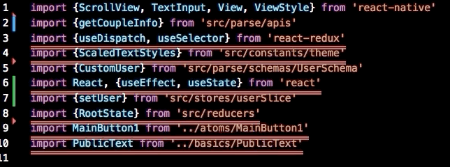

# Sort import



Easiest way to use automatic sort import is using VSCode extension called `sort-imports`. [dooboolab blog](https://medium.com/dooboolab/using-eslint-prettier-and-sort-imports-vscode-extensions-for-formatting-open-source-project-16edf317129d)
But we need to use sort import with ESlint customizable and fit to co-working with git. 

## Use eslint-plugin-import with typescript

> This plugin intends to support linting of ES2015+ (ES6+) import/export syntax, and prevent issues with misspelling of file paths and import names. All the goodness that the ES2015+ static module syntax intends to provide, marked up in your editor./* [eslint-plugin-import](https://github.com/benmosher/eslint-plugin-import)\

### Install [eslint-plugin-import](https://github.com/benmosher/eslint-plugin-import)

```
yarn add -D eslint-plugin-import
```

### Install [eslint-import-resolver-typescript](https://www.npmjs.com/package/eslint-import-resolver-typescript)

It is one of the module [Resolver](https://github.com/benmosher/eslint-plugin-import#resolvers) that allow you to use the path of typescript in eslint-plugin-import.

```
yarn add -D @typescript-eslint/parser eslint-import-resolver-typescript
```

.eslintrc.js

```
module.exports =  {
  parser:  "@typescript-eslint/parser",  // Specifies the ESLint parser
  extends:  [
    "eslint:recommended",
    "plugin:@typescript-eslint/recommended", // uses typescript-specific linting rules
    "plugin:react/recommended", // uses react-specific linting rules
    "prettier/react", // disables react-specific linting rules that conflict with prettier
    "plugin:prettier/recommended", // uses react-specific linting rules
  ],
  plugins: [
    "react",
    "react-native",
    "import", // eslint-plugin-import for custom configure
  ],
  parserOptions:  {
    ecmaVersion:  2020,  // Allows for the parsing of modern ECMAScript features
    sourceType:  "module",  // Allows for the use of imports
    project: "./tsconfig.json",
    tsconfigRootDir: "./",
  },
  rules: {
    ...,
    // import plugins
    "import/no-unresolved": "error",
    "import/named": "error",
    "import/namespace": "error",
    "import/default": "error",
    "import/export": "error",
    'import/order': [
      'error',
      {
        groups: ["builtin", "external", "parent", "sibling", "index"],
        alphabetize: {
          order: 'asc',
        },
      },
    ],
  },
  settings: {
    ...,
    "import/parsers": {
        "@typescript-eslint/parser": [".ts", ".tsx"]
      },
    "import/resolver": {
      "typescript": {
        "alwaysTryTypes": true
      },
    },
  }
```


### Try Auto Fix

```
npx eslint . --fix
```