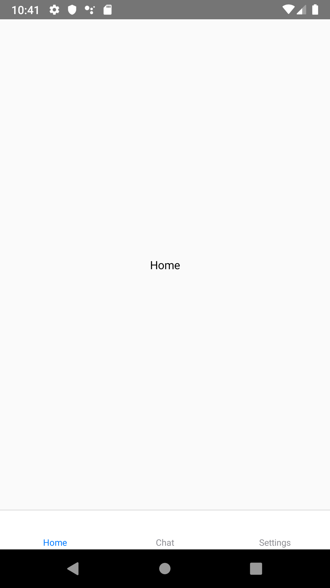
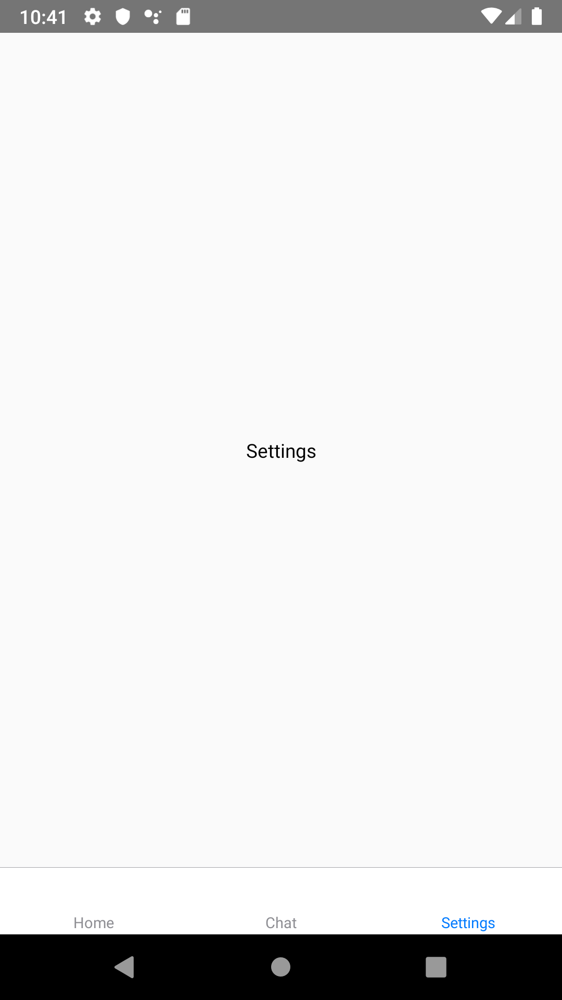
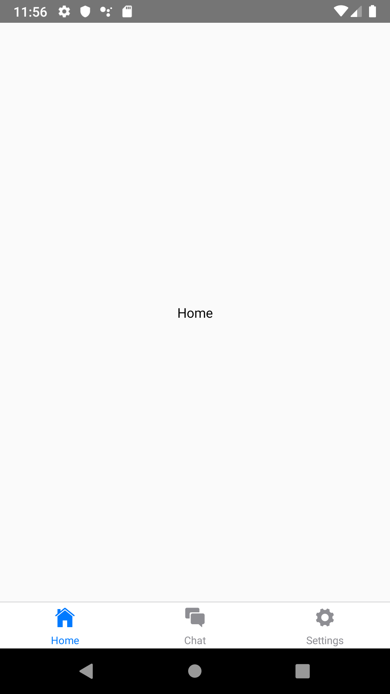
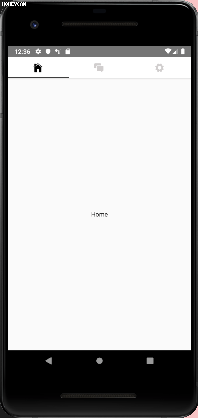
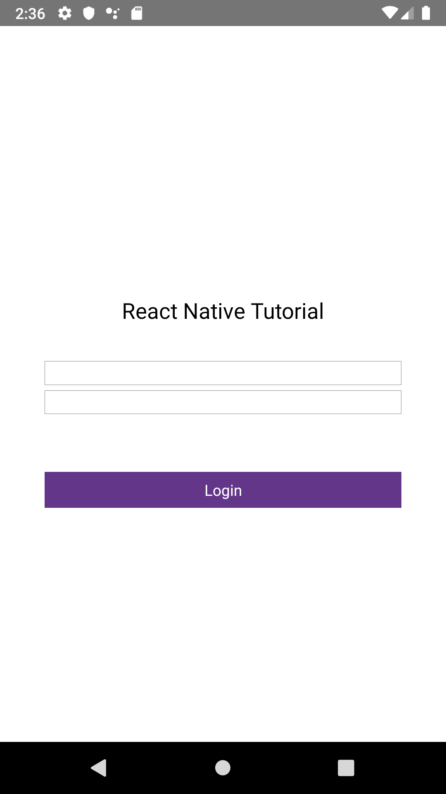
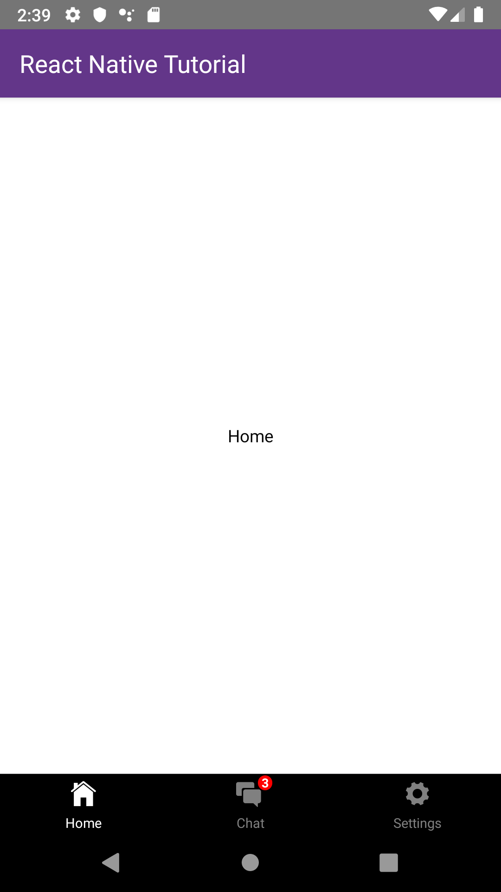

# React Native Tab Tutorial

### 1. Introducing React Navigation Tab


Mobile apps are commonly found in tab-based navigation styles by default. Tabs are usually located at the top instead of the bottom or headers, and this can be to easily switch to other routes by tapping or swipe the tabs. In this tutorial, let's use the most commonly used React-Navigation to create a Tab Navigation.


### 2. Install the React Navigation Tab

In order to make the tabs in react-navigation, the necessary libraries must be installed through the commands below.


**Install `react-navigation-tabs`**

```shell
npm install react-navigation-tabs --save
```

**Install`react-native-reanimated`**

```shell
npm install react-native-reanimated --save
```


### 3. Introduction basic library on React-navigation 

React Navigation provides three library for tabs by default.

| Library                         | Features                                                     |
| ------------------------------- | ------------------------------------------------------------ |
| createBottomTomTabNavigator     | located at the bottom of the screen. Library that provides tab navigation with basic features to switch to another route |
| createMaterialBotomTabNavigator | located at the bottom of the screen. library with more style effects than createBottomTabNavigator |
| createMaterialTopTabNavigator   | located at the top of the screen. library with more style effects than createBottomTabNavigator |


### 4. React Navigation tab default action

The most basic function of tab is to switch to their route when you click it.

Using the createBottomTabNavigator, let's create a tab navigation example that switches to three screens: Home, Chat, and Settings.





=


- Screen

  At first, we make up the screen for each page that we need

  *HomeScreen.js*

  ```jsx
  import React from 'react';
  import {StyleSheet, Text, View} from 'react-native';

  class HomeScreen extends React.Component {
    render() {
      return (
        <View style={styles.container}>
          <Text>Home</Text>
        </View>
      );
    }
  }

  const styles = StyleSheet.create({
    container: {
      flex: 1,
      justifyContent: 'center',
      alignItems: 'center',
    },
  });

  export default HomeScreen;

  ```

  *ChatScreen.js*

  ```jsx
  import React from 'react';
  import {StyleSheet, Text, View} from 'react-native';

  class ChatScreen extends React.Component {
    render() {
      return (
        <View style={styles.container}>
          <Text>Chat</Text>
        </View>
      );
    }
  }

  const styles = StyleSheet.create({
    container: {
      flex: 1,
      justifyContent: 'center',
      alignItems: 'center',
    },
  });

  export default ChatScreen;

  ```

   *SettingsScreen.js*

  ```jsx
  import React from 'react';
  import {StyleSheet, Text, View} from 'react-native';

  class SettingsScreen extends React.Component {
    render() {
      return (
        <View style={styles.container}>
          <Text>Settings</Text>
        </View>
      );
    }
  }

  const styles = StyleSheet.create({
    container: {
      flex: 1,
      justifyContent: 'center',
      alignItems: 'center',
    },
  });

  export default SettingsScreen;

  ```

  Now that you're ready to make tab navigation, let's use createBottomTabNavigator to add it.


  *App.js*

  ```jsx
  import {createAppContainer} from 'react-navigation';
  import {createBottomTabNavigator} from 'react-navigation-tabs';
  import HomeScreen from './screens/HomeScreen';
  import ChatScreen from './screens/ChatScreen';
  import SettingsScreen from './screens/SettingsScreen';

  const TabNavigator = createBottomTabNavigator({
    Home: {
      screen: HomeScreen,
    },
    Chat: {
      screen: ChatScreen,
    },
    Settings: {
      screen: SettingsScreen,
    },
  });
  export default createAppContainer(TabNavigator);

  ```


### 5. NavigationOptions

- Add Icon



For react navigation, you can show the icon for the tab bar in defaultNavigationOptions. We can use real-native-vector-icons to make your implementation prettier.

First, install react-native-vector-icons with the command below.

```
yarn add react-native-vector-icons
```


[IonIcons](https://ionicons.com/)

 In this example, we applied the IOS style icon in IonIcons and we found the required icon in the link above and set up the iconName for each route.


*App.js*

```jsx
import React from 'react';
import {createAppContainer} from 'react-navigation';
import {createBottomTabNavigator} from 'react-navigation-tabs';
import Ionicons from 'react-native-vector-icons/Ionicons';
import HomeScreen from './screens/HomeScreen';
import ChatScreen from './screens/ChatScreen';
import SettingsScreen from './screens/SettingsScreen';

const TabNavigator = createBottomTabNavigator(
  {
    Home: {
      screen: HomeScreen,
    },
    Chat: {
      screen: ChatScreen,
    },
    Settings: {
      screen: SettingsScreen,
    },
  },
  {
    defaultNavigationOptions: ({navigation}) => ({
      tabBarIcon: ({horizontal, tintColor}) => {
        const {routeName} = navigation.state;
        let iconName;
        if (routeName === 'Home') {
          iconName = 'ios-home';
        } else if (routeName === 'Chat') {
          iconName = 'ios-chatboxes';
        } else if (routeName === 'Settings') {
          iconName = 'ios-settings';
        }
        return (
          <Ionicons
            name={iconName}
            size={horizontal ? 20 : 25}
            color={tintColor}
          />
        );
      },
    }),
  },
);
export default createAppContainer(TabNavigator);

```


- **Add badge to icon**


If you want to add the badge on icon, add a view container to it as an icon.

(From UI perspective this component is ready to use, but you still need to find some way to pass down the badge count properly from somewhere else, like using React Context, Redux, MobX or event emitters.)


*IconWithBadge.js*

```jsx
import React from 'react';
import {StyleSheet, Text, View} from 'react-native';
import Ionicons from 'react-native-vector-icons/Ionicons';

export default class IconWithBadge extends React.Component {
  render() {
    const {name, badgeCount, color, size} = this.props;
    return (
      <View style={styles.container}>
        <Ionicons name={name} size={size} color={color} />
        {badgeCount > 0 && (
          <View style={styles.badge}>
            <Text style={styles.text}>{badgeCount}</Text>
          </View>
        )}
      </View>
    );
  }
}

const styles = StyleSheet.create({
  container: {
    width: 24,
    height: 24,
    margin: 5,
  },
  badge: {
    position: 'absolute',
    right: -6,
    top: -3,
    backgroundColor: 'red',
    borderRadius: 6,
    width: 12,
    height: 12,
    justifyContent: 'center',
    alignItems: 'center',
  },
  text: {
    color: 'white',
    fontSize: 10,
    fontWeight: 'bold',
  },
});

```


### 6. NavigationConfig

Now, in addition to the basic functions, let's use config to set up additional elements to complete the tab.

As I explained the default libraries, I told you that createBottomTabNavigator, createMaterialBotomTabNavigator and createMaterialTopTabNavigator has difference on style because these components provide some different config function!

In this chapter, we will use config in each library to create an example and introduce some features.

[React Navigation official document]: https://reactnavigation.org/docs/en/bottom-tab-navigator.html

(Refer to the official React Navigation document, and more config functions can be found in the official document.)


##### createBottomTabNavigator

In the example using createBottomTabNavigator, activeTintColor and inactiveTintColor were used to set the color of the label and icon depending on whether the label was activated or not, and backGroundColor was used in the style to specify the background color of the tab.


*App.js*

```jsx
import React from 'react';
import {createAppContainer} from 'react-navigation';
import {createBottomTabNavigator} from 'react-navigation-tabs';
import Ionicons from 'react-native-vector-icons/Ionicons';
import HomeScreen from './screens/HomeScreen';
import ChatScreen from './screens/ChatScreen';
import SettingsScreen from './screens/SettingsScreen';
import IconWithBadge from './IconWithBadge';

const HomeIconWithBadge = props => {
  return <IconWithBadge {...props} badgeCount={3} />;
};

const TabNavigator = createBottomTabNavigator(
  {
    Home: {
      screen: HomeScreen,
    },
    Chat: {
      screen: ChatScreen,
    },
    Settings: {
      screen: SettingsScreen,
    },
  },
  {
    defaultNavigationOptions: ({navigation}) => ({
      tabBarIcon: ({horizontal, tintColor}) => {
        const {routeName} = navigation.state;
        let IconComponent = Ionicons;
        let iconName;
        if (routeName === 'Home') {
          iconName = 'ios-home';
        } else if (routeName === 'Chat') {
          iconName = 'ios-chatboxes';
          IconComponent = HomeIconWithBadge;
        } else if (routeName === 'Settings') {
          iconName = 'ios-settings';
        }

        return (
          <IconComponent
            name={iconName}
            size={horizontal ? 20 : 25}
            color={tintColor}
          />
        );
      },
    }),
    tabBarOptions: {
      activeTintColor: 'white',
      inactiveTintColor: 'gray',
      style: {
        backgroundColor: 'black',
      },
    },
  },
);

export default createAppContainer(TabNavigator);

```

- `initialRouteName` - The routeName for the initial tab route when first loading.

- `defaultNavigationOptions` - Default navigation options to use for screens


- ```

  tabBarOptions

  ```

  - `activeTintColor` -  Label and icon color of the active tab.
  - `activeBackgroundColor` - Background color of the active tab.
  - `inactiveTintColor` - Label and icon color of the inactive tab.
  - `inactiveBackgroundColor` - Background color of the inactive tab.
  - `showLabel` - Whether to show label for tab, default is true.
  - `showIcon` - Whether to show icon for tab, default is true.
  - `style` - Style object for the tab bar.
  - `labelStyle` - Style object for the tab label.
  - `labelPosition` - Where to show the tab label in relation to the tab icon. Available values are `beside-icon` and `below-icon`. Defaults to `beside-icon`.
  - `tabStyle` - Style object for the tab.
  - `adaptive` - Should the tab icons and labels alignment change based on screen size? Defaults to `true` for iOS 11. If `false`, tab icons and labels align vertically all the time. When `true`, tab icons and labels align horizontally on tablet.
  - `keyboardHidesTabBar` - Defaults to `false`. If `true` hide the tab bar when keyboard opens.


##### createMaterialBottomTabNavigator

In the example using the createMaterialBottomTabNavigator, we used shifting to label of active tab, and we used activeTintColor, activeTintColor, and barStyle to config different background colors depending on whether they were active or not.


*App.js*


```jsx
import React from 'react';
import {View} from 'react-native';
import {createAppContainer} from 'react-navigation';
import {createMaterialBottomTabNavigator} from 'react-navigation-material-bottom-tabs';
import Icon from 'react-native-vector-icons/Ionicons';
import HomeScreen from './screens/HomeScreen';
import ChatScreen from './screens/ChatScreen';
import SettingsScreen from './screens/SettingsScreen';

const TabNavigator = createMaterialBottomTabNavigator(
  {
    Home: {
      screen: HomeScreen,
      navigationOptions: {
        tabBarLabel: 'Home',
        tabBarIcon: ({tintColor}) => (
          <View>
            <Icon style={[{color: tintColor}]} size={25} name={'ios-home'} />
          </View>
        ),
        activeColor: '#DC143C',
        inactiveColor: '#226557',
        barStyle: {backgroundColor: '#FFC0CB'},
      },
    },
    Chat: {
      screen: ChatScreen,
      navigationOptions: {
        tabBarLabel: 'Chat',
        tabBarIcon: ({tintColor}) => (
          <View>
            <Icon
              style={[{color: tintColor}]}
              size={25}
              name={'ios-chatboxes'}
            />
          </View>
        ),
        activeColor: '#000080',
        inactiveColor: '#226557',
        barStyle: {backgroundColor: '#B0C4DE'},
      },
    },
    Settings: {
      screen: SettingsScreen,
      navigationOptions: {
        tabBarLabel: 'Settings',
        tabBarIcon: ({tintColor}) => (
          <View>
            <Icon
              style={[{color: tintColor}]}
              size={25}
              name={'ios-settings'}
            />
          </View>
        ),
        activeColor: '#006400',
        inactiveColor: '#226557',
        barStyle: {backgroundColor: '#8FBC8F'},
      },
    },
  },
  {
    initialRouteName: 'Home',
    shifting: true,
  },
);

export default createAppContainer(TabNavigator);

```

- `shifting` - Whether the shifting style is used, the active tab appears wider and the inactive tabs won't have a label. By default, this is `true` when you have more than 3 tabs.
- `labeled` - Whether to show labels in tabs. When `false`, only icons will be displayed.
- `activeColor` - Custom color for icon and label in the active tab.
- `inactiveColor` - Custom color for icon and label in the inactive tab.
- `barStyle` - Style for the bottom navigation bar. You can set a bottom padding here if you have a translucent navigation bar on Android: `barStyle={{ paddingBottom: 48 }}`.
- `initialRouteName` -  The routeName for the initial tab route when first loading.


##### createMaterialTopTabNavigator

In the example using the createMaterialTopTabNavigator, you can see that only the icon is located on the tab, unlike other examples. This can be configured by setting the showIcon, showLabel's boolean value.  The indicatorStyle also allows you to save the style of the bar that points to the active tab and to indicate a color change through the pressColor when you click the tab.





*App.js*

```jsx
import React from 'react';
import {View} from 'react-native';
import {createMaterialTopTabNavigator} from 'react-navigation-tabs';
import {createAppContainer} from 'react-navigation';
import Icon from 'react-native-vector-icons/Ionicons';
import HomeScreen from './screens/HomeScreen';
import ChatScreen from './screens/ChatScreen';
import SettingsScreen from './screens/SettingsScreen';

const TabNavigator = createMaterialTopTabNavigator(
  {
    Home: {
      screen: HomeScreen,
      navigationOptions: {
        tabBarLabel: 'Home',
        tabBarIcon: ({tintColor}) => (
          <View>
            <Icon style={[{color: tintColor}]} size={25} name={'ios-home'} />
          </View>
        ),
        initialRouteName: 'Home',
        activeColor: '#C71585',
        inactiveColor: '#226557',
        barStyle: {backgroundColor: '#FFC0CB'},
      },
    },
    Chat: {
      screen: ChatScreen,
      navigationOptions: {
        tabBarLabel: 'Chat',
        tabBarIcon: ({tintColor}) => (
          <View>
            <Icon
              style={[{color: tintColor}]}
              size={25}
              name={'ios-chatboxes'}
            />
          </View>
        ),
        activeColor: '#4B0082',
        inactiveColor: '#226557',
        barStyle: {backgroundColor: '#B0C4DE'},
      },
    },
    Settings: {
      screen: SettingsScreen,
      navigationOptions: {
        tabBarLabel: 'Settings',
        tabBarIcon: ({tintColor}) => (
          <View>
            <Icon
              style={[{color: tintColor}]}
              size={25}
              name={'ios-settings'}
            />
          </View>
        ),
        activeColor: '#006400',
        inactiveColor: '#226557',
        barStyle: {backgroundColor: '#8FBC8F'},
      },
    },
  },
  {
    animationEnabled: true,
    swipeEnabled: true,
    tabBarOptions: {
      pressColor: 'black',
      style: {
        backgroundColor: 'white',
      },
      indicatorStyle: {
        backgroundColor: 'black',
      },
      activeTintColor: '#000',
      inactiveTintColor: '#d1cece',
      showLabel: false,
      showIcon: true,
    },
  },
);

export default createAppContainer(TabNavigator);

```

- `initialRouteName` - The routeName for the initial tab route when first loading.
- `defaultNavigationOptions` - Default navigation options to use for screens.
- `tabBarPosition` - Position of the tab bar, can be `'top'` or `'bottom'`, default is `top`.
- `swipeEnabled` - Whether to allow swiping between tabs.


- ```

  tabBarOptions

  ```

  - `activeTintColor` - Label and icon color of the active tab.
  - `inactiveTintColor` - Label and icon color of the inactive tab.
  - `showIcon` - Whether to show icon for tab, default is false.
  - `showLabel` - Whether to show label for tab, default is true.
  - `upperCaseLabel` - Whether to make label uppercase, default is true.
  - `pressColor` - Color for material ripple (Android >= 5.0 only).
  - `scrollEnabled` - Whether to enable scrollable tabs.
  - `tabStyle` -  Style object for the tab.
  - `indicatorStyle` - Style object for the tab indicator (line at the bottom of the tab).
  - `labelStyle` - Style object for the tab label.
  - `iconStyle` - Style object for the tab icon.


### 7. Move Between Tab

   When you want to switch from one router to another, using below code


```jsx

   this.props.navigation.navigate('Home');

```

Let's use this code to create an example of moving from the Settings screen to the Home screen.


*SettingScreen.js*

```jsx
import React from 'react';
import {Button, StyleSheet, Text, View} from 'react-native';

class SettingsScreen extends React.Component {
  render() {
    return (
      <View style={styles.container}>
        <Button
          title="Go To Home"
          onPress={() => this.props.navigation.navigate('Home')}
        />
      </View>
    );
  }
}

const styles = StyleSheet.create({
  container: {
    flex: 1,
    justifyContent: 'center',
    alignItems: 'center',
  },
});

export default SettingsScreen;

```

### 8. Tab Navigation with stack navigator

Now that we've completed all of Tab's config as a whole, let's create an example that we'll apply to the stack Navigator. 

This example is navigating from the tutorial Welcome screen, TutorialScreen, to the tab navigator.

we created a Tab Navigator with three screens: HomeScreen, ChatScreen, and SettingScreen in the previous examples. When you wrap the tab Navigator around the Stack Navigator, it is navigated from the TutorialScreen to the Tab Navigator for use.

You can also remove the header bar by setting 'the header: null' option in the Stack Navigator.  You can see that this feature is also implemented in TutorialScreen.


*TutorialScreen.js*

```jsx
import React from 'react';
import {
  StyleSheet,
  Text,
  TextInput,
  TouchableOpacity,
  View,
} from 'react-native';

class ChatScreen extends React.Component {
  static navigationOptions = {
    header: null,
  };

  _goToTab() {
    // do something
    this.props.navigation.replace('TabNavigator');
  }

  render() {
    return (
      <View style={styles.container}>
        <View style={styles.titleArea}>
          <Text style={styles.title}>React Native Tutorial</Text>
        </View>
        <View style={styles.formArea}>
          <TextInput style={styles.textForm} placeholder={'ID'} />
          <TextInput style={styles.textForm} placeholder={'Password'} />
        </View>
        <View style={styles.buttonArea}>
          <TouchableOpacity
            style={styles.button}
            onPress={this._goToTab.bind(this)}>
            <Text style={styles.buttonTitle}>Login</Text>
          </TouchableOpacity>
        </View>
      </View>
    );
  }
}

const styles = StyleSheet.create({
  container: {
    flex: 1,
    backgroundColor: 'white',
    paddingLeft: '10%',
    paddingRight: '10%',
    justifyContent: 'center',
  },
  titleArea: {
    width: '100%',
    padding: '10%',
    alignItems: 'center',
  },
  title: {
    fontSize: 20,
  },
  formArea: {
    width: '100%',
    paddingBottom: '10%',
  },
  textForm: {
    borderWidth: 0.5,
    borderColor: '#888',
    width: '100%',
    height: '5%',
    paddingLeft: 5,
    paddingRight: 5,
    marginBottom: 5,
  },
  buttonArea: {
    width: '100%',
    height: '5%',
  },
  button: {
    backgroundColor: '#633689',
    width: '100%',
    height: '100%',
    justifyContent: 'center',
    alignItems: 'center',
  },
  buttonTitle: {
    color: 'white',
  },
});

export default ChatScreen;

```

*tabNavigatorWithStack.js*

```jsx
import React from 'react';
import {createAppContainer} from 'react-navigation';
import {createBottomTabNavigator} from 'react-navigation-tabs';
import {createStackNavigator} from 'react-navigation-stack';
import Ionicons from 'react-native-vector-icons/Ionicons';
import TutorialScreen from './screens/TutorialScreen';
import HomeScreen from './screens/HomeScreen';
import ChatScreen from './screens/ChatScreen';
import SettingsScreen from './screens/SettingsScreen';
import IconWithBadge from './IconWithBadge';

const HomeIconWithBadge = props => {
  return <IconWithBadge {...props} badgeCount={3} />;
};

const TabNavigator = createBottomTabNavigator(
  {
    Home: {
      screen: HomeScreen,
    },
    Chat: {
      screen: ChatScreen,
    },
    Settings: {
      screen: SettingsScreen,
      navigationOptions: {
        header: null,
      },
    },
  },
  {
    defaultNavigationOptions: ({navigation}) => ({
      swipeEnabled: true,
      adaptive: true,
      tabBarIcon: ({horizontal, tintColor}) => {
        const {routeName} = navigation.state;
        let IconComponent = Ionicons;
        let iconName;
        if (routeName === 'Home') {
          iconName = 'ios-home';
        } else if (routeName === 'Chat') {
          iconName = 'ios-chatboxes';
          IconComponent = HomeIconWithBadge;
        } else if (routeName === 'Settings') {
          iconName = 'ios-settings';
        }

        return (
          <IconComponent
            name={iconName}
            size={horizontal ? 20 : 25}
            color={tintColor}
          />
        );
      },
    }),
    tabBarOptions: {
      activeTintColor: 'white',
      inactiveTintColor: 'gray',
      style: {
        backgroundColor: 'black',
      },
    },
  },
);

const App = createStackNavigator({
  screen: TutorialScreen,
  TabNavigator: {
    screen: TabNavigator,
    navigationOptions: {
      headerStyle: {
        backgroundColor: '#633689',
      },
      headerTintColor: '#FFFFFF',
      title: 'React Native Tutorial',
    },
  },
});
export default createAppContainer(App);

```

When you complete the code like this, TutorialScreen will be show that the header bar is removed  unlike the Tab Navigator, which consists of HomeScreen, ChatScreen, and SettingScreen. 

The below images are the screen of the completed code.





This tutorial uses React-Navigation to make a variety of tabs that are essential to navigation. Depending on the three default libraries of the tabs: createBottomTabNavigator, createMaterialBotomTabNavigator and createMaterialTopTabNavigator. You can also check out the essential icons on the tab in this tutorial. 

 Now, in addition to the tabs, use the Navigation feature together with a stack or draw to create an app!
