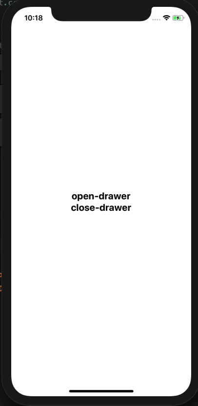

# React Navigation DrawerActions

`DrawerActions`은 drawer-navigators를 발생시키는 메소드들을 포함한 객체(object)이다.

총 3개의 `DrawerActions`이 있다.

1. **openDrawer** : drawer를 열게 하는 함수이다.

2. **closeDrawer** : drawer를 닫게 하는 함수이다.

3. **toggleDrawer** : drawer를 열고 닫게 해주는 함수이다.

## openDrawer 및 closeDrawer의 예제

Home화면에서는 `open-drawer`와 `close-drawer`가 존재하며 `open-drawer`를 누르면 **drawer**가 생성될 것이며 `close-drawer`를 누르면 아무 일도 일어나지 않을 것이다.
([drawer navi component 및 icon 활용](./drawer_navi_component&config.md) 부분에서 close-drawer을 어떻게 사용하는지 확인할 것이다.)

**Home.js**의 코드는 아래와 같다.

```jsx
import React, {Component} from 'react';
import {View, Text, StyleSheet, TouchableOpacity} from 'react-native';

import {DrawerActions} from 'react-navigation-drawer';

class Home extends Component {
  constructor(props) {
    super(props)
  }

  render() {
    return (
      <View style={styles.container}>
        <TouchableOpacity
          onPress={() => this.props.navigation.dispatch(DrawerActions.openDrawer())}
        >
          <Text style={styles.textStyle}>
            openDrawer
          </Text>
        </TouchableOpacity>
        <TouchableOpacity
          onPress={() => this.props.navigation.dispatch(DrawerActions.closeDrawer())}
        >
          <Text style={styles.textStyle}>
            closeDrawer
          </Text>
        </TouchableOpacity>
      </View>
    )
  }
}

const styles = StyleSheet.create({
  container: {
    flex: 1,
    justifyContent: 'center',
    alignItems: 'flex-end'
  },
  textStyle: {
    fontSize: 20,
    fontWeight: 'bold',
  }
});

export default Home;
```

## toggleDrawer 예제

About과 Detail에는 `toggleDrawer()`을 활용하여 **drawer**가 보이도록 하였다. `about-toggle` 혹은 `detail-toggle`을 누르면 drawer가 생성되는 것을 볼 수 있을 것이다.

About.js의 코드를 확인하도록 하자. (Detail.js는 About.js에서 about-toggle을 detail-toggle로 변경하면 된다.)

**About.js**의 코드를 아래와 같다.

```jsx
import React, {Component} from 'react';
import {View, Text, StyleSheet, TouchableOpacity} from 'react-native';
import {DrawerActions} from 'react-navigation-drawer';

class About extends Component {
  render() {
    return (
      <View style={styles.container}>
        <TouchableOpacity
          onPress={() =>
            this.props.navigation.dispatch(DrawerActions.toggleDrawer())
          }>
          <Text style={styles.textStyle}>about-toggle</Text>
        </TouchableOpacity>
      </View>
    );
  }
}

const styles = StyleSheet.create({
  container: {
    flex: 1,
    justifyContent: 'center',
    alignItems: 'center',
  },
  textStyle: {
    fontSize: 20,
    fontWeight: 'bold',
  },
});

export default About;
```

### 화면결과



> 만약 **null is not an object ( evaluating 'RNGestureHandlerModule.Direction')**이 오류가 뜬다면 `cd ios && pod install`을 하길 바란다.
