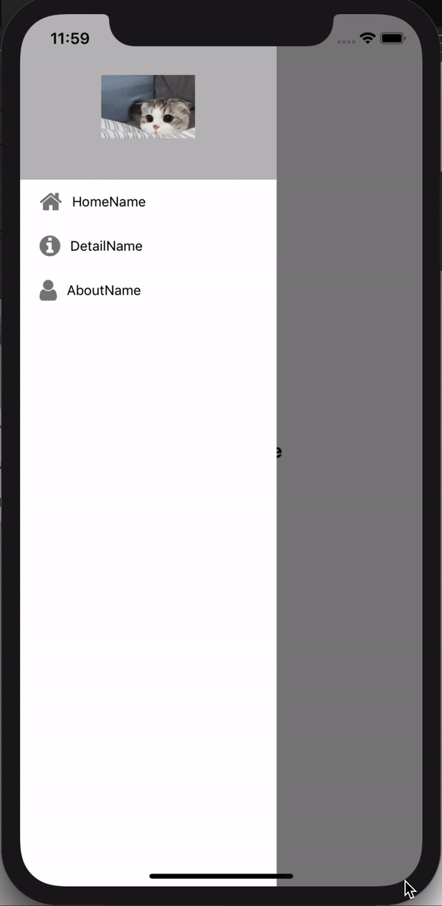

# drawer navi component 및 icon 활용

## drawer component를 사용하는 이유

drawer_navi_actions 에서 봤듯이 react-navigation에서 제공하는 기능으로 drawer를 구현할 수 있다. 하지만 기능 외에 다른 것(icon)을 넣어 자신만의 drawer를 만들 수 있다.

우선 자신만의 drawer을 만들기 전에 필요한 패키지들을 설치하자.

## pre-requirements

##### react-native-vector-icons 설치

리스트 관련 아이콘을 쓰기 위해서는 **react-native-vector-icons**라는 것을 설치 해야한다. 아래의 명령어를 터미널에 입력하도록 하자.

`npm install --save react-native-vector-icons`

## contentComponent를 활용한 예제

**Navigation.js**

```jsx
import {Dimensions} from 'react-native';
import Home from './screens/Home';
import Detail from './screens/Detail';
import About from './screens/About';
import CustomSidebarMenu from './CustomSidebarMenu';
import {createDrawerNavigator} from 'react-navigation-drawer';
import {createAppContainer} from 'react-navigation';

const DrawerNavigatorExample = createDrawerNavigator(
  {
    Home: {
      screen: Home,
      navigationOptions: {
        drawerLabel: 'Home',
      },
    },
    Detail: {
      screen: Detail,
      navigationOptions: {
        drawerLabel: 'Detail',
      },
    },
    About: {
      screen: About,
      navigationOptions: {
        drawerLabel: 'About',
      },
    },
  },
  {
    contentComponent: CustomSidebarMenu,
    drawerWidth: Dimensions.get('window').width - 150,
  },
);

export default createAppContainer(DrawerNavigatorExample);
```

createDrawerNavigator안에 routeConfig를 보면 Screen이 총 3개로 Home, Detail, About으로 구성되어 있는 것을 볼 수 있다. 이 값들은 **Navigation Prop**에 전달되어 저장된다. 저장됨에 따라 우리는 `this.props.navigation.navigate('스크린 이름')`을 통해 각각의 화면에 접근할 수 있게 된다.

`this.props.navigation.navigate('스크린 이름')`는 아래의 `CustomSidebarMenu.js`에서 확인할 수 있다.


#### 예제에서 사용한 DrawerNavigatorConfig

1. **contentComponent**: drawer의 기본 컴포넌트는 스크롤이 가능하고 RouteConfig에 있는 route에 대한 링크들만 포함한다.

2. **drawerWidth**: drawer width의 크기를 조절 할 수 있다.
    - 현재 코드에서는 [Dimensions](https://facebook.github.io/react-native/docs/dimensions)을 이용해 화면의 넓이를 구하여 drawer의 크기를 결정하고 있다.

이외에도 더 많은 **DrawerNavigatorConfig** 가 있으니 [여기 사이트](https://reactnavigation.org/docs/en/drawer-navigator.html#drawernavigatorconfig)에 들어가서 참고하길 바란다.

---

**CustomSidebarMenu.js**

icon의 모양을 바꾸고 싶다면 여기를 참고하면 된다. [react-native-vector-icons](https://oblador.github.io/react-native-vector-icons/)

```jsx
import React, {Component} from 'react';
import {View, StyleSheet, Image, Text} from 'react-native';

import Icon from 'react-native-vector-icons/FontAwesome';

export default class CustomDrawerMenu extends Component {
  constructor() {
    super();
    this.items = [
      {
        navOptionIcon: 'home',
        navOptionName: 'HomeName',
        screenToNavigate: 'Home',
      },
      {
        navOptionIcon: 'info-circle',
        navOptionName: 'DetailName',
        screenToNavigate: 'Detail',
      },
      {
        navOptionIcon: 'user',
        navOptionName: 'AboutName',
        screenToNavigate: 'About',
      },
    ];
  }
  render() {
    return (
      <View style={styles.drawerContainer}>
        <Image
          source={require('./images/cat.jpeg')}
          style={styles.drawerProfileIcon}
        />
        <View style={{width: '100%'}}>
          {this.items.map((item, key) => (
            <View
              style={{
                flexDirection: 'row',
                alignItems: 'center',
                paddingTop: 10,
                paddingBottom: 10,
                backgroundColor: '#ffffff',
              }}
              key={key}>
              <View
                style={{
                  marginRight: 10,
                  marginLeft: 20,
                }}>
                <Icon name={item.navOptionIcon} size={25} color="#808080" />
              </View>
              <Text
                onPress={() => {
                  this.props.navigation.navigate(item.screenToNavigate);
                }}>
                {item.navOptionName}
              </Text>
            </View>
          ))}
        </View>
      </View>
    );
  }
}

const styles = StyleSheet.create({
  drawerContainer: {
    backgroundColor: '#bbb',
    alignItems: 'center',
  },
  drawerProfileIcon: {
    resizeMode: 'center',
    width: 150,
    height: 150,
    marginTop: 20,
  },
});
```

### 화면 결과

아래는 Home, Detail, About이 있는 Drawer의 화면 결과이다.


