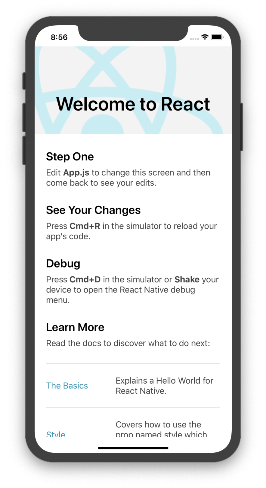
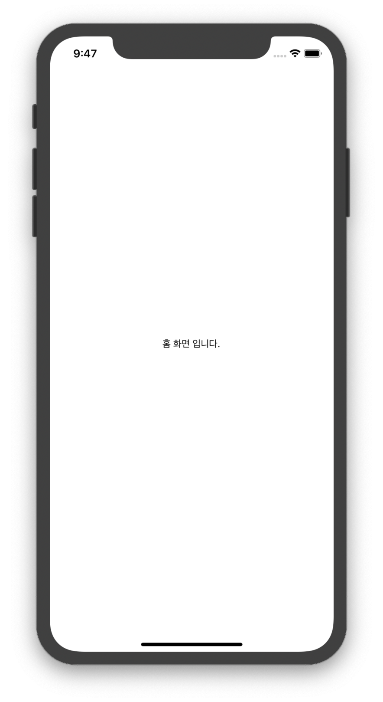
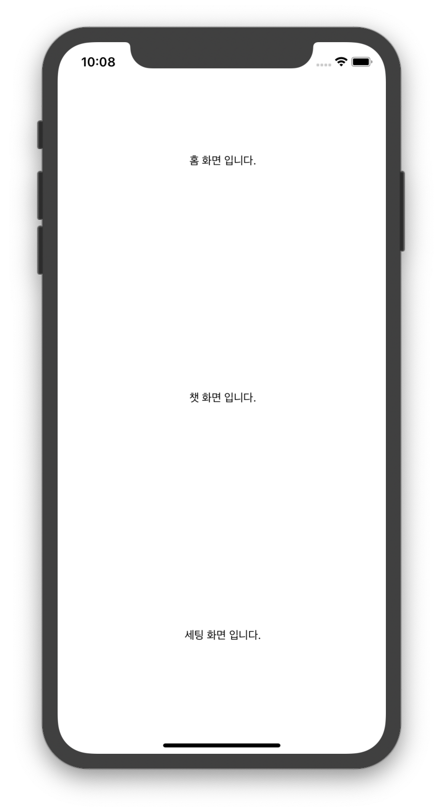
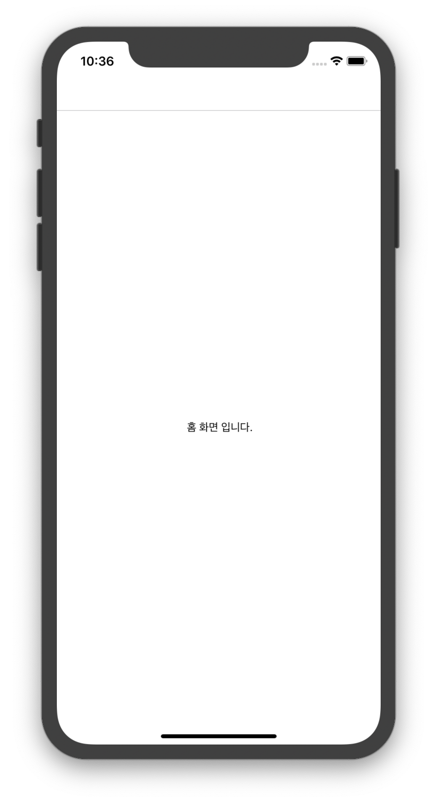

# **React Navigation**

React Native(이하 'RN') 관련 라이브러리 중 스크린간 이동을 도와주는 라이브러리인 React Navigation 을 소개합니다.

## **react-navigation-stack**

웹을 해 보신 분이라면 이해하기 쉬울 수 있는 개념 입니다. 웹에서의 Routing 이 RN의 Stack 입니다.

RN은 모바일 앱의 형태이기 때문에 브라우저(크롬, 인터넷 익스플로러 등) 처럼 상단 탭이 존재하지 않습니다.

그렇기 때문에, 페이지 간 이동이 쉽지 않을 뿐더러 이 와중에 브라우저처럼 '뒤로가기'를 제공 하기 때문에 각 라우팅 패스를 모두 기억 해 주어야 합니다.

한번 쯤, 모바일 앱에서 뒤로가기를 하면 무언가 쌓이고 빠져나가는 듯한(?) 애니메이션을 보셨을 겁니다.

이를 지원하는 RN의 라이브러리가 `react-navigation-stack` 입니다. 다만, 페이지를 딥(deep)하게 구성 할 수록 뒤로가기 했을 때의 버벅임은 인지하고 있어야 합니다.

이 장에서는 react-navigation-stack을 설치 해 보고 바로 사용 할 수 있는 간단한 튜토리얼를 함께 해 보겠습니다.

### **환경 구성**

- Mac OS Mojave
- [brew]([https://brew.sh/index_ko](https://brew.sh/index_ko))
- react-native : 0.59.10 ( expo는 사용하지 않습니다. )
- react-native-cli : 2.0.1
- react-navigation:

### RN 설치와 **RN Navigation stack 설치**

> 아래 링크를 참조하여 함께 설치를 진행 해 봅시다.

[Getting Started · React Native](https://facebook.github.io/react-native/docs/getting-started)

    brew install yarn
    brew install node
    brew install watchman
    brew tap AdoptOpenJDK/openjdk
    brew cask install adoptopenjdk8

Mac OS Package Manager로 알려 져 있는 Brew를 통해 RN 서버를 돌리고 Library를 관리할 yarn과 node 그리고 RN 코드를 관리 해 줄 watchman을 설치합니다.

아래 `AdoptOpenJDK/openjdk` 와 `adoptopenjdk8`는 Android 빌드를 위해 Java 환경이 필요하니 설치 해 줍니다.

이때 꼭 brew로 설치하실 필요는 없지만 수동으로 설치 하실 경우 환경변수를 잡아줘야 하는 번거로움이 있으니 brew를 추천합니다.

    npm install -g react-native-cli

RN 프로젝트를 `init`할 때 필요한 `react-native-cli`도 설치를 진행합니다.

iOS 빌드를 위해서는 Xcode가 필요하니 MacOS를 사용하시는 분들만 App Store에서 Xcode 를 다운 받아 주세요.

자 이제 RN 시작을 위한 모든 준비는 마쳤습니다.

원하는 폴더로 이동하여아래 커맨드를 실행해 제대로 프로젝트가 생성하는지 확인 해 볼까요 ?

    react-native init rnTutorial

위와 같이 폴더구조가 생성됐다면 성공입니다.

아래 순서대로 실행하여 시뮬레이터를 띄워 볼까요 ?

    # Root Path
    > cd ios # iOS 폴더로 들어가 React-natie Library 들을 iOS 에 설치 해 줍니다.
    > pod install
    > cd .. # 다시 루트 폴더로 온 후
    > yarn start # 서버 ON!
    yarn run v1.16.0
    $ react-native start
    ┌──────────────────────────────────────────────────────────────────────────────┐
    │                                                                              │
    │  Running Metro Bundler on port 8081.                                         │
    │                                                                              │
    │  Keep Metro running while developing on any JS projects. Feel free to        │
    │  close this tab and run your own Metro instance if you prefer.               │
    │                                                                              │
    │  https://github.com/facebook/react-native                                    │
    │                                                                              │
    └──────────────────────────────────────────────────────────────────────────────┘

    Looking for JS files in
       /Users/samslow/Desktop/GitProject/RNNavigationStack

    Loading dependency graph, done.

위 명령어가 나왔다면 loacalHost가 띄워진 것 입니다.

하지만, 서버는 이제 요청(Request)에 대한 응답(Response)만을 보내주는 일만 전담하기 때문에

이제 이 서버가 보내주는 내용을 받아줄 Simulator 를 띄워 볼까요 ?

    # Root Path
    > react-native run-ios
    ...
    success Successfully launched the app on the simulator

🎉  **축하합니다. 당신은 이제 리액트 네이티브 개발자 입니다.**

### **4종 기본 개념 소개**

이 장의 주제처럼 **react-navigation-stack**를 시작 할 준비를 이제 모두 마쳤습니다.

아래의 react-navigation-stack에서 제공하는  4가지 기본 라이브러리와 API만 안다면, 다른 Navigation을 하더라도 모두 쉽게 익힐 수 있습니다.

- CreateStackNavigator

    앱의 각 화면이 전환될 수 있는 기본 틀을 제공합니다.

- RouteConfigs

    CreateStackNavigator가 쭉 뻗은 도로를 제공 해 주었다면 RouteConfigs는 그 도로를 이리저리로 꺾고 각 화면으로 안내 해 주는 표지판을 세우는 작업을 합니다.

- StackNavigationConfig

    RouteConfig가 각 길을 안내 해 줬다면 전체 길에 대한 안내를 담당합니다.

    길을 Modal로 띄울지 Screen으로 띄울지, 아무것도 모르고 온 사람에게 어딜 제일 처음 안내 할 지 같은 설정을 담당합니다.

- navigationOptions

    각 길들의 세부 설정을 할 수 있습니다.

    이 길은 콘크리트로 할 지, 흙길로 할 지같이 Header에 표시 될 정보, Tab으로 표현할지 여부, 각 버튼의 색상 들 같은 가장 세부적인 설정들 입니다.

    총 26가지 정도로 이마저도 세부의 세부(?) 설정까지 있으니 입맛대로 찾아쓰면 됩니다.

위 내용을 참고하여 아래 예제를 직접 따라 쳐 보며 익혀 봅시다.

이번 예제에서는 `Home` , `Chatting`, `Settings` 를 사용하여 대화할 수 있는 앱을 만들어 보겠습니다.

### **CreateStackNavigator 로 기본 틀 잡기**

먼저 `App.js`에 있는 내용을 모두 지우고 아래 코드를 입력 해 주세요.

    import React, { Component } from 'react'
    import { Text, StyleSheet, View } from 'react-native'

    export default () => (
      <View style={styles.HomeView}>
        <Text> 홈 화면 입니다.</Text>
      </View>
    );

    const styles = StyleSheet.create({
      HomeView: {
        flex: 1,
        justifyContent: "center",
        alignItems: "center"
      }
    })

이 앱은 3가지 화면이 필요하지만, 먼저 각 화면들을 모두 한 화면에 표시 해 보겠습니다.

    import React from 'react';
    import { StyleSheet, View, Text } from 'react-native'

    class Home extends Component {
      render() {
        return (
          <View style={styles.eachView} >
            <Text> 홈 화면 입니다.</Text>
          </View>
        )
      }
    }

    class Chat extends Component {
      render() {
        return (
          <View style={styles.eachView} >
            <Text> 챗 화면 입니다.</Text>
          </View>
        )
      }
    }

    class Settings extends Component {
      render() {
        return (
          <View style={styles.eachView} >
            <Text> 세팅 화면 입니다.</Text>
          </View>
        )
      }
    }

    export default () => (
      <View style={styles.centerView}>
    		<Home />
        <Chat />
        <Settings />
      </View>
    );

    const styles = StyleSheet.create({
      centerView: {
        flex: 1,
        justifyContent: "center",
        alignItems: "center"
      },
      eachView: {
        flex: 1,
        justifyContent: "center",
        alignItems: "center"
      }
    })

세가지 화면에 따른 Style도 조정 해 주시고 위 화면이 나온다면 성공입니다.

그럼 이제 각 화면으로 갈 수 있는 기본 틀을 만들어 볼까요?

아래 명령어를 통해 필요한 라이브러리들을 설치 해 줍시다.

    # Root folder
    > yarn add react-native-gesture-handler
    > yarn add react-navigation react-navigation-stack
    > cd ios
    > pod install # 새로운 native library가 추가되었으니 연결 해 줍니다. (모든 Library들이 이 과정이 필요하진 않습니다.)

여기서 `yarn add react-native-gesture-handler`  의 역할은 무엇일까요 ?

- 모바일은 모든 컨트롤이 터치로 이루어지기 때문에 RN 환경에서 터치 인터페이스를 로드 해 주어야 합니다.
- 웹에서 왼쪽 클릭, 오른쪽 클릭처럼 예를 들어 클릭, 스크롤, 확대 · 축소 등이 있을 수 있겠죠.

라이브러리를 모두 설치 한 뒤 import 를 통해 저희 프로젝트에 로드 해 봅시다.

    import { createAppContainer } from 'react-navigation';
    import { createStackNavigator } from 'react-navigation-stack';

    ...

`createAppContainer` 는 Navigation으로 만들어낸 Stack 들을 하나의 상자에 담아 앱이 인식 할 수 있는 형태로 만들어주는 API 입니다.

그럼 이제 두 API 를 사용 해 봅시다.

    ...

    const App = createStackNavigator(
      {
        Chat: {
          screen: Chat,
        },
        Home: {
          screen: Home,
        },
        Settings // 설정이 'screen' 밖에 없다면, 중괄호는 생략 가능합니다.
      },
      {
        initialRouteName: 'Home' // 처음 보여 줄 화면을 설정합니다.
      },
    );

    const AppContainer = createAppContainer(App);

    export default () => (
      <AppContainer />
    );

    ...

이 화면이 나왔다면 잘 따라오신 겁니다.

근데, 뭔가 이상하지 않나요? 저희는 분명 Chat과 Settings를 만들었는데 어디에도 Chat과 Settings 로 가는 버튼이 없습니다.

그럼 이제 마무리를 지어볼까요 ?

홈 화면에서 Chat과 Settings로 가는 버튼을 만들고 Home으로 다시 돌아 올 수 있도록 만들어 봅시다.

우리는 이미 모든 기본 세팅을 해 두었기 때문에 활용 할 수 있는 `<Button />` 만 만들면 됩니다.

    ...

    class Home extends Component {
      render() {
        return (
          <View style={styles.eachView} >
            <Text> 홈 화면 입니다.</Text>
            <Button
              title="챗 화면으로 가기"
              onPress={() => this.props.navigation.navigate('Chat')}
            />
            <Button
              title="세팅 화면으로 가기"
              onPress={() => this.props.navigation.navigate('Settings')}
            />
          </View>
        )
      }
    }

    class Chat extends Component {
      render() {
        return (
          <View style={styles.eachView} >
            <Text> 챗 화면 입니다.</Text>
            <Button
              title="홈 화면으로 가기"
              onPress={() => this.props.navigation.navigate('Home')}
            />
          </View>
        )
      }
    }

    class Settings extends Component {
      render() {
        return (
          <View style={styles.eachView} >
            <Text> 세팅 화면 입니다.</Text>
            <Button
              title="홈 화면으로 가기"
              onPress={() => this.props.navigation.navigate('Home')}
            />
          </View>
        )
      }
    }

    ...

[작동되는 GIF 추가]

### **RouteConfigs 기능 소개**

### **StackNavigatorConfig 기능 소개**

### **navigationOptions 기능 소개**
