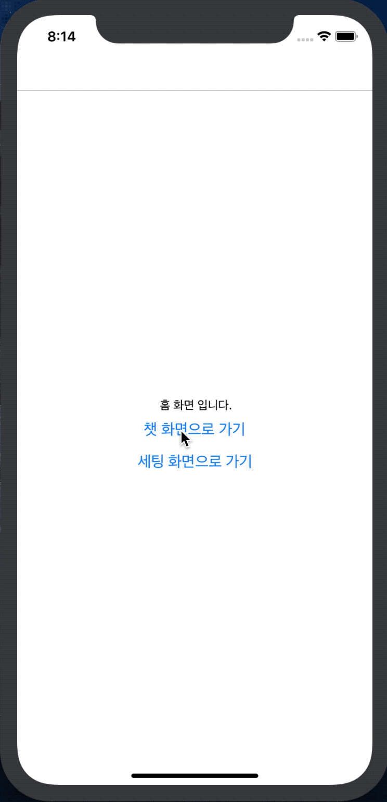

# **React Navigation**

React Navigation - related libraries that help you move between screens.

## **react-navigation-stack**

It's a concept that can be easily understood by anyone who's ever tried the web. Routing on the web is Stack of React Native.

Because React Native is in the form of a mobile app, the top tab doesn't exist like a browser (chrome, Internet Explorer, etc.).

Because of this, it's not easy to navigate between pages, and it also provides a 'backward button' like a browser, so remember each routing pass.

And you've seen, once you've gone back in your mobile app, you've seen animation like something's piled up and gone.

React Native's library supporting this is 'react-navigation-stack'. However, the more deep the page is configured, the more you should be aware of the slowing that you're going to have when you're going back

In this chapter, we'll try installing the react-navigation-stack, and we'll give you a quick tutorial that you can use right away.

### **Environment**

- Mac OS Mojave
- [brew]([https://brew.sh/index_ko](https://brew.sh/index_ko))
- react-native : 0.59.10 ( We don't install expo )
- react-native-cli : 2.0.1
- react-navigation: 4.0.10

### React Native install & **React Navigation Stack install**

> Let's refer to the link below to proceed with the installation.

[Getting Started · React Native](https://facebook.github.io/react-native/docs/getting-started)

    brew install yarn
    brew install node
    brew install watchman
    brew tap AdoptOpenJDK/openjdk
    brew cask install adoptopenjdk8

Turn the React Native server through Brew, known as Mac OS Package Manager, and install watchman to manage the yarn and node and React Native code to manage the library.

Under 'AdoptOpenJDK/openjdk' and 'Adoptenjdk8' install the Java environment for Android build.

You don't have to install the brew at this time, but if you install it manually, it's a hassle to set the environment variable, so we recommend brew.

    npm install -g react-native-cli

Install 'react-native-cli', which is required when 'init' React Native project.

Xcode is required for iOS build, so only MacOS users can download it from the App Store.

Now we're all set to start React Native.

Let's go to the desired folder and run the command below to make sure the project is created properly.

    react-native init rnTutorial

If the folder structure was created as above, it would be successful.

Shall we run the simulator in the order below?

    # Root Path
    > cd ios # Enter the iOS folder and install the React Native library on iOS.
    > pod install
    > cd .. # After you come back to the root folder,
    > yarn start # Server ON!
    yarn run v1.16.0
    $ react-native start
    ┌──────────────────────────────────────────────────────────────────────────────┐
    │                                                                              │
    │  Running Metro Bundler on port 8081.                                         │
    │                                                                              │
    │  Keep Metro running while developing on any JS projects. Feel free to        │
    │  close this tab and run your own Metro instance if you prefer.               │
    │                                                                              │
    │  https://github.com/facebook/react-native                                    │
    │                                                                              │
    └──────────────────────────────────────────────────────────────────────────────┘

    Looking for JS files in
       /Users/samslow/Desktop/GitProject/RNNavigationStack

    Loading dependency graph, done.

If the above command is issued, the Localhost is up.

However, the server is now dedicated to sending only the response to the request.

Now, let's launch a simulator to receive what this server sends us.

    # Root Path
    > react-native run-ios
    ...
    success Successfully launched the app on the simulator

🎉  **Congratulations. You are now a react native developer.**

### **Introducing the Concepts of the Four Types**

You are now ready to start **react-navigation-stack**, as is the subject in this chapter.

If you know only the four basic libraries and APIs provided by the react-navigation-stack below, you can learn them all easily by doing other navigation.

- CreateStackNavigator

    Provides a basic framework for switching each screen in the app.

- RouteConfigs

    If the CreateStackNavigator provided you with a stretch of road, RouteConfigs would knock the road around and put up a sign that would guide you to each screen.

- StackNavigationConfig

    If you had to guide the way each is routeconfig StackNavigationConfig is in charge of the guidance for the whole way.

    It's responsible for setting up the road to Modal, Screen, and where to first guide people who have no idea.

- NavigationOptions

    You can set the details of each path.

    These are the most detailed settings, like concrete or dirt roads, that will be displayed in the header, whether it will be represented by a tab, and the color of each button.

    In total, there are 26 different types of detail settings. You can use them as you like.

Let's follow the example below and learn about it.

In this example, we will create an app that can talk using 'Home', 'Chatting', and 'Settings'.

### **Set default frame with stateStackNavigator**

Please clear all contents of 'App.js' and enter the code below.

    import React, { Component } from 'react'
    import { Text, StyleSheet, View } from 'react-native'

    export default () => (
      <View style={styles.HomeView}>
        <Text>This is Home Screen</Text>
      </View>
    );

    const styles = StyleSheet.create({
      HomeView: {
        flex: 1,
        justifyContent: "center",
        alignItems: "center"
      }
    })

This app requires three screens, but first let's show each one on one screen.

    import React from 'react';
    import { StyleSheet, View, Text } from 'react-native'

    class Home extends Component {
      render() {
        return (
          <View style={styles.eachView} >
            <Text>This is Home Screen</Text>
          </View>
        )
      }
    }

    class Chat extends Component {
      render() {
        return (
          <View style={styles.eachView} >
            <Text>This is Chat Screen</Text>
          </View>
        )
      }
    }

    class Settings extends Component {
      render() {
        return (
          <View style={styles.eachView} >
            <Text>This is Chat Screen</Text>
          </View>
        )
      }
    }

    export default () => (
      <View style={styles.centerView}>
    		<Home />
        <Chat />
        <Settings />
      </View>
    );

    const styles = StyleSheet.create({
      centerView: {
        flex: 1,
        justifyContent: "center",
        alignItems: "center"
      },
      eachView: {
        flex: 1,
        justifyContent: "center",
        alignItems: "center"
      }
    })

Adjust the three-screen style. If the screen above appears, it will be successful.

Now, let's create a basic frame for each screen.

Let's install the libraries you need using the instructions below.

    # Root folder
    > yarn add react-native-gesture-handler
    > yarn add react-navigation react-navigation-stack
    > cd ios
    > pod install # A new native library has been added, so I'll connect you. (Not all Libraries need this process.)

What is the role of 'yarn add reality-native-guesture-handler' here?

- Mobile requires the touch interface to be loaded in an React Native environment as all controls are touch-touch.
- Left click on the Web, right click, for example, click, scroll, zoom in and out.

Let's install all the libraries and load them into our project via import.

    import { createAppContainer } from 'react-navigation';
    import { createStackNavigator } from 'react-navigation-stack';

    ...

'createAppContainer' is an API that puts stacks made by Navigation in one box and makes them recognizable by the app.

Now let's use two APIs.

    ...

    const App = createStackNavigator(
      {
        Chat: {
          screen: Chat,
        },
        Home: {
          screen: Home,
        },
        Settings // If the setting is only 'screen', the brackets can be omitted.
      },
      {
        initialRouteName: 'Home' // Set the screen you want to show for the first time.
      },
    );

    const AppContainer = createAppContainer(App);

    export default () => (
      <AppContainer />
    );

    ...

If this screen came out, you'd have followed me well.

Well, isn't there something wrong? We've certainly created Chat and Settings, and nowhere else is there a button for Chat and Settings.

Shall we wrap up now?

Let's make the buttons to Chat and Settings on the Home screen and return to Home.

We already have all the basic settings, so we only need to make <Button/> that we can use.

    ...

    class Home extends Component {
      render() {
        return (
          <View style={styles.eachView} >
            <Text>This is Home Screen</Text>
            <Button
              title="Go to Chat"
              onPress={() => this.props.navigation.navigate('Chat')}
            />
            <Button
              title="Go to Settings
              onPress={() => this.props.navigation.navigate('Settings')}
            />
          </View>
        )
      }
    }

    class Chat extends Component {
      render() {
        return (
          <View style={styles.eachView} >
            <Text>This is Chat Screen</Text>
            <Button
              title="Go to Home Screen"
              onPress={() => this.props.navigation.navigate('Home')}
            />
          </View>
        )
      }
    }

    class Settings extends Component {
      render() {
        return (
          <View style={styles.eachView} >
            <Text>This is Setting Screen</Text>
            <Button
              title="Go to Home"
              onPress={() => this.props.navigation.navigate('Home')}
            />
          </View>
        )
      }
    }

    ...

