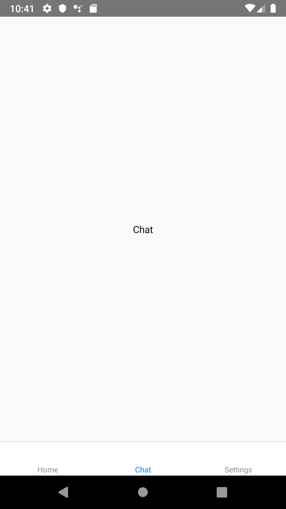
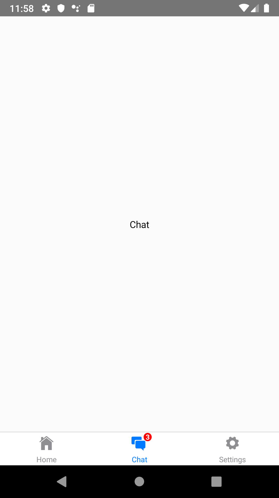
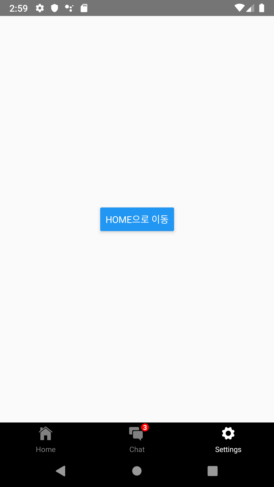

# React Native Tab Tutorial

### 1.React Navigation tab 소개

모바일 앱은 기본적으로 탭을 기반으로 한 네비게이션 스타일을 흔히 볼 수 있습니다. 탭은 주로 하단이나 헤더를 대신하여 상단에 주로 위치해있고, 이 탭을 이용하여 우리는 탭을 누르거나 swipe하는 방식으로  다른 라우트로 쉽게 전환할 수 있게 됩니다.  이번 튜토리얼에서는 가장 많이 사용되는 React-Navigation을 사용하여 Tab Navigation을 만들어보겠습니다.


### 2. React Navigation tab 설치

react-navigation에서 탭을 구현하기 위해서는 필요한 라이브러리들을 아래의 명령어를 통해 설치해야합니다.

**`react-navigation-tabs` 설치**

```shell
npm install react-navigation-tabs --save
```

**`react-native-reanimated` 설치**

```shell
npm install react-native-reanimated --save
```


### 3. React Navigation tab 기본 라이브러리 소개

React Navigation에서는 기본적으로 3가지 탭 라이브러리를 제공합니다.

| 라이브러리                       | 기능                                                         |
| -------------------------------- | ------------------------------------------------------------ |
| createBottomTabNavigator         | 화면 하단에 위치. 다른 라우트로 전환할 수 있는 기본 기능을 가진 탭 네비게이션을 제공하는 라이브러리 |
| createMaterialBottomTabNavigator | 화면 하단에 위치. createBottomTabNavigator보다 많은 스타일 효과를 제공하는 라이브러리 |
| createMaterialTopTabNavigator    | 화면 상단에 위치. createBottomTabNavigator보다 많은 스타일 효과를 제공하는 라이브러리 |


### 4. React Navigation tab 기본 동작

탭의 가장 기본적인 기능은 탭을 누를 시 해당 라우트로 전환되는 동작입니다.

createBottomTabNavigator을 이용하여 아래와 같이 Home, Chat, Settings 총 3가지 화면으로 전환되는 탭 네비게이션 예제를 작성해보겠습니다.





- Screen

  우선 탭 네비게이션에서 필요한 각 페이지의 screen부터 구성합니다.

  *HomeScreen.js*

  ```jsx
  import React from 'react';
  import {StyleSheet, Text, View} from 'react-native';

  class HomeScreen extends React.Component {
    render() {
      return (
        <View style={styles.container}>
          <Text>Home</Text>
        </View>
      );
    }
  }

  const styles = StyleSheet.create({
    container: {
      flex: 1,
      justifyContent: 'center',
      alignItems: 'center',
    },
  });

  export default HomeScreen;

  ```

  *ChatScreen.js*

  ```jsx
  import React from 'react';
  import {StyleSheet, Text, View} from 'react-native';

  class ChatScreen extends React.Component {
    render() {
      return (
        <View style={styles.container}>
          <Text>Chat</Text>
        </View>
      );
    }
  }

  const styles = StyleSheet.create({
    container: {
      flex: 1,
      justifyContent: 'center',
      alignItems: 'center',
    },
  });

  export default ChatScreen;

  ```

   *SettingsScreen.js*

  ```jsx
  import React from 'react';
  import {StyleSheet, Text, View} from 'react-native';

  class SettingsScreen extends React.Component {
    render() {
      return (
        <View style={styles.container}>
          <Text>Settings</Text>
        </View>
      );
    }
  }

  const styles = StyleSheet.create({
    container: {
      flex: 1,
      justifyContent: 'center',
      alignItems: 'center',
    },
  });

  export default SettingsScreen;

  ```

  이제 탭 네비게이션을 구현하기 위한 준비를 모두 마쳤으니 createBottomTabNavigator를 사용하여 탭 네비게이션을 추가해보겠습니다.

  *App.js*

  ```jsx
  import {createAppContainer} from 'react-navigation';
  import {createBottomTabNavigator} from 'react-navigation-tabs';
  import HomeScreen from './screens/HomeScreen';
  import ChatScreen from './screens/ChatScreen';
  import SettingsScreen from './screens/SettingsScreen';

  const TabNavigator = createBottomTabNavigator({
    Home: {
      screen: HomeScreen,
    },
    Chat: {
      screen: ChatScreen,
    },
    Settings: {
      screen: SettingsScreen,
    },
  });
  export default createAppContainer(TabNavigator);

  ```


### 5. NavigationOptions

- 아이콘 추가

  

react navigation은 defaultNavigationOptions에서 Tab bar의 아이콘을 지정할 수 있습니다. react-native-vector-icons등을 사용하여 더 예쁘게 구현할 수 있습니다.

우선 아래의 명령어로 react-native-vector-icons를 설치합니다.

```
yarn add react-native-vector-icons
```

[IonIcons](https://ionicons.com/)

이 예제에서는 IonIcons의 IOS style 아이콘을 적용하였으며 위 링크에서 필요한 아이콘을 찾아 라우트 각각의 iconName을 설정해주었습니다.

```jsx
import React from 'react';
import {createAppContainer} from 'react-navigation';
import {createBottomTabNavigator} from 'react-navigation-tabs';
import Ionicons from 'react-native-vector-icons/Ionicons';
import HomeScreen from './screens/HomeScreen';
import ChatScreen from './screens/ChatScreen';
import SettingsScreen from './screens/SettingsScreen';

const TabNavigator = createBottomTabNavigator(
  {
    Home: {
      screen: HomeScreen,
    },
    Chat: {
      screen: ChatScreen,
    },
    Settings: {
      screen: SettingsScreen,
    },
  },
  {
    defaultNavigationOptions: ({navigation}) => ({
      tabBarIcon: ({horizontal, tintColor}) => {
        const {routeName} = navigation.state;
        let iconName;
        if (routeName === 'Home') {
          iconName = 'ios-home';
        } else if (routeName === 'Chat') {
          iconName = 'ios-chatboxes';
        } else if (routeName === 'Settings') {
          iconName = 'ios-settings';
        }
        return (
          <Ionicons
            name={iconName}
            size={horizontal ? 20 : 25}
            color={tintColor}
          />
        );
      },
    }),
  },
);
export default createAppContainer(TabNavigator);

```


- **아이콘에 뱃지 추가**

  

아이콘에 뱃지가 필요한 경우 뷰 컨테이너를 추가하여 아이콘 방식으로 추가시켜줍니다.

(아래 예제는 UI 상에서만 뱃지를 추가한 상태입니다.  redux, mobx 등을 통하여 상태관리를 해주어야합니다.)

*IconWithBadge.js*

```jsx
import React from 'react';
import {StyleSheet, Text, View} from 'react-native';
import Ionicons from 'react-native-vector-icons/Ionicons';

export default class IconWithBadge extends React.Component {
  render() {
    const {name, badgeCount, color, size} = this.props;
    return (
      <View style={styles.container}>
        <Ionicons name={name} size={size} color={color} />
        {badgeCount > 0 && (
          <View style={styles.badge}>
            <Text style={styles.text}>{badgeCount}</Text>
          </View>
        )}
      </View>
    );
  }
}

const styles = StyleSheet.create({
  container: {
    width: 24,
    height: 24,
    margin: 5,
  },
  badge: {
    position: 'absolute',
    right: -6,
    top: -3,
    backgroundColor: 'red',
    borderRadius: 6,
    width: 12,
    height: 12,
    justifyContent: 'center',
    alignItems: 'center',
  },
  text: {
    color: 'white',
    fontSize: 10,
    fontWeight: 'bold',
  },
});

```


### 6. NavigationConfig

이제 기본적인 기능 이외에도 config를 사용하여 부가적인 요소들을 설정해 Tab을 완성시켜보겠습니다.

앞서 기본 라이브러리들을 설명하면서 bottomTabNavigator, MaterialBottomTabNavigator, MaterialTopTabNavigator 에서 스타일 부분에서 차이가 생긴다고 했는데 바로 이 config부분에서 각각 몇가지의 다른 기능을 제공하기 때문입니다!

이번 챕터에서는 각각의 라이브러리에서  config를 사용하여 예제를 만들고 몇가지 기능들을 소개해보겠습니다.

[React Navigation 공식 문서]: https://reactnavigation.org/docs/en/bottom-tab-navigator.html

(React Navigation 공식 문서를 참조하였고, 더 많은 config기능들을 공식 문서에서 확인하실 수 있습니다.)


###### createBottomTabNavigator

createBottomTabNavigator을 사용한 예제에서는 activeTintColor와 inactiveTintColor을 사용해 라벨과 아이콘의 활성화 여부에 따른 색깔을 설정해주었고 style에서 backGroundColor을 사용해 tab bar의 배경색을 지정해주었습니다.


*CreateBottomTabNavigator.js*

```jsx
import React from 'react';
import {createAppContainer} from 'react-navigation';
import {createBottomTabNavigator} from 'react-navigation-tabs';
import Ionicons from 'react-native-vector-icons/Ionicons';
import HomeScreen from './screens/HomeScreen';
import ChatScreen from './screens/ChatScreen';
import SettingsScreen from './screens/SettingsScreen';
import IconWithBadge from './IconWithBadge';

const HomeIconWithBadge = props => {
  return <IconWithBadge {...props} badgeCount={3} />;
};

const TabNavigator = createBottomTabNavigator(
  {
    Home: {
      screen: HomeScreen,
    },
    Chat: {
      screen: ChatScreen,
    },
    Settings: {
      screen: SettingsScreen,
    },
  },
  {
    defaultNavigationOptions: ({navigation}) => ({
      tabBarIcon: ({horizontal, tintColor}) => {
        const {routeName} = navigation.state;
        let IconComponent = Ionicons;
        let iconName;
        if (routeName === 'Home') {
          iconName = 'ios-home';
        } else if (routeName === 'Chat') {
          iconName = 'ios-chatboxes';
          IconComponent = HomeIconWithBadge;
        } else if (routeName === 'Settings') {
          iconName = 'ios-settings';
        }

        return (
          <IconComponent
            name={iconName}
            size={horizontal ? 20 : 25}
            color={tintColor}
          />
        );
      },
    }),
    tabBarOptions: {
      activeTintColor: 'white',
      inactiveTintColor: 'gray',
      style: {
        backgroundColor: 'black',
      },
    },
  },
);

export default createAppContainer(TabNavigator);

```

- `initialRouteName` - The routeName for the initial tab route when first loading.

  첫 로딩시 초기 탭 라우터 이름 설정

- `defaultNavigationOptions` - Default navigation options to use for screens

  네비게이터에 있는 모든 routes에 디폴트 옵션으로 적용

- ```
  tabBarOptions
  ```

  - `activeTintColor` - 활성화된 탭의 라벨과 아이콘 색깔 설정
  - `activeBackgroundColor` - 활성화된 탭의 배경 색깔 설정
  - `inactiveTintColor` - 비활성화된 탭의 라벨과 아이콘 색깔 설정
  - `inactiveBackgroundColor` - 비활성화된 탭의 배경 색깔 설정
  - `showLabel` - 라벨 show 여부 설정
  - `showIcon` - 아이콘 show 여부 설정
  - `style` - tab bar 스타일 설정
  - `labelStyle` - label 스타일 설정
  - `labelPosition` - label 위치 설정
  - `tabStyle` - 탭 스타일 설정
  - `adaptive` - 스크린에 따른 아이콘 및 라벨 조정여부 설정
  - `keyboardHidesTabBar` - 키보드 사용시 탭바 숨김 여부 설정


###### createMaterialBottomTabNavigator

createMaterialBottomTabNavigator을 사용한 예제에서는 아래에서 볼 수 있듯이 shifting을 이용해 해당하는 탭의 라벨만 표시되고 activeTintColor, inactiveTintColor, barStyle을 이용해 배경색 역시 각각 활성화 여부에 따라 다르게 지정해주었습니다.


*createMateiralBottomTabNavigator.js*

```jsx
import React from 'react';
import {View} from 'react-native';
import {createAppContainer} from 'react-navigation';
import {createMaterialBottomTabNavigator} from 'react-navigation-material-bottom-tabs';
import Icon from 'react-native-vector-icons/Ionicons';
import HomeScreen from './screens/HomeScreen';
import ChatScreen from './screens/ChatScreen';
import SettingsScreen from './screens/SettingsScreen';

const TabNavigator = createMaterialBottomTabNavigator(
  {
    Home: {
      screen: HomeScreen,
      navigationOptions: {
        tabBarLabel: 'Home',
        tabBarIcon: ({tintColor}) => (
          <View>
            <Icon style={[{color: tintColor}]} size={25} name={'ios-home'} />
          </View>
        ),
        activeColor: '#DC143C',
        inactiveColor: '#226557',
        barStyle: {backgroundColor: '#FFC0CB'},
      },
    },
    Chat: {
      screen: ChatScreen,
      navigationOptions: {
        tabBarLabel: 'Chat',
        tabBarIcon: ({tintColor}) => (
          <View>
            <Icon
              style={[{color: tintColor}]}
              size={25}
              name={'ios-chatboxes'}
            />
          </View>
        ),
        activeColor: '#000080',
        inactiveColor: '#226557',
        barStyle: {backgroundColor: '#B0C4DE'},
      },
    },
    Settings: {
      screen: SettingsScreen,
      navigationOptions: {
        tabBarLabel: 'Settings',
        tabBarIcon: ({tintColor}) => (
          <View>
            <Icon
              style={[{color: tintColor}]}
              size={25}
              name={'ios-settings'}
            />
          </View>
        ),
        activeColor: '#006400',
        inactiveColor: '#226557',
        barStyle: {backgroundColor: '#8FBC8F'},
      },
    },
  },
  {
    initialRouteName: 'Home',
    shifting: true,
  },
);

export default createAppContainer(TabNavigator);

```

- `shifting` - 3개 이상의 탭이 존재할 경우, 활성화 된 탭의 라벨만 show 여부 설정
- `labeled` - 라벨 show 여부 설정
- `activeColor` - 활성화된 탭의 라벨과 아이콘 색깔
- `inactiveColor` - 비활성화된 탭의 라벨과 아이콘 색깔
- `barStyle` - tab bar 스타일 설정
- `initialRouteName` - 로딩시 초기 탭 라우터 설정


###### createMaterialTopTabNavigator

createMaterialTopTabNavigator을 사용한 예제에서는 다른 예제들과는 다르게 탭에 icon만 위치해있는것을 볼 수 있습니다. 이는 showIcon, showLabel 의 boolean값을 설정함으로써 show 여부를 결정할 수 있습니다.  또한, indicatorStyle을 통해 활성화된 탭을 가르키는 바의 스타일을 저장할 수 있고 탭을 누를 때 역시 pressColor을 통한 잠깐의 색깔 변경을 나타낼 수 있습니다.


*createTabTobNavigator.js*

```jsx
import React from 'react';
import {View} from 'react-native';
import {createMaterialTopTabNavigator} from 'react-navigation-tabs';
import {createAppContainer} from 'react-navigation';
import Icon from 'react-native-vector-icons/Ionicons';
import HomeScreen from './screens/HomeScreen';
import ChatScreen from './screens/ChatScreen';
import SettingsScreen from './screens/SettingsScreen';

const TabNavigator = createMaterialTopTabNavigator(
  {
    Home: {
      screen: HomeScreen,
      navigationOptions: {
        tabBarLabel: 'Home',
        tabBarIcon: ({tintColor}) => (
          <View>
            <Icon style={[{color: tintColor}]} size={25} name={'ios-home'} />
          </View>
        ),
        initialRouteName: 'Home',
        activeColor: '#C71585',
        inactiveColor: '#226557',
        barStyle: {backgroundColor: '#FFC0CB'},
      },
    },
    Chat: {
      screen: ChatScreen,
      navigationOptions: {
        tabBarLabel: 'Chat',
        tabBarIcon: ({tintColor}) => (
          <View>
            <Icon
              style={[{color: tintColor}]}
              size={25}
              name={'ios-chatboxes'}
            />
          </View>
        ),
        activeColor: '#4B0082',
        inactiveColor: '#226557',
        barStyle: {backgroundColor: '#B0C4DE'},
      },
    },
    Settings: {
      screen: SettingsScreen,
      navigationOptions: {
        tabBarLabel: 'Settings',
        tabBarIcon: ({tintColor}) => (
          <View>
            <Icon
              style={[{color: tintColor}]}
              size={25}
              name={'ios-settings'}
            />
          </View>
        ),
        activeColor: '#006400',
        inactiveColor: '#226557',
        barStyle: {backgroundColor: '#8FBC8F'},
      },
    },
  },
  {
    animationEnabled: true,
    swipeEnabled: true,
    tabBarOptions: {
      pressColor: 'black',
      style: {
        backgroundColor: 'white',
      },
      indicatorStyle: {
        backgroundColor: 'black',
      },
      activeTintColor: '#000',
      inactiveTintColor: '#d1cece',
      showLabel: false,
      showIcon: true,
    },
  },
);

export default createAppContainer(TabNavigator);

```

- `initialRouteName` - The routeName for the initial tab route when first loading.

  첫 로딩시 초기 탭 라우터 이름 설정

- `defaultNavigationOptions` - 네비게이터에 있는 모든 routes에 디폴트 옵션으로 적용

- `tabBarPosition` - tabBar 위치 설정

- `swipeEnabled` - swipe기능 허가 설정


- ```
  tabBarOptions
  ```

  - `activeTintColor` - 활성화된 탭의 라벨과 아이콘 색깔 설정
  - `inactiveTintColor` - 비활성화된 탭의 라벨과 아이콘 색깔 설정
  - `showIcon` - 아이콘 show 여부 설정
  - `showLabel` - 라벨 show 여부 설정
  - `upperCaseLabel` - 라벨 대문자 설정
  - `pressColor` - 탭 누를 시 색깔 설정
  - `scrollEnabled` - 스크롤 가능 설정
  - `tabStyle` - 탭 스타일 설정
  - `indicatorStyle` - tab indicator 스타일 설정
  - `labelStyle` - 라벨 스타일 설정
  - `iconStyle` - 아이콘 스타일 설정


### 7. Tab간의 이동

   Tab간의 라우트에서 라우트로 전환할 때 아래에 코드를 사용합니다.

```jsx
   this.props.navigation.navigate('Home');
```

이 코드를 사용하여 Settings화면에서 Home화면으로 이동하는 예제를 만들어봅시다.




settingsScreen.js에서 버튼을 생성 후 위에서 언급한 코드를 사용해 작성하였습니다.

*settingScreen.js*

```jsx
import React from 'react';
import {Button, StyleSheet, Text, View} from 'react-native';

class SettingsScreen extends React.Component {
  render() {
    return (
      <View style={styles.container}>
        <Button
          title="Home으로 이동"
          onPress={() => this.props.navigation.navigate('Home')}
        />
      </View>
    );
  }
}

const styles = StyleSheet.create({
  container: {
    flex: 1,
    justifyContent: 'center',
    alignItems: 'center',
  },
});

export default SettingsScreen;

```

