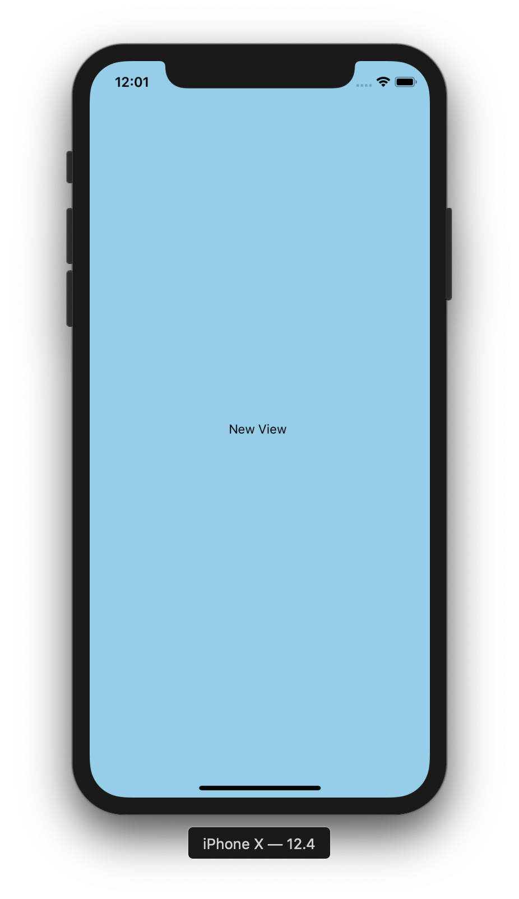

## 3. 새로운 컴포넌트 만들기 - `CoinView`

- 새로운 파일을 만듭니다. 'screens/CoinView.js'
- 새로운 컴포넌트를 아래의 코드와 같이 만들어 줍니다. 

CoinView.js

```js
import React from 'react'
import { StyleSheet, Text, View } from 'react-native';

class CoinView extends React.Component {
  render () {
    return (
      <View style={styles.container}>
        <Text>New View </Text>
      </View>
    )
  }
}

const styles = StyleSheet.create({
  container: {
    flex: 1,
    flexDirection: 'column',
    backgroundColor: 'skyblue',
    justifyContent: 'center',
    alignItems: 'center',
  },
});

export default CoinView;
```


App.js

```js
import React from 'react';
import { StyleSheet, Text, View, SafeAreaView } from 'react-native';
import CoinView from './screens/CoinView'

export default class App extends React.Component {
  render() {
    return (
      <CoinView></CoinView>
    );
  }
}

const styles = StyleSheet.create({
  container: {
    flex: 1,
    backgroundColor: '#fff',
    alignItems: 'center',
    justifyContent: 'center',
  },
});

```

### Run and Test!


