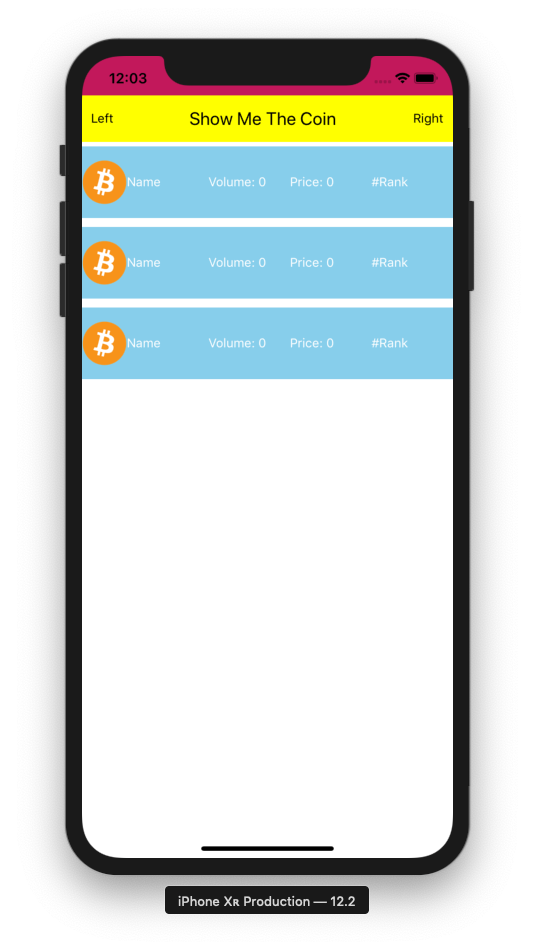

## 7. Brand New CoinItem Component

- Add components/CoinItem.js file

components/CoinItem.js

```js
import React from 'react';
import { StyleSheet, Text, View, Image } from 'react-native';

class CoinItem extends React.Component {
  render() {
    let date = new Date();
    let now = date.toLocaleString();

    return (
      <View style={styles.container}>
        <Image
          style={{ width: 50, height: 50 }}
          source={{ uri: 'https://bitcoin.org/img/icons/opengraph.png' }}
        />
        <Text style={[styles.text, { flex: 1 }]}>
          {this.props.name || 'Name'}
        </Text>
        <Text style={[styles.text, { flex: 1 }]}>
          {'Volume: ' + (this.props.volume || 0)}
        </Text>
        <Text style={[styles.text, { flex: 1 }]}>
          {'Price: ' + (this.props.price || 0)}
        </Text>
        <Text style={[styles.text, { flex: 1 }]}>
          {'#' + (this.props.rank || 'Rank')}
        </Text>
      </View>
    );
  }
}

const styles = StyleSheet.create({
  container: {
    width: '100%',
    height: 80,
    flexDirection: 'row', // row
    backgroundColor: 'skyblue',
    alignItems: 'center',
    justifyContent: 'space-around', // center, space-around
    marginTop: 5,
    marginBottom: 5
  },
  text: {
    color: 'white'
  }
});

export default CoinItem;
```

screens/CoinView.js

```js
import React from 'react';
import { StyleSheet, Text, View } from 'react-native';
import CoinItem from '../components/CoinItem';

class CoinView extends React.Component {
  render() {
    return (
      <View style={[styles.container, this.props.style]}>
        <CoinItem></CoinItem>
        <CoinItem></CoinItem>
        <CoinItem></CoinItem>
      </View>
    );
  }
}

const styles = StyleSheet.create({
  container: {
    flex: 1,
    flexDirection: 'column', // row
    backgroundColor: 'skyblue',
    // justifyContent: 'center',
    // alignItems: 'center'
  }
});

export default CoinView;
 ```

 ### Run

 