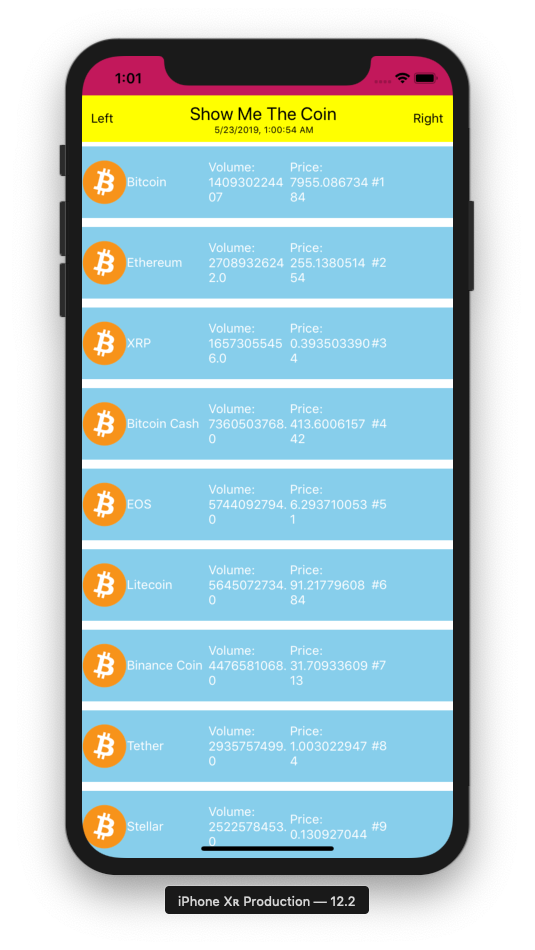

## 10. TopBar 업그레이드

### Communication between parent and child components

- Add refresh date information on `TopBar`
- Sequence of `refreshDate`'s data flow:
`CoinView.js` -> `App.js` -> `TopBar.js`

screens/CoinView.js

```js
  _getCoinData = async (limit) => {
    this.setState({
      isLoading: true,
    });

    try {
      const response = await fetch(`https://api.coinmarketcap.com/v1/ticker/?limit=${limit}`);
      const responseJson = await response.json();

      const date = new Date();
      const now = date.toLocaleString()

      if (this.props.refreshDate != null) {
        this.props.refreshDate(now); // Run func type props
      }

      await this.setState({
        coinData: responseJson,
        isLoading: false,
      });

    } catch(error) {
      console.error('_getCoinData', error);
    }
  }
```

Add state, `_setRefreshDate` ....

App.js

```js
import React from 'react';
import { StyleSheet, Text, View } from 'react-native';
import Constants from 'expo-constants';
import CoinView from './screens/CoinView';
import TopBar from './components/TopBar';

export default class App extends React.Component {
  constructor(props) {
    super(props);
    this.state = {
      refreshDate: '-',
    }
  }

  _setRefreshDate = (date) => { // Called from CoinView's prop
    console.log('Updated: '+ date);
    this.setState({
      refreshDate: date,
    });
  }

  render() {
    return (
      <View style={styles.container}>
        <View style={styles.statusBar} />
        <TopBar title="Show Me The Coin" refreshDate={this.state.refreshDate} />
        <CoinView
          refreshDate={this._setRefreshDate}
          style={styles.coinView}
        />
      </View>
    );
  }
}

const styles = StyleSheet.create({
  statusBar: {
    backgroundColor: '#C2185B',
    height: Constants.statusBarHeight
  },
  container: {
    flex: 1
  },
  coinView: {
    width: '100%',
    flex: 1,
    flexDirection: 'column', // row
    backgroundColor: 'white',
    alignItems: 'center',
    justifyContent: 'flex-start' // center, space-around
  }
});
```

components/TopBar.js

Add refreshDate property.

```js
  render() {
    return (
      <View style={styles.container}>
        <Text>Left</Text>
        <View>
          <Text style={{ fontSize: 20 }}>{this.props.title}</Text>
          <Text style={{ fontSize: 10, textAlign: 'center' }}>{this.props.refreshDate || '-'}</Text>
        </View>
        <Text>Right</Text>
      </View>
    );
  }
```

#### Result


