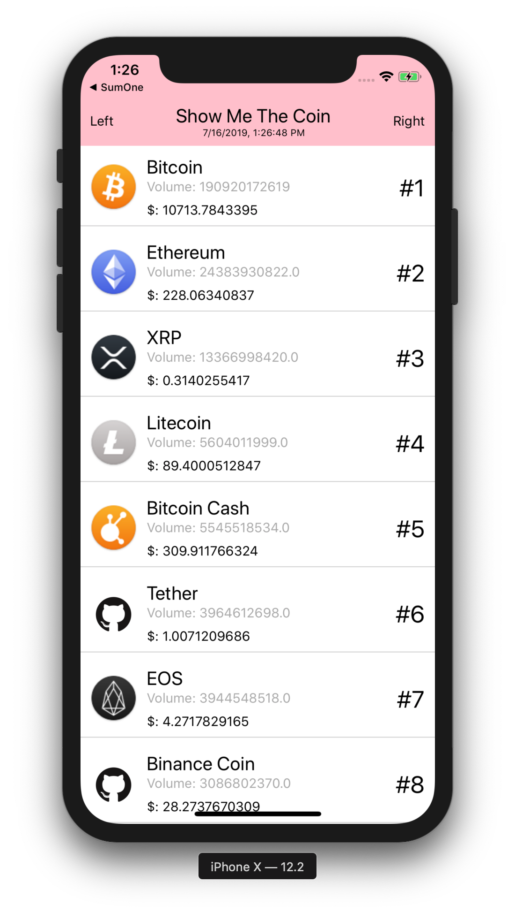

# React Native Tutorial: Show Me The Coin - 2019

Build real native simple application with javascript



## How to run 

Project sources: [Examples/show-me-the-coin](https://github.com/JeffGuKang/react-native-tutorial)

```
cd Examples/ShowMeTheCoin
yarn # Install dependencies
yarn start # Start expo
```