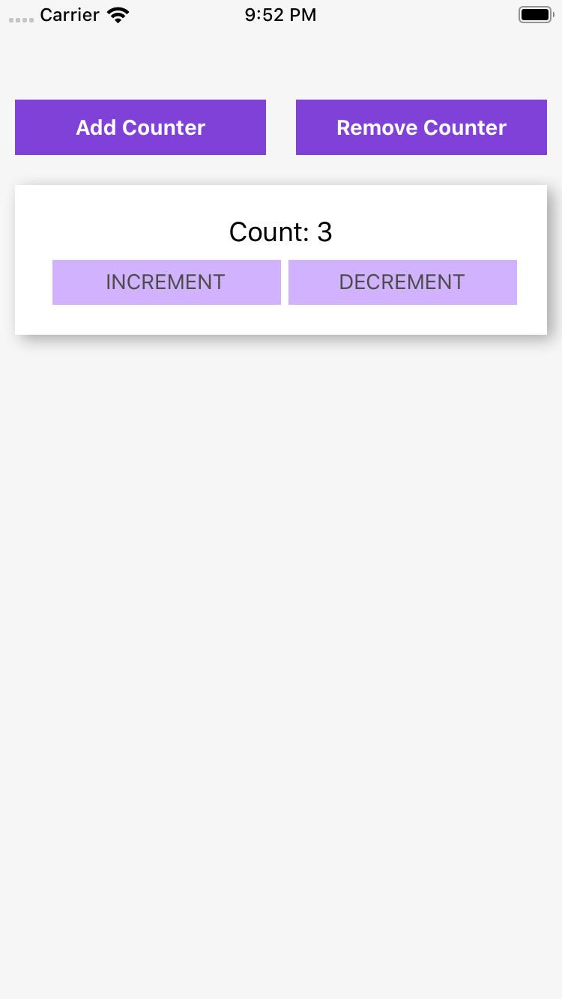

# 01. Let's make Multi Counter 

 각각의 카운터에서 숫자를 `increment` , `decrement` 할 수 있고 이 카운터를 여러개 만들 수 있는 `Add`, `Remove` 의 기능이 있는 Multi Counter 예제를 통해 `Redux`를 알아보겠습니다.

### 예제 미리보기


### Directory 구조
```
ㄴ app
  ㄴ actions
     ActionTypes.js
     index.js
  ㄴ components
     App.js 
     Counter.js
     CounterList.js
  ㄴ containers
     index.js
  ㄴ reducers
     index.js
  EntryPoint.js
App.js
index.js
```

