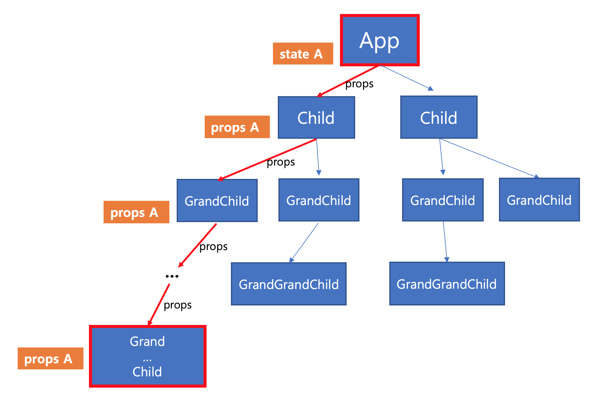
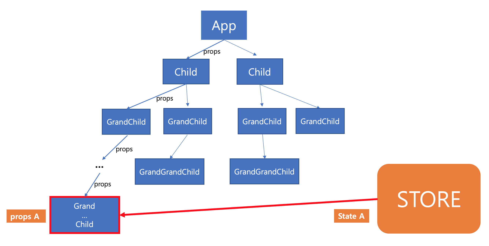

# Redux 란?

공식 페이지에서 Redux를 다음과 같이 정의합니다.

> Redux는 자바스크립트 어플리케이션에서 흔히 쓰이는 상태 컨테이너입니다.
 
## React vs React + Redux

### React
 > 부모 컴포넌트인 App에서 모든 것을 관리하고 데이터를 아래로 내려주는 구조

 

 - 장점 : 직관적이며, 데이터 관리를 한 곳에서 하기 때문에 관리하기 편하다.
 - 단점 : 앱의 규모가 커졌을 때를 생각해볼 수 있다. 
        
      위의 그림처럼, 최상단 `App 컴포넌트` 의 데이터(state)을 최하단 `Grand ... Child 컴포넌트` 에 `props`로 전달해주는 것을 생각해본다면 복잡성을 생각해볼 수 있습니다.
   
### React + Redux
  >- `Redux` 는 애플리케이션의 상위에 자리잡은 글로벌 `Store`를 만들어서 다른 모든 컴포넌트로 `State`를 공급한다.
  >- 데이터를 전역에서 관리하는데 이를 관리하는 곳이 `Store` 이고 내부에 `Action` 에 따른 데이터 값을 변화시켜주는 순수함수 `Reducer`가 정의되어있다. 
   
  

## Redux의 세가지 원칙
1. **진실은 하나의 소스로부터**

   > redux는 한 곳에서 데이터를 전역적으로 관리하며, 이를 관리하는 곳을 `Store` 라고 부른다.
	
2. **State는 읽기 전용이다** 

   > 기존의 상태를 건드리지 않고 새로운 state를 생성하여 업데이트해줘야 합니다. 즉, 불변성을 유지하면서 상태를 변경해줘야합니다.

3. **변화는 순수 함수로 작성되어야 한다**

   > 동일한 입력값이 있다면 동일한 출력값이 있어야하는 순수함수로 작성되어야합니다.
   
## redux, react-redux 모듈 설치
모듈 패키지 설치를 위해 프로젝트의 터미널에서 다음을 입력해주세요.
```
npm install --save redux react-redux
```
 - **redux**
  
    : Javascript 앱을 위한 상태 컨테이너
    
 - **react-redux**
    
    - `Provider` 컴포넌트와 `connect`메서드를 제공하여 React + Redux 개발을 더욱 쉽게 해줍니다.


지금부터 redux, react-redux 모듈을 사용해서 여러개의 카운터(Multi Counter)를 만드는 예제를 해보겠습니다.