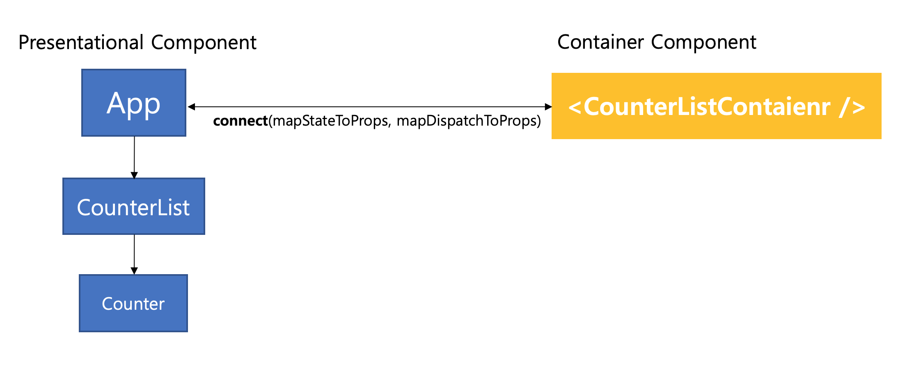
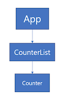

# Container Component and Presentational Component 

## Entire Structure

We will try to configure the components as shown below.
  
  

## Examples and Description

Go to 'Examples/StateManagement/ReduxTutorial'. 

Add folders and files as follows:
```
$ mkdir components containers
$ touch components/App.js components/Counter.js components/CounterList.js containers/CounterListContainer.js
```
then it will be configured as follows.

```
/components  
   App.js   
   Counter.js  
   CounterList.js
/containers  
   CounterListContainer.js
```

We will make it according to the Presentational and Container pattern, which is a method of separating components by `/components` and `/containers`.
## Presentational and Container Pattern? 
 
> Patterns that are developed into parts that handle data and parts that express the screen 
 
  | Presentational Component| Container Component |  
|--|--|  
| DOM markup and style | Behavior Logic |  
|  No Data Processing Capability | Data processing Capability |  
|Not related to Redux|Related to Redux|  
| It uses data and callback that is 'props' that is received from parents. | It transferred data and callback that should be rendered to components that do not have the ability to process data as props.|

It is convenient to develop this for reuse, but it is not necessary.
The Presentational component may have a state other than props, and the Container component may have a DOM markup or style.
It's a pattern made by purpose, not by technology. 
[More detail Presentational and Container Pattern](https://blog.naver.com/PostView.nhn?blogId=backsajang420&logNo=221368885149&categoryNo=77&parentCategoryNo=0)
  
  
### 1. Presentational Component

> The data and callback of the presentational component are passed to and used by props.
> This is a component that can focus only on the style without being affected by redux.

let's make structure as following.

{:height="300px" width="280px"}

app/components/App.js  
```
import React from 'react';
import CounterList from './CounterList';
import {StyleSheet, Text, TouchableOpacity, View, ScrollView} from 'react-native';
import PropTypes from 'prop-types';

const App = ({counter, handleAddCounter, handleRemoveCounter, handleIncrement, handleDecrement}) => {
    return (
        <ScrollView style={styles.container}>
            <View style={styles.counterAddRemoveContainer}>
                <TouchableOpacity
                    style={styles.counterAddRemoveButton}
                    onPress={handleAddCounter}>
                    <Text
                        style={{textAlign: 'center', color: 'white', fontWeight: '700'}}>
                        Add Counter
                    </Text>
                </TouchableOpacity>
                <TouchableOpacity
                    style={styles.counterAddRemoveButton}
                    onPress={handleRemoveCounter}>
                    <Text
                        style={{textAlign: 'center', color: 'white', fontWeight: '700'}}>
                        Remove Counter
                    </Text>
                </TouchableOpacity>
            </View>

            <View>
                <CounterList
                    counter={counter}
                    handleIncrement={handleIncrement}
                    handleDecrement={handleDecrement}
                />
            </View>
        </ScrollView>
    );
};

App.propTypes = {
    counter: PropTypes.arrayOf(PropTypes.shape({
        counterNum : PropTypes.number,
    })),
    handleIncrement : PropTypes.func,
    handleDecrement : PropTypes.func,
    handleAddCounter : PropTypes.func,
    handleRemoveCounter : PropTypes.func,
};

App.defaultProps = {
    counter : [],
    handleIncrement : () => console.warn('handleIncrement not defined'),
    handleDecrement : () => console.warn('handleDecrement not defined'),
    handleAddCounter : () => console.warn('handleAddCounter not defiend'),
    handleRemoveCounter : () => console.warn('handleRemoveCounter not defiend'),
}


const styles = StyleSheet.create({
    container: {
      flex: 1,
      width: '100%',
      backgroundColor: '#F6F6F6',
      paddingTop: '15%',
      paddingBottom : '15%',
    },
    counterAddRemoveContainer: {
        width: '100%',
        display: 'flex',
        flexDirection: 'row',
    },
    counterAddRemoveButton: {
        margin: 10,
        padding: 10,
        flex: 1,
        backgroundColor: '#8041D9',
    },
});

export default App;
```

app/components/CounterList.js  
```
import React from 'react';
import Counter from './Counter';
import {StyleSheet, View} from 'react-native';
import PropTypes from 'prop-types';

const CounterList = ({counter, handleAddCounter, handleRemoveCounter, handleIncrement, handleDecrement}) => {
    const counterModule = counter.map((item, index) => (
            <Counter
                key={index}
                index={index}
                value={item}
                handleIncrement={handleIncrement}
                handleDecrement={handleDecrement}
            />
      ));

    return (
        <View style={styles.counterFrame}>
            {counterModule}
        </View>
    );
};

CounterList.propTypes = {
    counter: PropTypes.array,
    handleIncrement : PropTypes.func,
    handleDecrement : PropTypes.func,
    handleAddCounter : PropTypes.func,
    handleRemoveCounter : PropTypes.func,
};

CounterList.defaultProps = {
    counter : [],
    handleIncrement : () => console.warn('handleIncrement not defined'),
    handleDecrement : () => console.warn('handleDecrement not defined'),
    handleAddCounter : () => console.warn('handleAddCounter not defiend'),
    handleRemoveCounter : () => console.warn('handleRemoveCounter not defiend'),
};

const styles = StyleSheet.create({
    counterFrame: {
        padding: 10,
    },
});

export default CounterList;
```

app/components/Counter.js 
```
import React from 'react';
import {StyleSheet, Text, TouchableOpacity, View} from 'react-native';
import PropTypes from 'prop-types';

const Counter = ({index, value, handleIncrement, handleDecrement}) => {
    return (
      <View style={styles.counterContainer}>
        <Text style={styles.counterInfo}>
          Count: {value.counterNum}
        </Text>
        <View style={styles.counterBtnContainer}>
          <TouchableOpacity
              style={styles.counterButton}
              onPress={() => handleIncrement(index)}>
            <Text style={{color: '#4C4C4C'}}>INCREMENT</Text>
          </TouchableOpacity>
          <TouchableOpacity
              style={styles.counterButton}
              onPress={() => handleDecrement(index)}>
            <Text style={{color: '#4C4C4C'}}>DECREMENT</Text>
          </TouchableOpacity>
        </View>
      </View>
    );
};

Counter.propTypes = {
  index : PropTypes.number,
  value : PropTypes.object,
  handleIncrement : PropTypes.func,
  handleDecrement : PropTypes.func,
};

Counter.defaultProps = {
  index : 0,
  value : { counterNum : 0 },
  handleIncrement : () => console.warn('handleIncrement not defined'),
  handleDecrement : () => console.warn('handleDecrement not defined'),
};


const styles = StyleSheet.create({
  counterContainer: {
    width: '100%',
    height: 100,
    padding: 20,
    backgroundColor: 'white',
    shadowColor: '#000',
    shadowOffset: {
      width: 4,
      height: 3,
    },
    shadowOpacity: 0.32,
    shadowRadius: 5.46,
    elevation: 9,
    marginBottom: 10,
  },
  counterInfo: {
    flex: 1,
    justifyContent: 'center',
    alignItems: 'center',
    textAlign: 'center',
    fontSize: 18,
  },
  counterBtnContainer: {
    flex: 1,
    flexDirection: 'row',
    width: '100%',
  },
  counterButton: {
    backgroundColor: '#D1B2FF',
    marginLeft: 5,
    flex: 1,
    justifyContent: 'center',
    alignItems: 'center',
  },
});

export default Counter;
``` 

### 2. Container Component
> It defines the data and callback to the component as props and the action calls for Redux.

app/containers/CounterListContainer.js
```
import * as actions from '../actions';  
import { connect } from 'react-redux';  
import App from '../components/App';  
  
const mapStateToProps = (state) => ({  
    counter : state.counter,  
});  
  
const mapDispatchToProps = (dispatch) => ({  
  handleIncrement : (index) => dispatch(actions.increment(index)),  
  handleDecrement : (index) => dispatch(actions.decrement(index)),  
  handleAddCounter : () => dispatch(actions.add()),  
  handleRemoveCounter : () => dispatch(actions.remove()),  
});  
  
const CounterListContainer = connect(  
    mapStateToProps,  
  mapDispatchToProps  
)(App);  
  
export default CounterListContainer;
```

### connect()()
- Connect the redux to the react-native component. 
- Through `mapStateToProps` and `mapDispatchToProps`, it passes `state` and `callback` to components.  
- Like the `subscribe()` of the redux package, it ensures that data is rendered whenever there is a change, but in particular, `store` is only available where needed and the code is made cleaner.
- Usually used as shown below, you can assign `null` to `mapStateToProps` or `mapDispatchToProps` without state values or callback to pass on.

    ```
    connect(
        mapStateToProps, 
        mapDispatchToProps
    )([presentational Component])
    ```


1. mapStateToProps

	The data `state` inside the `store` managed all over the place is passed to the component as a `props` object.
	 
	```
	const mapStateToProps = (state) => ({  
	    counter : state.counter,  
	});
	```
	When used in components, `state.counter` will be passed on and used in the same way as `props.counter`.  
	The state value to pass on to the presentational component has been placed in mapStateToProps.
	We will now assign callback to `mapDispatchToProps`.
	
2. mapDispatchToProps

	Connect callback function and corresponding action to be dispatched and put in `mapDispatchToProps`.
	```
	const mapDispatchToProps = (dispatch) => ({  
		  handleIncrement : (index) => dispatch(actions.increment(index)),  
		  handleDecrement : (index) => dispatch(actions.decrement(index)),  
		  handleAddCounter : () => dispatch(actions.add()),  
		  handleRemoveCounter : () => dispatch(actions.remove()),  
	});
	```

	`dispatch()`?
	> A method that gives action values to stores that manage data globally and tells them how to change the state.  
	> In other words, the method that receives the action value as a factor and is used to modify the state value.
	
3. connect

    Use `connect( )` to connect the state, callback to a presentational component and export the module as a `CounterListContainer`.
	```
	const CounterListContainer = connect(  
	    mapStateToProps,  
	    mapDispatchToProps  
	)(App);

	export default CounterListContainer;
	```

	What is ()() of `connect()()`  ?
	> `connect()()` is the return of another function that receives a presentational component as a input.

	```
	function connect (mapStateToProps, mapDispatchToProps) {  
		return function(component){ 
			//implementaion 
		}
	}
	```
	
