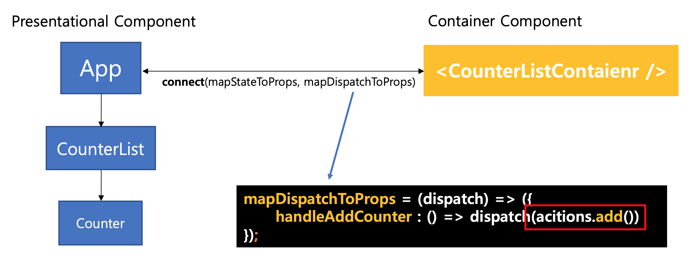

# Action

> - The only source of information at `store` that tells us what changes are going to happen.
> - An ordinary JavaScript object with the same essential element as the name of `Action`

## Example

Go to ‘Examples/StateManagement/ReduxTutorial/app’ and Add folders and files as follows.
```
$ mkdir actions
$ touch actions/ActionTypes.js actions/index.js
```

app/actions/ActionTypes.js

```
export const INCREMENT = 'INCREMENT';  
export const DECREMENT = 'DECREMENT';  
                          
export const ADD = 'ADD';  
export const REMOVE = 'REMOVE';
```
	
app/actions/index.js
```
import * as types from './ActionTypes';

export const add = () => ({
    type : types.ADD
});

export const remove = () => ({
    type : types.REMOVE,
});

export const increment = (index) => ({
    type : types.INCREMENT,
    index
});

export const decrement = (index) => ({
    type : types.DECREMENT,
    index
});
```

## What is Action?

### Format of Action
'Action' has the 'type' attribute as the name.
```
{
	type : "[String constants]",
	...,
	index,
	...
}
```

### How to use Action
 - `Action` tells `Store()` to change state using a function called `dispatch()`.
    ```
     store.dispatch({ type : "INCREMENT", index });
     ```
    It can be used as above. However, it usually uses the Action generator, which is a function that returns `action`.
     ```
     store.dispatch(() => increment(index));
     ```
 - `Store` find out that `state` must be changed and perform it according to the manual defined in `Reducer`.    
 
    Although we will discuss it in more detail later on, `Reducer` is a pure function that defines how the `State` value should change depending on the `Action`.
 - Keep `State` as small as possible because it represents the minimum information required to transform `State`.
 - The `dispatch()` function that is executed according to `Action` can be executed anywhere.
 - In this tutorial, it is used in a function called `mapDispatchToProps` in the container component.

    In the picture below, the state change defined when the action value is `ADD` is delivered to the presentational component as the `props.handleAddCounter` value through the callback function `handleAddCounter`.
       
    

